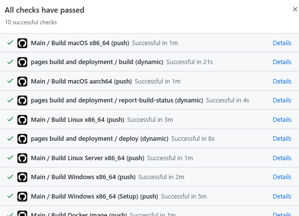

# 主要工作流

CI 的主要工作流：

*   构建 Docker 镜像并发布到 GitHub Docker 注册表。
*   使用[交付脚本](../../Building/Build%20deliveries%20locally.md)的一部分为以下平台构建产物：
    *   Windows `x86_64` 作为 .zip 文件
    *   Windows `x86_64` 安装程序（使用 Squirrel）
    *   macOS `x86_64` 和 `aarch64`。
    *   Linux `x86_64`
    *   Linux 服务器 `x86_64`。

CI 的主要工作流运行在 `develop` 分支以及任何以 `feature/update_` 开头的分支上。

## 从主分支下载产物

只需前往 [GitHub 上的 `develop` 分支](https://github.com/TriliumNext/Trilium)并查看提交栏：

<figure class="image"></figure>

按下绿色勾选标记（如果出现问题则为红色叉号）。然后查看作业列表及其状态：

<figure class="image"></figure>

然后查找任何以“Main”开头的条目，并点击其旁边的“Details”链接。选择哪个平台并不重要，因为产物都在同一页面上可用。