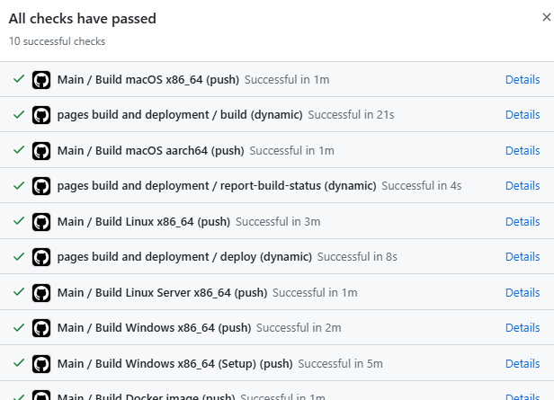

# 主流程
CI 的主流程：

*   构建 Docker 镜像并发布到 GitHub Docker 仓库。
*   使用 [交付脚本](../../Building/Build%20deliveries%20locally.md) 产物的部分内容为以下平台构建：
    *   Windows `x86_64` 的 .zip 文件
    *   Windows `x86_64` 安装程序（使用 Squirrel）
    *   macOS `x86_64` 和 `aarch64`。
    *   Linux `x86_64`
    *   Linux 服务器 `x86_64`。

CI 的主流程在 `develop` 分支以及任何以 `feature/update_` 开头的分支上运行。

## 从主分支下载产物

只需前往 [GitHub 上的 `develop` 分支](https://github.com/TriliumNext/Trilium) 并查看提交栏：

<figure class="image"></figure>

点击绿色对勾（如果出现问题则点击红色叉号）。然后查看任务列表及其状态：

<figure class="image"></figure>

然后查找任何以“Main”开头的条目，并点击其旁边的“Details”链接。选择哪个平台并不重要，因为产物在同一页面上都可用。

## 预览部署

三个工作流会为每个拉取请求发布 Cloudflare Pages 预览：`deploy-app.yml`（独立应用，`trilium-app`）、`deploy-docs.yml`（`trilium-docs`）和 `website.yml`（`trilium-homepage`）。每个预览都位于 `https://pr-<number>.<project>.pages.dev`，拉取请求上的机器人评论会附带该链接。

这些工作流本身并不部署预览。从 fork 启动的 `pull_request` 运行既不会获得密钥，也不会获得仓库变量，因此它无法访问 Cloudflare，并且 `vars.REPO_MAIN` 读取为空。取而代之的是，该运行进行构建，`.github/actions/upload-cloudflare-preview` 将构建目录和拉取请求编号作为产物上传，已完成的运行会引发 `workflow_run` 事件。`deploy-previews.yml` 响应该事件并调用 `cloudflare-preview.yml`，后者下载产物，使用 `wrangler` 进行部署并发布评论。`workflow_run` 运行始终使用基础仓库的密钥执行默认分支中的工作流副本。

有两个后果值得了解：

*   `cloudflare-preview.yml` 绝不能检出拉取请求的头部或安装其依赖项。它持有 Cloudflare 凭据，在其旁边运行 fork 编写的代码会将这些凭据泄露出去。它唯一受 fork 控制的输入是传递给 `wrangler` 的静态文件目录。
*   拉取请求可以编辑写入产物的工作流，因此它声称的拉取请求编号在使用前会与 `workflow_run.head_sha` 进行核对。
*   构建以静态文件形式提供，但 Cloudflare Pages 会在服务端运行 `functions/` 目录和 `_worker.js`，项目的绑定在那里可以访问。这三个站点都没有使用它们，因此携带它们的构建会导致部署失败，而不是将其发布。`_headers` 和 `_redirects` 照常发布；`apps/standalone/public/_headers` 设置了应用所需的跨源隔离。

由于 GitHub 仅从默认分支上的工作流文件触发 `workflow_run`，对 `deploy-previews.yml` 和 `cloudflare-preview.yml` 的更改在合并到 `main` 后才会生效，并且无法从分支进行测试。