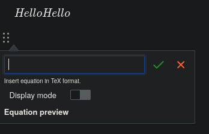

# ckeditor5-math
<figure class="image image-style-align-right"><figcaption><code>ckeditor5-math</code> 实际运行效果。</figcaption></figure>

这是 [isaul32/ckeditor5-math](https://github.com/isaul32/ckeditor5-math) 的一个分支，该插件为 CKEditor5 添加了数学公式功能。我们维护自己的版本是为了能在最新版本的 CKEditor 上使用它，并附带一些自定义的改进。

## 开发环境

*   已在 Node.js 20 上测试。
*   包管理器为 yarn 1（在撰写本文时，已知 v1.22.22 版本可正常工作）。

重要命令：

*   检查代码是否存在格式问题：`yarn lint`
*   启动实时预览：`yarn start`
*   运行测试：`yarn test`
    *   注意，这需要 Chromium，在 NixOS 上可以通过运行 `nix-shell -p chromium` 来实现，并在其中运行 `CHROME_BIN=$(which chromium) yarn test`。