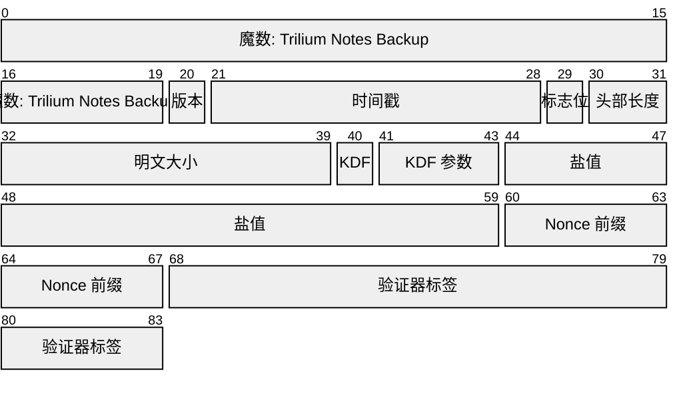
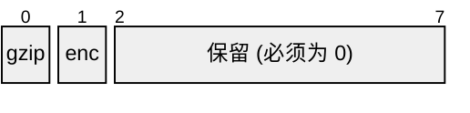
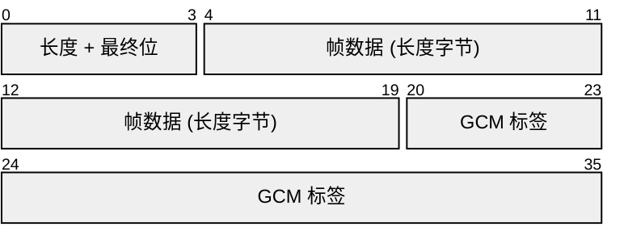
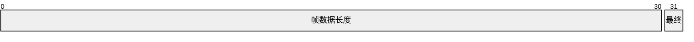

# Trilium 备份容器 (.tnbackup) 文件格式

容器恰好封装一个 SQLite 数据库文件，可选 gzip 压缩和可选的 AES-256-GCM 认证加密。容器命名为 `.tnbackup`。

**每个容器都是单次正向写入完成的。** 容器中的任何内容都不会在之后被修补，因此无法写回的存储目标（例如正在下载给用户的文件）也能像普通文件一样轻松保存此格式。这就是为什么负载摘要放在文件末尾而不是头部，也是为什么即使是最简单的容器（既不压缩也不加密）也有一个哈希值来保障其内容。

备份是否采用容器格式是策略问题，而非格式问题：当既不需要压缩也不需要加密时，写入方可以跳过容器格式，直接复制纯 `.db` 文件。

**负载** 是头部之后的所有内容：被封装的数据，采用标志位选择的四种形式之一。除非另有说明，所有整数均为小端序。所有偏移量均为从文件开头算起的绝对字节偏移量。

规范性引用：gzip 为 RFC 1952，AES-256-GCM 为 NIST SP 800-38D，scrypt 为 RFC 7914，SQLite 文件头为 SQLite 文件格式规范第 1.3 节。

### 头部布局

单元格为字节，每行 16 个。图示展示了一个加密容器。在未加密的容器中，从 `KDF` 到 `验证器标签` 的字段不存在，因此头部为 40 字节，负载从那里开始。



**验证器标签始终是头部的最后一个字段**。它是在密钥生成后写入的，因此不包含在其认证的范围内。后续版本添加的任何字段都位于它之前，因此会被认证，如同时间戳一样。

### 固定头部

始终存在。

| 偏移量 | 大小 | 字段 | 值 |
| --- | --- | --- | --- |
| 0 | 20 | 魔数 | ASCII `Trilium Notes Backup` |
| 20 | 1 | 版本 | `1`。版本 `0` 永远无效 |
| 21 | 8 | 时间戳 | 备份时间，Unix 纪元以来的毫秒数。未记录时为 `0` |
| 29 | 1 | 标志位 | 位 0：gzip 压缩。位 1：加密。位 2 至 7 保留，必须为 0 |
| 30 | 2 | 头部长度 | 头部总大小（字节），即负载开始的偏移量 |
| 32 | 8 | 明文大小 | 封装数据库的大小（字节），压缩前。未知时为 `0`。这是一个提示；尾部会权威地说明它 |

标志位字节，单元格为位：



`明文大小` 是一个提示，绝非指令。在未加密的容器中它不受认证，在加密容器中，只有在验证器标签检查通过后才能确认。读取方不得根据它进行内存分配，也不得让它扩大任何边界。当容器已加密但未压缩时，它等于总负载明文长度；压缩时，负载按压缩率缩短，因此任何持有文件的人都能得知压缩率。这种信息泄露是为了实现恢复进度报告和最终长度检查而接受的权衡。

### 尾部

每个容器的最后 40 字节，也是唯一必须在负载完成后才能写入的部分。

| 距文件末尾的偏移量 | 大小 | 字段 | 值 |
| --- | --- | --- | --- |
| \-40 | 32 | 负载摘要 | 对负载按存储原样进行 SHA-256 哈希，即字节 `[headerLength, EOF - 40)` |
| \-8 | 8 | 明文大小 | 写入时计数的明文长度 |

因此，**负载** 从 `headerLength` 延伸到 `EOF - 40`，而不是到文件末尾。

将两者放在末尾是使格式可前向写入的原因，而前向可写性使摘要成为无条件要求。头部中的摘要必须在负载已知后修补进去，这是下载或套接字无法做到的；放在末尾则只是接下来要写入的内容。因此每个容器都携带一个摘要，包括没有任何其他保障的未压缩未加密容器。

#### 负载摘要

它摘要的是**存储时**的负载，而非明文。在加密容器中，这意味着它覆盖密文，因此不会泄露持有文件本身不会泄露的任何信息，并且任何审计备份目录的人都可以检查它。

这是一个损坏检查，而非真实性检查。它位于头部认证的所有内容之外，因此能够重写文件攻击者也能随之重写摘要。篡改由加密容器中的 GCM 捕获；摘要的存在是为了捕获位衰减、截断副本和传输损坏。

其在失败路径上的实际用途：当验证器标签不匹配时，读取方随后发现摘要**完好**，则知道文件未损坏，密码短语确实错误。

#### 明文大小

这是权威值，是在负载经过时计数而非预先承诺的。头部自身的 `明文大小` 是预先需要知道的信息的提示，如 `Content-Length` 或进度条；而这是输出实际需要满足的。读取方拒绝与此不完全相等的输出，并拒绝非零且与此不一致的头部提示。

#### 定位尾部

格式的两端都不需要寻址。

*   **加密。** 帧是自定界的，且其中一帧带有最终标志，因此尾部就是最后一帧之后的 40 字节，文件末尾必须紧随其后。
*   **未加密。** 没有信息宣告负载在哪里停止，因此读取方在数据经过时保留最后 40 字节，当输入结束时仍持有的内容即为尾部。

太短而无法容纳尾部的文件被视为截断，并如此报告。

### 派生长度

**未压缩** 的容器长度由其头部固定，因为其中没有任何内容随内容变化：

```
未加密: 40 + 明文大小 + 40
加密:   84 + 明文大小 + (floor(明文大小 / 1048576) + 1) * 20 + 40
```

加密形式增加了每个帧的 4 字节长度字段和 16 字节标签，包括负载恰好是帧大小的整数倍时仍会携带的空最终帧。两种形式都增加了尾部。

由此产生两点。写入方在写入任何内容之前就知道确切的字节数，这使下载能够声明 `Content-Length`，浏览器能够绘制进度条。读取方可以仅从头部将该数字与实际文件大小进行比较，并在花费一分钟解密已到达的部分之前拒绝过短的文件。

压缩打破了这一点：负载比明文短，压缩率在头部中未说明，因此压缩容器没有可预测的长度，不能以这种方式衡量。

### 头部长度

在版本 1 中，头部长度由标志位固定，读取方必须要求相等而不是最小值：

| 标志位 | 头部长度 |
| --- | --- |
| 位 1 清除 | 恰好 40 |
| 位 1 设置 | 恰好 84 |

追加字段的版本会提高版本字节，因此较旧的读取方会在头部长度成为问题之前就在版本检查时拒绝该文件。在所有版本中，有两个限制成立：

*   超过读取方配置的最大值（4096 是合理的默认值）的头部长度，在任何内存分配或寻址之前就被拒绝。
*   超出文件末尾的头部长度被拒绝。读取方绝不能仅凭未经验证的字段就寻址超过 EOF。

### 识别容器

容器是什么，它以明文形式声明。版本、时间戳、两个标志位和明文大小都位于前 40 个字节中，且均未加密，因此读取方可以区分压缩备份和加密备份，并确定其日期和大小，**无需密码短语，也无需接触负载**。列出一个备份目录只需每个文件 40 字节，无论文件多大。

仅执行此操作的读取方仍应用与其他读取方相同的检查：魔数、版本和保留标志位。无法理解的内容应报告为无法识别的文件，而不是失败，这样单个损坏的容器不会使整个列表失效。

### 加密头部

仅当标志位 1 设置时存在。

| 偏移量 | 大小 | 字段 | 值 |
| --- | --- | --- | --- |
| 40 | 1 | KDF id | `1` = scrypt。`2` 保留给 Argon2id。其他值保留 |
| 41 | 3 | KDF 参数 | 三个字节，其含义由 `KDF id` 定义 |
| 44 | 16 | 盐值 | 随机，每个文件新生成 |
| 60 | 8 | Nonce 前缀 | 随机，每个文件新生成 |
| 68 | 16 | 验证器标签 | 对空明文进行 AES-256-GCM 标签计算 |

#### KDF 参数

三个参数字节按算法解释，因此未来的 KDF 不会被强制采用 scrypt 的形式：

| KDF id | 字节 41 | 字节 42 | 字节 43 |
| --- | --- | --- | --- |
| `1` scrypt | log2(N) | r | p |
| `2` 及以上 | 在分配 id 时定义 |  |  |

```
key = scrypt(NFC(密码短语) 作为 UTF-8, 盐值, 32 字节, { N: 1 << log2N, r, p })
```

密码短语是用户的备份密码短语，不是 Trilium 登录密码。

**密码短语编码是格式的一部分**：密码短语在进入 KDF 之前被规范化为 Unicode NFC 并编码为 UTF-8。JavaScript 和 Node 都不会隐式规范化，因此实现必须显式调用 `String.prototype.normalize("NFC")`。否则，在一台机器上输入带有组合 `é` 的相同密码短语，在另一台机器上输入分解形式，会派生不同的密钥，用户会被告知密码短语错误。

盐值每个文件都是新的，因此密钥每个文件都是新的，因此 nonce 在密钥下永远不会重复。

新文件的推荐参数：log2(N) = 17，r = 8，p = 1。读取方必须遵守文件中存储的参数，而不是自己的默认值，在以下边界内。

#### 参数边界

容器是不可信的输入，KDF 参数是资源耗尽向量：`log2(N) = 30` 在读取单个帧之前就要求读取方使用超过 128 GiB 的内存。读取方必须拒绝以下情况，视为不支持的容器：

*   scrypt 超出 `10 <= log2(N) <= 20`，`1 <= r <= 16`，`1 <= p <= 8`。
*   任何派生成本（scrypt 为 `128 * N * r` 字节）超过读取方配置的内存上限的参数集。

上限是真正保护读取方的因素，必须在尝试派生之前应用，而不是事后捕获。

> 运行时也可能施加自己的上限，低于这些边界。Node 的 `crypto.scrypt` 默认 `maxmem` 为 32 MiB，低于推荐参数所需，因此实现必须显式提高它，否则每次派生都会失败。该限制属于平台，而非格式：使用某个读取方拒绝的参数编写的容器仍然是有效容器。

### 负载

| 标志位 | 负载 |
| --- | --- |
| 均未设置 | 原始数据库字节，位于头部和尾部之间 |
| 仅压缩 | 单个 RFC 1952 gzip 流 |
| 加密 | 帧序列 |
| 两者 | 明文为 RFC 1952 gzip 流的帧序列 |

压缩在加密之前应用。

写入方必须生成 MTIME 为 0、无 FNAME 和 FEXTRA、OS 字节为 255 的 gzip 流。否则 gzip 头部会携带时间戳、可能的源路径以及写入它的操作系统家族，在负载中重新引入此格式有意排除在自身头部之外的元数据。

OS 字节通常需要事后设置。基于 zlib 的写入方会在那里输出其构建平台的代码——Unix 为 3，Windows 为 10——并且通常无法选择，因此写入方必须在 gzip 流经过时覆盖第 9 字节。这是安全的：该字节仅提供信息，gzip 头部位于 CRC32 之外，CRC32 仅覆盖未压缩数据。MTIME 和不存在的 FNAME/FEXTRA 通常不需要处理，因为它们已经是 zlib 的默认值。

### 认证头部

一个跨度，验证器标签和每个帧都使用：

```
认证头部 = 头部字节 [0, 验证器标签偏移量)      // 版本 1 中为 [0, 68)
```

它在验证器标签之前停止，因为标签是在密钥生成后写入的，不能覆盖自身。它之前的所有内容都被覆盖，包括时间戳。尾部也在其外部，因为它是在负载之后写入的，这没有代价：其摘要是 GCM 已经取代的篡改检查的损坏检查。

帧排除标签这一点很重要。如果帧的 AAD 覆盖验证器标签，那么该标签中的单个翻转位将破坏文件中的每个帧，下面的恢复将不可能实现。

### 验证器标签

```
nonce     = nonce前缀 || uint32LE(0xFFFFFFFF)
aad       = 认证头部
明文      = 空
标签      = 16 字节，存储在验证器标签偏移量处
```

### 帧

```
帧 := 长度 (4 字节, LE) || 数据 (长度字节) || 标签 (16 字节)
```

单元格为字节。数据单元格绘制得较短：它是 `长度` 字节，通常为 1 MiB。



长度字段，单元格为位：



| 字段 | 含义 |
| --- | --- |
| `长度` 位 0 至 30 | 帧数据长度（字节）。GCM 保持长度不变，因此这既是密文长度也是明文长度 |
| `长度` 位 31 | 最终帧标志 |
| `标签` | 此帧的 AES-256-GCM 标签 |

帧按文件顺序从 0 开始编号。对于帧 `i`：

```
nonce_i = nonce前缀 (8 字节) || uint32LE(i)
aad_i   = 认证头部 || 此帧的 4 字节长度字段
```

由于计数器在 nonce 中，长度字段在 AAD 中，每个帧都对其位置和长度进行认证。重排、复制、调整大小或拼接帧都会导致验证失败。

计数器 `0xFFFFFFFF` 保留给验证器，帧绝不能使用。

#### 分帧是规范的

一个负载恰好只有一种有效的分帧方式：

*   最终帧之前的每个帧恰好携带 1048576 字节。
*   恰好一个帧设置了最终标志，并且它是文件中的最后一帧。
*   最终帧携带 1 到 1048576 字节，但当负载长度为 0 或 1048576 的精确倍数时，它携带 0 字节。
*   文件末尾紧随最终帧之后。尾随字节使容器无效。

这仅约束分帧。封装相同数据库的两个容器不是字节相同的：盐值和 nonce 前缀每个文件都是随机的，gzip 输出随编码器版本和级别而变化。

空最终帧使写入方能够单次流式写入：帧在填满时密封，刷新时密封剩余内容，因此写入方永远不必知道是否还有更多数据到来。

想要不同帧大小的后续版本必须在头部中声明，而不能静默更改。

#### 大小限制

可用的帧计数器从 0 到 `0xFFFFFFFE`，即 4294967295 帧。每帧 1 MiB，最大可表示负载略低于 4 PiB。写入方必须拒绝需要超过此帧数的负载，而不是回绕计数器，这会在文件的密钥下重复 nonce。

### 写入方要求

*   从 CSPRNG 填充盐值和 nonce 前缀，每个文件独立生成。
*   在派生密钥之前，将密码短语规范化为 NFC 并编码为 UTF-8。
*   将 `明文大小` 设置为源数据库的大小，如果未知则设置为 `0`。
*   将保留标志位设置为 0。
*   按计数器顺序发出帧，无间隙，按上述规范分帧，并在帧计数器限制处停止，而不是回绕。
*   恰好发出一个最终帧，作为文件的最后字节。
*   在流式传输时计算负载摘要，并将其与经过时计数的明文长度一起作为尾部写入。绝不寻址：所有内容按顺序只写一次。
*   在输入处、压缩或分帧之前计数尾部的明文，以便记录数据库自身的长度，而不是负载变成的长度。

其余两条适用于目标是文件的情况。流式传输到其他目标（下载或套接字）的写入方没有可原子化的重命名，其输出在写入方控制的任何意义上都不是持久的。

*   在重命名之前刷新并 `fsync` 文件，并在 POSIX 上重命名后 `fsync` 包含目录。重命名提供原子性，而非持久性；没有刷新，崩溃可能会在最终名称下留下一个零长度文件，这比没有备份更糟糕，因为它看起来像一个备份。
*   写入目标目录中唯一命名的临时文件，并在成功时重命名，这样部分文件永远不会带有最终名称，两个写入方也不能共享临时文件。最终名称仍然是一个冲突点，因此写入方必须由调用方串行化。

### 读取方要求

*   除非前 20 个字节与魔数匹配，否则拒绝该文件。
*   拒绝版本 `0`，并拒绝高于读取方自身版本的版本。
*   拒绝任何已设置的保留标志位。
*   拒绝不是此版本和这些标志所要求的精确值、超过配置的最大值或超出文件末尾的头部长度。
*   加密时，拒绝未知的 KDF id，拒绝超出范围的 KDF 参数，然后在读取任何帧之前检查验证器标签。
*   拒绝声称长度超过 1048576 的帧，**在**读取其数据之前。长度字段最多可以声称 2 GiB，信任它的读取方会在标签检查失败之前缓冲那么多数据。
*   拒绝长度不是 1048576 的非最终帧。
*   在发出任何明文之前验证每个帧的标签。
*   拒绝最终帧之后的任何帧，以及其后的任何尾随字节。
*   拒绝前面没有最终帧的文件末尾。
*   在尾部停止负载，而不是在文件末尾：加密时在最终帧之后，未加密时通过保留最后 40 字节。
*   验证读取字节上的负载摘要，并拒绝不匹配。每个容器都有一个。
*   拒绝长度与尾部的 `明文大小` 不一致的输出，并拒绝非零且与尾部不一致的头部 `明文大小`。
*   绝不根据 `明文大小` 分配内存。流式传输输出并在最后比较长度。
*   拒绝没有空间容纳尾部的文件，以及其后的任何字节。
*   对于未压缩的容器，其总长度由头部派生，因此短于此长度的文件不完整，可以在读取任何内容之前被拒绝。
*   对解压缩**始终**应用配置的输出上限，并在多余字节到达磁盘之前中止。非零的 `明文大小` 只能收紧该界限，绝不能放宽：该字段在未加密容器中不受认证，否则精心构造的值会完全禁用上限。
*   让 AEAD 实现验证标签。在显式比较标签的地方，比较必须是恒定时间的。
*   检查输出的 SQLite 头部，如下所述。

#### SQLite 头部检查

成本低，并且能捕获封装了数据库以外内容的容器：

*   字节 0 到 15 是魔数 `SQLite format 3\0`，十六进制 `53514c69746520666f726d6174203300`。
*   字节 16 到 17 是页面大小，一个**大端序** `uint16`。它必须是 512 到 32768 之间的 2 的幂，或者是值 `1`，它编码 65536 的页面大小。简单的 `<= 65536` 界限会错误地拒绝 64 KiB 页面的数据库，因为 65536 不适合该字段。

#### 拒绝条件

| 条件 | 报告为 |
| --- | --- |
| 魔数不匹配 | 不是 Trilium 备份容器 |
| 版本 `0` | 不是有效的容器 |
| 版本高于读取方的 | 由较新的 Trilium 编写 |
| 保留标志位已设置、未知的 KDF id 或超出范围的 KDF 参数 | 不支持的容器 |
| 头部长度错误、过大或超出 EOF | 不是有效的容器 |
| 验证器标签不匹配 | 备份密码短语错误，或头部损坏 |
| 帧标签不匹配 | 在字节偏移量 N 处损坏 |
| 帧长度超出范围 | 在字节偏移量 N 处损坏 |
| 尾部之后有数据 | 损坏 |
| 文件末尾没有最终帧 | 不完整或截断 |
| 负载摘要不匹配 | 损坏 |
| 文件太短，无法容纳尾部 | 不完整或截断 |
| 文件短于未压缩容器的派生长度 | 不完整或截断 |
| 输出长度与尾部的 `明文大小` 不一致 | 不完整或截断 |
| 头部 `明文大小` 与尾部的不一致 | 损坏 |
| 输出未通过 SQLite 头部检查 | 损坏 |

仅验证器不匹配无法区分密码短语错误和盐值、nonce 前缀或标签中的位翻转。头部布局提供了两种恢复方法：

*   检查负载摘要。完好意味着密码短语确实错误。
*   跳过验证器并尝试帧 0。当损坏仅限于验证器标签时，这会成功，因为标签位于认证头部之外。

### 版本历史

| 版本 | 变更 |
| --- | --- |
| 1 | 初始格式 |

该格式在发布前经过重新设计，版本字节有意保持在 1：旧布局编写的容器在开发之外不存在，因此没有需要保持兼容的内容。两种布局在任何情况下都可以通过头部长度区分，64 或 108 对比 40 或 84，以防万一需要区分它们。

扩展规则：

*   字段只能追加，在验证器标签和负载摘要之前，并且追加时版本字节会提高。`头部长度` 无需解析字段即可定位负载，认证头部自动覆盖追加的字段。
*   保留标志位可以被赋予含义而无需提高版本，因为较旧的读取方已经拒绝它们不认识的位。对于不改变布局的任何内容，优先使用标志而不是版本升级：它使每个未受影响的文件都能被每个现有读取方读取。
*   改变读取方必须验证内容的标志必须说明什么替代了它移除的检查，并且替代品必须是强制性的而非建议性的。最好不要有这样的标志：每个容器都携带的检查比允许某些容器跳过它的标志更有价值。
*   只有在负载写入后才能知道的字段属于尾部，绝不属于头部，这样写入方永远不必寻址，每个目标都能保存该格式。
*   版本 `0` 永远无效，因为它是零填充或截断文件产生的结果。
*   认证头部逐字包含在每个帧的 AAD 中，在版本 1 中是 68 字节，因此是免费的。将其增长到数千字节的版本应将帧 AAD 切换为其摘要，以便每帧认证保持恒定成本。