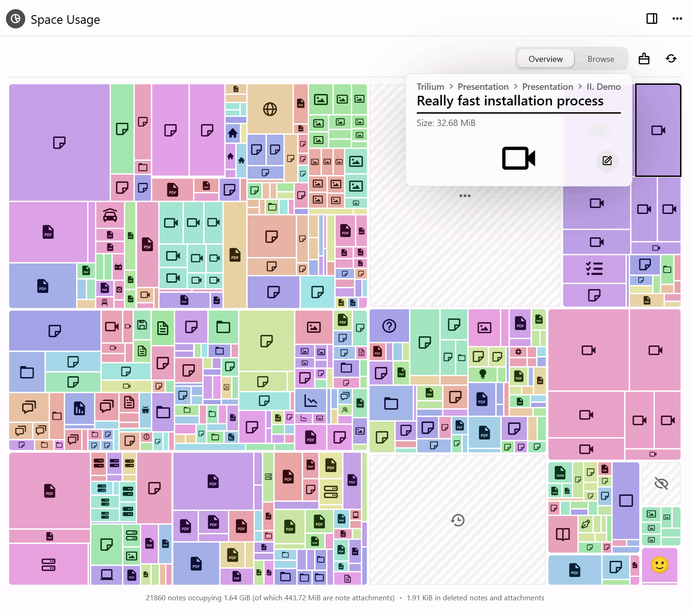
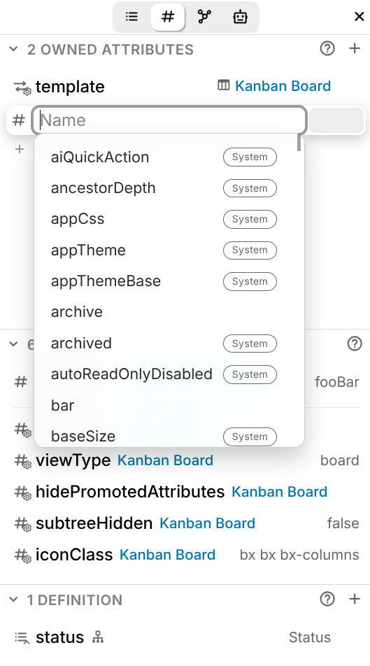
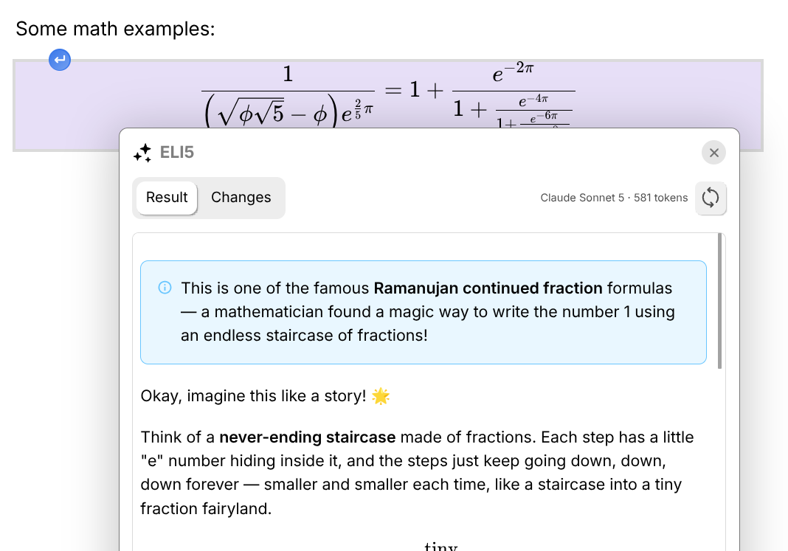

# v0.105.0

> [!IMPORTANT]
> 如果您喜欢这个版本，请考虑通过以下方式表示赞赏：
> 
> *   在 [GitHub](https://github.com/TriliumNext/Trilium) 上按下“Star”按钮（右上角）。
> *   考虑通过 [GitHub Sponsors](https://github.com/sponsors/eliandoran) 或 [PayPal](https://paypal.me/eliandoran) 向[首席开发者](https://github.com/eliandoran)进行一次性或定期捐赠。

_这个版本让 Trilium 更轻量、更直观、更易于整理：图片会自动压缩，属性有了自己的专属位置，而且你的备份终于可以恢复了。_

    
🚨 对于 ARM64 Docker 用户

    
<code spellcheck="false">arm64</code> 镜像现在基于 Debian 13 "trixie"，因为 Debian 11 将于 2026-08-31 终止支持。你的宿主机需要足够新的 <code spellcheck="false">libseccomp</code> 以支持 <code spellcheck="false">clone3</code> 系统调用（大约 2.5+ 版本），否则容器将无法启动。如果无法启动，请添加：

    <pre><code class="language-text-x-yaml">services:
  trilium:
    security_opt:
      - seccomp:unconfined</code></pre>
    
更新 Docker 本身没有帮助，因为 <code spellcheck="false">runc</code> 链接的是宿主机的 <code spellcheck="false">libseccomp</code>。32 位的 <code spellcheck="false">linux/arm/v7</code> 和 <code spellcheck="false">linux/arm/v8</code> 镜像以及原生 ARM 构建不受影响。

> [!WARNING]
> **升级前请注意。** 此版本包含可能破坏现有设置的更改。
> 
> 1.  **MCP 现在需要身份验证**，并且可以选择通过网络访问。→ _请为现有的 MCP 客户端重新配置凭据。_
> 2.  **文本笔记中的通用 HTML 支持现在默认禁用。** 这使得从网站复制粘贴时表现良好，不会抓取不需要的标签，例如输入框。→ _可通过 选项 → 文本笔记 → 保留不支持的 HTML 标签 重新启用。_
> 3.  **文本笔记中的 `
` 现在会被展开**，而不是原样保留，无论设置如何。这可以防止输入新段落时出现行为异常，以及诸如无法退出代码块之类的错误。

## ✨ 主要亮点

#### 了解你的数据库内容——并找回空间

<figure class="image image-style-align-right image_resized" style="width:45.59%;"></figure>

两个新工具从相反的方向回答了同一个问题：究竟是什么占用了所有空间？

*   **空间使用情况** 将其绘制为矩形树图——笔记、修订版和附件按占用空间大小排列——因此，悄悄占用磁盘空间的东西可以一目了然，而不是靠猜测。**清理工具** 随后可对您发现的内容进行操作：清除已删除的笔记、修剪旧的修订版、删除未使用的附件并压缩数据库。
*   **压缩图片** 针对常见的罪魁祸首，调整过大图片的尺寸并重新保存为更小的文件——可从笔记、树、附件列表、图片查看器或清理运行中操作。它会在开始前告诉您发现了什么，并在完成后告诉您节省了多少空间。

上传、粘贴和导入时的自动压缩现在会将 PNG 保留为 PNG 格式，不处理已压缩的图片，并在服务应用的线程之外运行，因此大型导入不再会冻结 Trilium。 _(@adoriandoran)_

### 属性终于有了自己的位置

<figure class="image image-style-align-left image_resized" style="width:19.59%;"></figure>

一个专用的 **属性** 侧边栏标签页在一个清晰的列表中显示拥有的、继承的和提升的属性，并允许您就地编辑它们。系统属性在侧边栏中用图标标记，在自动补全中带有徽章，并且每个属性现在都有描述。它们的值使用合适的控件进行编辑——颜色选择器、URL 字段、日期选择器。

移动端获得了具有相同界面的属性编辑器，经典的属性编辑器及其配置模态框也进行了一轮修复。

### 可锁定且可真正恢复的备份

备份现在可以 **压缩和加密**。加密使用 AES-256-GCM，密码由您自己设定，并保存在操作系统的密钥环中，因此写入同步或共享文件夹的备份无法被其他能访问该文件夹的人读取——并且可以检测到后续的篡改或损坏。两者默认均为关闭状态。

更重要的是，Trilium 现在可以 **恢复** 备份。设置实例时，除了新建知识库、从服务器同步和与桌面应用配对之外，还提供了从备份恢复作为第四条路径；正在运行的实例可以通过 选项 → 备份 到达同一屏幕，并首先提供现有内容的副本。在替换任何内容之前会检查候选备份，并且失败的恢复会回滚——因此，一个不可用的备份会让您的笔记保持原样。以 GB 为单位的备份也能正确处理：浏览器以可恢复的分片发送备份，桌面应用则直接读取其所在位置的备份。 _(@adoriandoran)_

### 查看数据库运行的所有内容

数据库多年来积累了脚本、主题和小组件，到目前为止，没有一个单一的地方可以查看它们——或者判断是哪一个导致了您一直遇到的奇怪行为。

**内容管理器** 按类别列出所有内容，并允许您在不删除的情况下关闭其中任何一个。关闭某个内容，看看问题是否消失，然后再重新打开。 _(@adoriandoran)_

### 让编辑器来代笔

<figure class="image image_resized image-style-align-right" style="width:61.67%;"></figure>

Trilium 的大语言模型支持已从聊天面板移入文本编辑器。选择任何内容并将其交给模型——校对、精简、总结——并直接内联获取结果，无需将文本复制到聊天窗口再复制回来。自定义提示词让您可以保留经常执行的操作。需要配置一个 LLM 提供商；GitHub Copilot 订阅现在可以作为提供商使用，与现有的提供商并列。

### 可搜索的设置，适配屏幕的界面

每个设置页面都已基于共享的卡片组件重建——每个主题一张卡片，每行一个设置，其说明位于名称下方而不是旁边——并且 **搜索字段** 现在可以同时搜索所有设置。它显示设置本身，实时且可在原地操作，并按所属页面分组，同时也能找到页面自身的命令：立即备份、恢复备份、创建 ETAPI 令牌。 _(@adoriandoran)_

## 🎁 其他新增功能

*   **基于 MapLibre 的地理地图** — WebGL 渲染、3D 地形、标记聚类、全屏模式以及每个标记的浮动信息面板，并完整支持 GPX 轨迹。
*   **思维导图节点面板** — 通过侧面板调整颜色、字体、图标、图片和富文本备注。
*   **日历界面升级** — 新的主题和布局，以及更友好的创建和编辑事件弹窗。
*   **连接侧边栏标签页** — 反链、笔记路径和笔记地图集中在一处。
*   **Office 和 EPUB 预览** — `.docx`、`.xlsx`、`.pptx`、ODF、RTF 和 EPUB 文件可在 Trilium 中打开。
*   修复了一个累积组件和事件监听器的重要内存泄漏问题，一致性检查在拥有 2 万+ 笔记的数据库上不再需要花费数分钟。

## 📋 其他变更

    
备份

    <ul>
        <li><em>新增：</em>备份可以 **压缩**、**加密** 或两者兼有，并写入为 <code spellcheck="false">.tnbackup</code> 容器。密码保存在操作系统密钥环中，并且仅在桌面应用中提供，因为那里有安全的地方可以保存它。</li>
        <li><em>改进：</em>备份设置页面打开时会显示存在多少备份以及最近一次备份是多久前写入的，旁边是“立即备份”按钮。</li>
        <li><em>改进：</em>手动备份时可以为备份指定名称和密码，而不是遵循计划备份的设置。</li>
        <li><em>修复：</em>中途失败的备份会被删除，因此永远不会列出或提供下载半写入的文件。</li>
    </ul>

    
数据库与维护

    <ul>
        <li><em>新增：</em><strong>选项 → 数据库</strong> 现在是管理整个知识库的地方。它打开时会显示摘要——位置、笔记和附件数量、创建日期、大小以及备份状态——然后是所有作用于数据库的操作：清理、空间分析、完整性检查和修复、压缩以及匿名副本。</li>
        <li><em>新增：</em>一个 **清理工具**，用于清除已删除的笔记、未使用的附件和多余的修订快照，遵循 <code spellcheck="false">#versioningLimit</code>，并压缩数据库。</li>
        <li><em>新增：</em>一个 **保留已命名修订** 选项，因此您已命名的修订可以在清理后保留下来。</li>
        <li><em>新增：</em><strong>重新开始</strong> 将实例返回到设置向导，而无需重新安装。在服务器上，它会要求您输入密码，如果配置了第二因素，还会要求输入第二因素，因此从外部可访问的实例在等待时会保持关闭状态。</li>
        <li><em>改进：</em>匿名数据库副本在移交后可以被删除，并且存放它们的文件夹可以在文件管理器中打开。</li>
    </ul>

    
设置

    <ul>
        <li><em>新增：</em>一个 **搜索字段**，可同时搜索所有设置页面，显示按所属页面分组的实时控件。</li>
        <li><em>改进：</em>所有 18 个设置页面都基于共享的卡片组件重建，其中几个页面重新排列，以便页面的核心内容优先显示。</li>
        <li><em>改进：</em>设置可在手机上使用——堆叠的控件、原生点击选择的组合框、全宽描述和拇指大小的行。</li>
        <li><em>改进：</em>媒体页面将图片压缩功能整合到图片卡片中，而不是将其作为一个独立的主题。</li>
        <li><em>修复：</em>代码笔记 MIME 列表中的纯文本条目显示为未勾选，尽管它总是被应用。</li>
        <li><strong>数据库操作已移至 选项 → 数据库。</strong> 清理、空间分析、完整性检查、压缩和匿名副本不再位于 选项 → 高级 下，该页面现在仅包含实验性功能和两个高级同步操作。</li>
    </ul>

    
<strong>文本笔记与编辑器</strong>

    
<strong>改进</strong>

    <ul>
        <li>从高级 CKEditor 功能（商业许可证）迁移到自研的斜杠命令、文本片段和复制格式实现。更改文本片段不再需要刷新编辑器，笔记图标集成也更加原生。</li>
        <li>文本自动替换（引号、破折号）已重新设计，每个选项现在都可以单独配置。</li>
        <li>CKEditor 的自动补全机制（<code spellcheck="false">@</code>-引用链接、表情符号）已从头重写：它不再卡在 <code spellcheck="false">@</code> 字符上，按 Escape 键不再在文本中留下标记。属性编辑器在您点击其内部时不再显示自动补全。</li>
        <li>文本片段在没有描述时显示一个小型内容预览。</li>
        <li>Markdown 高亮（Obsidian 风格的 <code spellcheck="false">==</code>）在导入/导出管道和 Markdown 预览中得到支持，并出现在侧边栏中。</li>
        <li><a href="https://github.com/TriliumNext/Trilium/issues/7931">内联 Mermaid 图表会记住其显示模式</a>。</li>
    </ul>
    
<strong>修复</strong>

    <ul>
        <li>
            <a href="https://github.com/TriliumNext/Trilium/issues/9722">多个内联 Mermaid 图表不进行更改就无法渲染</a>
        </li>
        <li>
            <a href="https://github.com/TriliumNext/Trilium/issues/9749">调整 Mermaid 拆分视图大小会使甘特图和条形图消失</a>
            <em>(@maphew)</em>
        </li>
        <li>
            <a href="https://github.com/TriliumNext/Trilium/issues/10859">图片上传失败导致编辑器崩溃</a>
        </li>
        <li>
            <a href="https://github.com/TriliumNext/Trilium/issues/10683">在其之前删除内容时，可折叠块文本编辑器崩溃</a>
        </li>
        <li><a href="https://github.com/TriliumNext/Trilium/issues/11050">按一次退格键会删除可折叠块的整个内容</a>；可折叠块在删除其后文本的换行符时也会自动展开</li>
        <li>
            <a href="https://github.com/TriliumNext/Trilium/issues/11084">格式化文本被粘贴到可折叠块内部，而不是其标题中</a>
        </li>
        <li>
            <a href="https://github.com/TriliumNext/Trilium/issues/10973">复选框任务状态以不直观的方式影响子任务</a>
            <em>(@adoriandoran)</em>
        </li>
        <li>
            <a href="https://github.com/TriliumNext/Trilium/pull/11063">锚点引用链接插入发生在提及选择位置</a>
            <em>(@maphew)</em>
        </li>
        <li>
            <a href="https://github.com/TriliumNext/Trilium/issues/11077">点击带有链接文本的内联代码附近时 CKEditor 崩溃</a>
        </li>
        <li>
            <a href="https://github.com/TriliumNext/Trilium/issues/10903">弹出编辑器中的格式按钮与文本重叠</a>
        </li>
        <li><a href="https://github.com/TriliumNext/Trilium/issues/10949">复选框在 RTL 笔记中对齐不正确</a>；只读文本笔记也没有正确对齐</li>
        <li>缺失的笔记引用链接看起来不可见</li>
    </ul>
    <aside class="admonition warning">
<strong>“连续格式”已被移除</strong>，这是从高级 CKEditor 功能迁移的一部分。→ <em>如果您依赖此功能，请提交功能请求。</em>
</aside>

    
<strong>集合</strong>

    
<strong>表格</strong>

    <ul>
        <li><em>改进：</em><em>选择</em> 列支持单值和多值，并在选择时扩展到单元格外部；颜色列增加了删除按钮，时间列增加了时间选择器；表格末尾添加了“新行”按钮；多值列不再隐藏，并在单个单元格内将每个值显示为标签。</li>
        <li><em>修复：</em><a href="https://github.com/TriliumNext/Trilium/issues/10703">日期列以 ISO 格式渲染，而不是本地化格式</a>；按关系类型列排序不起作用；编辑单元格或创建行时丢失滚动位置。</li>
    </ul>
    
<strong>看板</strong>

    <ul>
        <li><em>修复：</em><a href="https://github.com/TriliumNext/Trilium/issues/10689">添加新列不会自动刷新列</a>；当看板项目很多时，在子笔记中打字会变慢。</li>
    </ul>
    
<strong>日历</strong>

    <ul>
        <li><em>修复：</em>全天重复事件显示为午夜；事件对继承的属性更改没有反应；在日志中创建事件导致事件闪烁；日历显示的属性未考虑别名；日期选择器未遵循中文区域设置的日期格式。</li>
    </ul>
    
<strong>地理地图</strong>

    <ul style="list-style-type:disc;margin-left:0px;">
        <li style="margin-left:0px;"><em>改进：</em>从 Leaflet 迁移到 <strong>MapLibre GL</strong> — WebGL 渲染、3D 地形、标记聚类和全屏模式。标记经过全面改进，具有全彩图标、自动标签防重叠、正确的 DPI 缩放以及可扩展到数千个的性能。添加了自定义瓦片集、尊重自定义主题的深色模式、悬停笔记提示、缩放按钮，并在 WebGL 不可用时给出清晰警告。</li>
        <li style="margin-left:0px;"><em>改进：</em>点击标记会打开一个 **浮动信息面板** — 标题、图标、颜色、操作按钮（打开、移动、快速编辑、移除）、带有坐标复制按钮的提升属性，以及作为内联富文本编辑器的笔记正文。此面板与思维导图共享。</li>
        <li style="margin-left:0px;"><em>改进：</em>完整的 **GPX 轨迹** 支持，包括距离、点和段计数、航点列表和可高亮路径。</li>
        <li style="margin-left:0px;"><em>修复：</em>添加标记时现在会显示幽灵预览；修复了几个标记定位错误。</li>
    </ul>
    
<strong>地理地图、思维导图与关系图</strong>

    <ul>
        <li><em>改进：</em>关系图、Mermaid 图表、地理地图和思维导图现在共享相同的缩放和添加笔记控件；地理地图的锁定按钮已被移除，取而代之的是用于笔记的标准只读机制。</li>
    </ul>

    
<strong>属性</strong>

    <ul>
        <li><em>新增：</em>提升属性类型 <em>电话</em>、<em>电子邮件</em> 和 <em>选择</em> — 后者显示固定项目列表，同时仍允许轻松创建新项目。所有这些都与 Notion 和 AnyType 导入器以及表格集合集成。</li>
        <li><em>改进：</em>具有多个值的提升属性渲染为带有徽章/标签的单个字段，而不是多个字段。</li>
        <li><em>修复：</em>当至少一个提升属性具有复选框时，提升属性部分显示了不必要的滚动条。</li>
    </ul>

    
<strong>附件、文件与 PDF</strong>

    
<strong>改进</strong>

    <ul>
        <li>附件中源代码的语法高亮。</li>
        <li>附件列表增加了分组机制（您的 vs. 系统）、网格布局和整体界面升级。</li>
        <li>链接预览现在使用去重后的附件，而不是内联图片，并调整了网站图标检索并更好地支持深色主题。Notion 导入器会自动下载网站图标。</li>
        <li><code spellcheck="false">.ico</code> 文件被视为图片而不是文件附件。</li>
        <li>PDF：没有选中文本的高亮和文本注释现在显示在侧边栏中。</li>
    </ul>
    
<strong>修复</strong>

    <ul>
        <li>
            <a href="https://github.com/TriliumNext/Trilium/issues/10707">链接预览在笔记修订版中不可见</a>
        </li>
        <li>
            <a href="https://github.com/TriliumNext/Trilium/issues/9879">在启用“阻止常见攻击”的 Nginx 代理管理器上，PDF 附件返回 404</a>
        </li>
        <li>
            <a href="https://github.com/TriliumNext/Trilium/issues/11059">进入 PDF 编辑模式即使没有可保存的内容也会触发保存</a>
        </li>
        <li>当两个 PDF 在拆分视图中打开时，PDF 侧边栏信息错误</li>
        <li>编辑时 PDF 注释未显示在侧边栏中</li>
    </ul>

    
<strong>图片与剪贴板</strong>

    <ul>
        <li><em>改进：</em>您现在可以 <a href="https://github.com/TriliumNext/Trilium/issues/5233">将 Trilium 中带有图片的文本粘贴到其他应用，图片不会消失</a>；从无法访问的来源（Google Chat、Slack）粘贴的单个图片可以正确粘贴，而不会显示为损坏。</li>
        <li><em>修复：</em><a href="https://github.com/TriliumNext/Trilium/issues/10823">上传图片后立即删除笔记会导致桌面应用崩溃</a>。</li>
    </ul>

    
<strong>LLM 与 MCP</strong>

    
<strong>改进</strong>

    <ul>
        <li>GitHub Copilot 订阅可用于 LLM 对话。</li>
        <li>一个新的 **编辑器内 LLM** 用于文本笔记，处理校对和总结等操作，并支持自定义提示词。</li>
        <li>重新设计的 LLM 对话栏，具有缩短的模型名称和更合适的消息页脚，改进的错误显示，更好的图标搜索，以及为 Claude Code 集成改进的模型列表。</li>
    </ul>
    
<strong>修复</strong>

    <ul>
        <li>
            <a href="https://github.com/TriliumNext/Trilium/issues/10781">当端点位于需要身份验证的反向代理后面时，AI 提供商设置失败并显示“Unexpected token '&lt;'”</a>
            <em>(@raman325)</em>
        </li>
        <li>
            <a href="https://github.com/TriliumNext/Trilium/issues/10996">自定义 OpenAPI 端点可能因自动发现而在 Web 应用防火墙后面失败</a>
        </li>
        <li>MCP 在某些情况下可能断开连接</li>
    </ul>

    
<strong>导入与导出</strong>

    <ul>
        <li>OneNote 导入：改进的错误日志和限流报告（包括长时间导入期间），刷新 OneNote 分区的按钮，改进的浅色/深色画笔检测，以及代码块检测。</li>
        <li>Notion 和 AnyType 导入器支持新的提升属性类型。</li>
    </ul>
    
<strong>Markdown</strong>

    <ul>
        <li><strong>不再支持单波浪线删除线</strong>，以避免与用于数字近似的 <code spellcheck="false">~</code> 冲突。→ <em>影响现有笔记和导入管道；请使用 </em><code spellcheck="false"><em>~~text~~</em></code><em>。</em></li>
        <li>高亮（<code spellcheck="false">==</code>）在导入/导出管道中得到端到端支持。</li>
    </ul>

    
<strong>桌面应用</strong>

    <ul>
        <li><em>新增：</em><a href="https://github.com/TriliumNext/Trilium/pull/10871">备份到您选择的文件夹</a>，而不是数据目录内的文件夹。选项 → 备份 增加了一个“备份位置”卡片，您可以在其中选择文件夹、在文件管理器中打开它或重置它。如果所选文件夹无法写入，备份将转到默认位置而不是丢失，并且您会收到通知。服务器不受影响，继续使用 <code spellcheck="false">TRILIUM_BACKUP_DIR</code>。 <em>(@adoriandoran)</em></li>
        <li><em>改进：</em>更好的错误管理——应用不应再因未处理的拒绝而崩溃；将带有拆分的标签页拖到新窗口时会保留拆分。</li>
        <li><em>修复：</em><a href="https://github.com/TriliumNext/Trilium/issues/10721">当应用已在运行时打印 <code spellcheck="false">undefined</code></a>；<a href="https://github.com/TriliumNext/Trilium/issues/10720">通过网络访问的桌面构建上“切换到移动版”不起作用</a>；<a href="https://github.com/TriliumNext/Trilium/issues/8912">macOS 动态红绿灯偏移基于缩放因子</a>；<a href="https://github.com/TriliumNext/Trilium/issues/9977">Windows 上自定义系统资源管理器的文件链接处理损坏</a>。</li>
        <li>更改：<strong>在 Linux 上，原生标题栏现在默认禁用</strong>，因为自定义框架支持圆角，并带有原生窗口按钮。</li>
        <li><em>新增：</em>数据库文件在 选项 → 数据库 中通过文件管理器显示，并且原生文件夹选择器支持备份位置 (@adoriandoran)</li>
    </ul>

    
<strong>移动端</strong>

    <ul>
        <li><em>新增：</em>一个属性编辑器，界面与新的侧边栏编辑器相同。</li>
        <li><em>修复：</em><a href="https://github.com/TriliumNext/Trilium/issues/10835">竖屏 → 横屏方向更改后启动栏消失</a>；树形滑动动画未遵循减少动画设置。</li>
        <li><em>新增：</em>整个设置界面为窄屏重新布局，页面列表上方有搜索字段 (@adoriandoran)</li>
    </ul>

    
<strong>界面与主题</strong>

    
<strong>改进</strong>

    <ul>
        <li>侧边栏现在分为标签页：大纲（目录 + 高亮）、新的属性面板、LLM 对话和自定义组件。</li>
        <li>大多数侧边栏部分都有一个专用的帮助按钮。</li>
        <li><a href="https://github.com/TriliumNext/Trilium/issues/5475">用于管理拆分的键盘快捷键</a>。</li>
        <li>树：使用 Ctrl+C 复制笔记引用现在在 Web 版本上也会粘贴为引用链接，而不仅仅是桌面版。</li>
    </ul>
    
<strong>修复</strong>

    <ul>
        <li>旧版主题：<a href="https://github.com/TriliumNext/Trilium/issues/10839">提示消息不渲染</a>、<a href="https://github.com/TriliumNext/Trilium/issues/8195">提升属性具有不同的布局</a>、<a href="https://github.com/TriliumNext/Trilium/issues/10903">块拖动图标与文本重叠</a></li>
        <li>
            <a href="https://github.com/TriliumNext/Trilium/issues/10938">设置中开关与窗口按钮重叠</a>
        </li>
        <li>
            <a href="https://github.com/TriliumNext/Trilium/issues/10680">图标工具提示卡在屏幕上</a>
            <em>(@maphew)</em>
        </li>
        <li>
            <a href="https://github.com/TriliumNext/Trilium/issues/10723">在不安全的上下文中复制浏览器书签导致崩溃</a>
        </li>
        <li>删除活动笔记时显示提示消息声称未找到该笔记</li>
        <li>更新指示器损坏</li>
        <li>笔记地图有时根本无法渲染</li>
    </ul>

    
<strong>脚本</strong>

    <ul>
        <li>
            <a href="https://github.com/TriliumNext/Trilium/pull/10526">更多用于脚本的 React 组件</a>
            <em>(@BeatLink)</em>
        </li>
        <li>某些启动器脚本现在被标记为危险，需要关闭安全导入。</li>
        <li><em>修复：</em><a href="https://github.com/TriliumNext/Trilium/issues/10765">渲染笔记将无作用域的 <code spellcheck="false">&lt;style&gt;</code> 注入应用 DOM，并且泄漏的样式在导航离开后仍然存在</a>。</li>
    </ul>

    
<strong>服务器、同步与身份验证</strong>

    <ul>
        <li><em>改进：</em><a href="https://github.com/TriliumNext/Trilium/pull/9635">OIDC 获得可配置的 HTTP 超时、会话生命周期和作用域</a> <em>(@perfectra1n)</em>。</li>
        <li><em>修复：</em><a href="https://github.com/TriliumNext/Trilium/issues/10695">由于缺少前导斜杠，OAuth 在 Authentik 上失败并显示 <code spellcheck="false">OAUTH_JSON_ATTRIBUTE_COMPARISON_FAILED</code></a>；OIDC 与某些身份提供商不兼容；部分同步导致偶发的前端错误；<a href="https://github.com/TriliumNext/Trilium/issues/10976">OCR 不适用于受保护的笔记</a>。</li>
    </ul>

    
<strong>性能与稳定性</strong>

    <ul>
        <li>修复了一个重要的内存泄漏问题，该问题由于组件清理不当而累积组件和事件监听器。</li>
        <li>一致性检查在大型数据库（2 万+ 笔记）上不再需要很长时间。</li>
        <li><a href="https://github.com/TriliumNext/Trilium/issues/10997">减少了右键单击树时发出的请求数量</a>。</li>
        <li>CKEditor 被预加载以加快加载速度。</li>
        <li>图片压缩现在在服务应用的线程之外运行。</li>
        <li><a href="https://github.com/TriliumNext/Trilium/issues/8314">剪刀“剪切并粘贴选区到子笔记”现在会转移图片附件</a>，并且<a href="https://github.com/TriliumNext/Trilium/issues/9890">不再间歇性失败</a>。</li>
    </ul>

    
安全

    <ul>
        <li>图片自动下载和 LLM 集成中的 SSRF 保护。</li>
        <li>MCP 现在需要身份验证（请参阅 <em>升级前请注意</em>）。</li>
        <li>Web 视图现在需要绝对 URL 才能显示。</li>
    </ul>

    
国际化

    <ul>
        <li>添加了韩语 <em>(@yoonnamhyuk)</em></li>
        <li>添加了土耳其语 <em>(@erkdgn)</em></li>
        <li>文本编辑器现在完全可翻译，包括 Trilium 特有的功能。</li>
    </ul>

    
文档

    <ul>
        <li>添加了 <code spellcheck="false">CONTRIBUTING.md</code> <em>(@maphew)</em></li>
    </ul>

