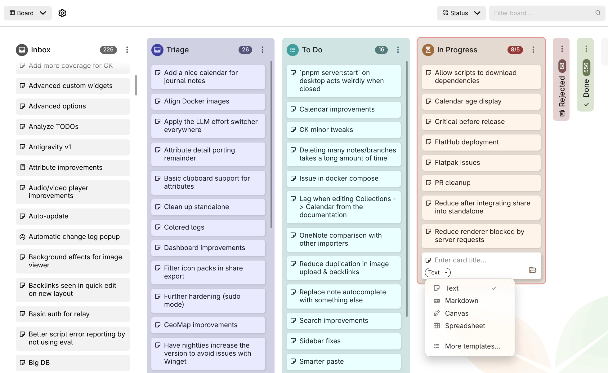

# v0.106.0
> [!NOTE]
> 如果你喜欢这个版本，可以考虑通过以下方式表达你的赞赏：
> 
> *   在 [GitHub](https://github.com/TriliumNext/Trilium) 上点击右上角的“Star”按钮。
> *   考虑通过 [GitHub Sponsors](https://github.com/sponsors/eliandoran) 或 [PayPal](https://paypal.me/eliandoran) 向[首席开发者](https://github.com/eliandoran)进行一次性或定期捐赠。

> [!TIP]
> **Linux 用户：** Trilium 现已在 [Flathub](https://flathub.org/en/apps/org.triliumnotes.Trilium) 上架！

> [!IMPORTANT]
> **Docker 用户：** 如果升级后 Docker 容器显示不健康，请在使用自动更新器的情况下重新创建容器，并检查 Docker compose 中是否有 `healthcheck` 覆盖配置。

## 💡 重点亮点

<figure class="image image-style-align-right image_resized" style="width:60.75%;"></figure>

### 📋 看板全面重构，由 @adoriandoran 贡献

看板已重建，以应对真实项目。为每一列设置图标、颜色或卡片数量限制，折叠你当前不处理的列，并在完成后将其归档。尚不属于任何列的新笔记会进入一个可选的 **收件箱** 列。卡片可以从模板创建（例如用于 bug 跟踪器的 _Bug_ 模板），**看板属性** 控制卡片显示哪些属性以及显示顺序。你还可以随时切换看板的分组属性，每个分组保留各自的列。

随着看板增长，可以按标题、日期或任意属性自动排序列，并通过标题栏中的过滤框缩小看板范围，该过滤框接受完整的搜索语法。使用 <kbd>Ctrl</kbd>/<kbd>Shift</kbd>+点击选择多张卡片，即可一起移动、编辑或删除。使用 **复制引用** 从任意笔记链接到某张卡片或某一列。整个看板都支持键盘操作（<kbd>Alt</kbd>+<kbd>F1</kbd> 列出快捷键）和移动端触控，包含数千张卡片的列现在也能保持流畅。

这标志着看板系列第二阶段的完成，更多功能即将推出。

### 🔎 搜索的重大改进

1.  **匹配改进，由 @perfectra1n 贡献**
    1.  标点感知的精确匹配：`=sync` 可以找到 `(sync)`、`sync,`、`"sync"`（#10616）
    2.  模糊容差现在随词条长度缩放（0/1/2 次编辑）；子字符串不再被视为拼写错误
    3.  `~*` 再次匹配片段；模糊回退扩展到笔记正文内容
    4.  链接预览和引用链接目标标题已被索引并可搜索
    5.  变音符号不仅用于匹配，也用于高亮时进行规范化
    6.  **排序：** 结果按匹配质量排序（精确短语 > 邻近 > 单词 > 前缀 > 子字符串 > 模糊），并设有上限，确保内容永远不会排在标题匹配之前。
2.  **结果视图，由 @perfectra1n 贡献**
    1.  Google 风格的摘要卡片，带有面包屑和匹配属性徽章（#5667、#6225）
    2.  始终可见的结果计数 + 同步的 10/20/50/100 每页数量选项
    3.  模糊匹配以独特的样式（橙色虚线）与精确匹配区分高亮；`%=` 正则表达式词条正确高亮（#5332）
3.  **跳转到匹配项，由 @perfectra1n 贡献：** 点击结果会在第一个匹配项处打开笔记，并预填查找栏；折叠的区块会自动展开（#3098、#10616）。跳转到笔记仍保持仅标题导航（不显示误导性的内容摘要）。
4.  通过优化搜索本身，以及遵循在自动补全中禁用模糊搜索的选项（该选项默认禁用但此前完全未生效），显著提升了跳转到笔记的速度。

### 🗺️ 地理地图现已内置位置搜索、当前位置指示器和形状

<figure class="image image-style-align-right image_resized" style="width:51.61%;"></figure>

地理地图新增了 **搜索栏**。当你输入时，它会查找地图上已有的标记、轨迹和形状。要搜索世界其他地方，选择提供该选项的行，它会请求 Nominatim；在你仍在输入时不会发送任何内容。结果按距离排序并优先显示屏幕上的内容，因此从你所在城镇搜索一家商店会找到附近的那家。城镇和区域会显示其轮廓，任何结果都可以通过 **添加为标记** 保留。你也可以粘贴坐标直接跳转到某个地点。

你现在还可以 **在地图上绘制**：路径、区域、矩形和圆形。每个形状都是一个笔记，因此它会采用笔记的颜色和图标，并在与标记相同的面板中打开。地图上显示的地点，如商店或海滩，也可以点击并添加为标记。在手机或平板上，新的 **定位** 按钮会显示你所在的位置，方便查看附近有什么。

### 📰 模板现在可以为新笔记定义默认父级

在模板笔记中添加 `~template:newNoteDefaultParent` 关系，将其指向其实例应存放的笔记（例如 _Person_ 模板指向 _People_）。当你从该模板创建笔记时（通过 **选择笔记类型**、`@` 补全、_创建并链接子笔记_ 或属性编辑器），且未明确选择位置，笔记会落在该默认父级下，而不是当前笔记下。自行选择路径始终优先，树中的 _插入子笔记_ / _在之后插入笔记_ 不受影响。

### ✨️ 其他改进…

*   LLM：新增对 Google Antigravity 的支持，也可使用免费方案。
*   应用程序现在有了正式的加载屏幕，而不是在一切加载完成前显示纯白背景。
*   OCR 现在正确支持图像（扫描）和基于矢量的 PDF。
*   [排序现在支持多条件](https://github.com/TriliumNext/Trilium/issues/6829)，由 @BeatLink 和 @eliandoran 贡献
*   搜索（完整搜索、快速搜索）现在具有语法高亮、自动补全、@-笔记插入。此外，搜索会检查错误并内联显示。完整搜索现在支持多行。
*   图标（与笔记图标一样）现在可以插入到文本笔记中。

## 🐞 错误修复

1.  [侧边栏按钮在较小尺寸下与标签按钮重叠](https://github.com/TriliumNext/Trilium/issues/11097)
2.  LLM
    1.  在 macOS 上通过 `npm` 安装时，Claude Code / Copilot 集成有时无法找到二进制文件。
    2.  中断来自 Claude Code 的流时显示错误。
3.  [Markdown 导入在按换行拆分时不会保留复选框](https://github.com/TriliumNext/Trilium/issues/11129)
4.  [Startup-metrics.log 文件出现在主目录中](https://github.com/TriliumNext/Trilium/issues/11165#issuecomment-5387721208)
5.  [macOS 应用图标在较小尺寸下渲染为彩色噪点](https://github.com/TriliumNext/Trilium/issues/11187)
6.  Notion 导入：[尽管 HTML 导出中存在创建日期，但某些笔记的创建日期未被保留](https://github.com/TriliumNext/Trilium/issues/11205)
7.  [自动只读模式渲染笔记内容的垂直间距与编辑模式略有不同](https://github.com/TriliumNext/Trilium/issues/11194)
8.  桌面端同步修复，由 @emxv 贡献
    1.  [不要在网络列表中显示回环地址](https://github.com/TriliumNext/Trilium/pull/11262)
    2.  [移动端布局问题](https://github.com/TriliumNext/Trilium/pull/11263)
9.  [自动浅色/深色主题切换在 Linux 上有时无法正确更新](https://github.com/TriliumNext/Trilium/issues/11267)
10.  [`/assets/vX` 无法正常工作。](https://github.com/TriliumNext/Trilium/issues/8613)
11.  搜索：[将 ~= 和 ~\* 词法分析为单一模糊匹配运算符](https://github.com/TriliumNext/Trilium/pull/9508)，由 @mrbeandev 贡献
12.  [页面内搜索（Ctrl+F）无法找到内联、卡片和内部链接中的文本](https://github.com/TriliumNext/Trilium/issues/11242)，由 @maphew 贡献
13.  [将笔记类型切换为 Markdown 再切回后，格式和属性消失](https://github.com/TriliumNext/Trilium/issues/11367)，由 @jmrplens 贡献
14.  [使用“新建笔记”启动栏项时日历被重新创建](https://github.com/TriliumNext/Trilium/issues/11034)（以及通过其他笔记创建机制）
15.  [搜索：引号内文本中的逗号处理不当](https://github.com/TriliumNext/Trilium/issues/11132)，由 @yzxcj797 贡献
16.  [自定义 LLM 提供商的 Base URL 不正确](https://github.com/TriliumNext/Trilium/issues/11323)
17.  [出现多个图标选择器窗口](https://github.com/TriliumNext/Trilium/issues/11163)，由 @maphew 贡献
18.  [当代码笔记的主题（深色/浅色）与全局外观主题不同时，子笔记预览的可读性下降](https://github.com/TriliumNext/Trilium/issues/11309)
19.  [待办/无序列表的两个折叠相关回车键错误](https://github.com/TriliumNext/Trilium/issues/11256)，由 @maphew 贡献
20.  [快速搜索未限制在提升的隐藏笔记中](https://github.com/TriliumNext/Trilium/issues/10803)
21.  [搜索在隐藏树中找到已加书签的笔记](https://github.com/TriliumNext/Trilium/issues/10021)
22.  移动端侧边栏未考虑分屏。
23.  当 end\_session\_endpoint 因 XHR/CORS 跨域时，OIDC 登出失败，由 @dajiaohuang 贡献
24.  Markdown 活动块指示器并非对所有块类型（例如警示框）正常工作。
25.  [在未编辑文本笔记时按 Ctrl+M 会最小化 Trilium](https://github.com/TriliumNext/Trilium/issues/9753)，由 @maphew 贡献
26.  [引用链接图标和文本之间缺少不间断空格](https://github.com/TriliumNext/Trilium/issues/11459)，由 @maphew 贡献
27.  [启动栏中已加书签的笔记图标：“在新标签页中打开笔记”总是在最末尾添加标签页](https://github.com/TriliumNext/Trilium/issues/11458)，由 @maphew 贡献
28.  [提升属性中的键盘导航——关系被跳过](https://github.com/TriliumNext/Trilium/issues/11447)，由 @maphew 贡献
29.  [在 Ctrl+L 后快速输入会导致搜索文本被添加到笔记中](https://github.com/TriliumNext/Trilium/issues/7996)，由 @maphew 贡献
30.  表格集合：[在新记录中按 Tab 切换到下一个表格视图字段时，原始字段获得焦点](https://github.com/TriliumNext/Trilium/issues/6474)
31.  [可折叠块中复选框消失/重新出现](https://github.com/TriliumNext/Trilium/issues/11544)
32.  [多值标签提升属性缺少自动补全](https://github.com/TriliumNext/Trilium/issues/11558)
33.  [Mermaid 错误（“矩阵不可逆”）](https://github.com/TriliumNext/Trilium/issues/11322)
34.  下拉菜单在被禁用时未关闭，由 @maphew 贡献
35.  [强制指定时 noteId 未经验证，导致笔记链接损坏](https://github.com/TriliumNext/Trilium/issues/8169)，由 @maphew 贡献
36.  [一些工具提示和上下文菜单故障](https://github.com/TriliumNext/Trilium/issues/10705)（部分修复），由 @maphew 贡献
37.  [shareAlias 链接在共享笔记中不可点击](https://github.com/TriliumNext/Trilium/issues/8942)，由 @maphew 贡献
38.  [属性 #shareExternalLink 无效](https://github.com/TriliumNext/Trilium/issues/8448)，由 @maphew 贡献
39.  “English RTL”语言会出现在初始设置中。
40.  [表格：# 列无法正确自动调整大小](https://github.com/TriliumNext/Trilium/issues/11590)
41.  [LLM：在空闲代理超时期间保持聊天 SSE 流活跃](https://github.com/TriliumNext/Trilium/pull/11628)，由 @ltomazetto 贡献
42.  [\--start-hidden / “启动时最小化到托盘”在启动时不会隐藏窗口（Linux，所有配置）](https://github.com/TriliumNext/Trilium/issues/10808)，由 @maphew 贡献
43.  [浏览器导航未正确处理笔记导航](https://github.com/TriliumNext/Trilium/pull/11545)，由 @maphew 贡献
44.  在大量同步后，已删除的笔记会显示为空笔记（无内容、无标题）
45.  右键点击某些链接会打开链接，而不是仅显示上下文菜单。
46.  [Windows 保留名称处理未考虑扩展名](https://github.com/TriliumNext/Trilium/pull/11626)，由 @sxh313 贡献
47.  [搜索不支持转义字符，如 &](https://github.com/TriliumNext/Trilium/pull/11625)，由 @shx313 贡献
48.  [画布：在桌面应用中插入图像和导出绘图失败](https://github.com/TriliumNext/Trilium/pull/11213)，由 @adoriandoran 贡献

## ✨ 改进

1.  Markdown 导入/导出：在转换为 HTML 及反向转换时，尽可能保留可折叠属性和格式。
2.  地理地图改进：
    1.  新标记现在遵循 `#titleTemplate`
    2.  GPX 轨迹有专用图标，导入时其名称不再携带扩展名。
    3.  矢量主题的自动浅色/深色模式
3.  Docker 健康检查脚本已改进，速度更快、CPU 占用更低。健康检查现在报告正确的状态，即使对于自签名证书也是如此。
4.  演示集合新增了几个主题。
5.  [Markdown：从预览中移除 `<style>` 标签。](https://github.com/TriliumNext/Trilium/pull/11210)
6.  桌面端：额外窗口（例如在新窗口中打开笔记）现在打开速度更快。
7.  分享：显示搜索结果时展示匹配的内容。
8.  [笔记自动补全（例如 @-提及）现在也提供在日记/收件箱中创建笔记，而不是作为子笔记。](https://github.com/TriliumNext/Trilium/issues/6817)
9.  [在目录中高亮活动标题](https://github.com/TriliumNext/Trilium/pull/9727)，由 @SiriusXT 和 @eliandoran 贡献
10.  [打印：使用笔记标题而不是通用的“Trilium Notes”](https://github.com/TriliumNext/Trilium/issues/11140)，由 @yzxcj797 和 @eliandoran 贡献
11.  [脚本现在可以返回多个小组件](https://github.com/TriliumNext/Trilium/pull/11120)，由 @BeatLink 贡献
12.  [删除笔记时保持树和笔记位置不变](https://github.com/TriliumNext/Trilium/pull/11409)，由 @perfectra1n 贡献
13.  改进了代码笔记的滚动性能
14.  [TOTP 现在强制验证码只能使用一次，并容忍时钟漂移](https://github.com/TriliumNext/Trilium/pull/11448)，由 @jmrplens 贡献
15.  文本笔记上下文菜单现在也适用于 Web 版本。
16.  [在快速搜索底部显示“完整搜索”](https://github.com/TriliumNext/Trilium/pull/11473)，由 @BeatLink 贡献
17.  API 日志现在也适用于移动端。
18.  上传图像的斜杠命令。
19.  [快速搜索现在可以使用方向键导航](https://github.com/TriliumNext/Trilium/pull/11474)，由 @BeatLink 和 @eliandoran 贡献
20.  笔记树中的拖放导入现在可以识别 Obsidian 库
21.  提升属性：多值关系现在有链接可快速导航到笔记。
22.  在代码笔记中禁用虚拟键盘自动补全。
23.  笔记类型选择器的键盘导航，由 @itsjakobx 和 @eliandoran 贡献
24.  [macOS 26 着色图标](https://github.com/TriliumNext/Trilium/pull/11487)，由 @anandghegde 贡献
25.  [斜杠命令：添加待办列表项](https://github.com/TriliumNext/Trilium/pull/11529)，由 @itsjakobx 贡献
26.  重做了 Mermaid 预览，具有更好的平移和缩放以及键盘交互。
27.  改进了批量删除笔记的性能，包括进度报告。
28.  同步按钮现在显示一个小进度条来指示同步进度。
29.  LLM：
    1.  检测 GitHub Copilot 垫片并正确报告。
    2.  更高效的 Claude Code 和 GitHub Copilot，减少了对话之间的时间和内存消耗。
30.  电子表格现在打印、导出和分享的效果与编辑器中一致，包括链接、旋转文本和边框，由 @adoriandoran 贡献
31.  图标现在在整个应用中正确垂直对齐，包括图标包，由 @adoriandoran 贡献
32.  插入日期/时间现在有多种格式，可通过下拉箭头和斜杠命令访问。
33.  ETAPI：在 `create-note` 和笔记补丁中接受 `utcDateModified`

## 🚨 破坏性变更

*   `cheerio` 已作为内置库被移除，因为应用程序本身未使用它，仅由第三方脚本使用。请参阅文档了解如何迁移。
*   服务器已迁移到 ESM，因此入口点已从 `main.cjs` 更改为 `main.mjs`。如果你使用正常的 `trilium.sh`，则没有影响，但如果你直接指向 `main.cjs`，则需要更改配置。
*   `#label=value` 现在是严格的全值相等，`#capital=Vienna` 不再匹配 `Vienna Austria`（#9422）。快速搜索保持“包含”语义。

## 🌍 国际化

## 📖 文档

## 🛠️ 技术更新

1.  通过清理一些依赖并优化现有依赖，将 Trilium 的磁盘占用减少了约 8 MB。
2.  服务器和桌面应用已迁移到 ESM，带来了更低的内存消耗和更快的启动速度。
3.  CI 加固，由 @Totara-thib 贡献
4.  添加替代的 Trillium 拼写以便发现，由 @maphew 贡献
5.  将 Linux 窗口类与启动器对齐，由 @dajiaohuang 和 @eliandoran 贡献
6.  修复了首次初始化数据库时的一些非关键错误。
7.  `SortableCard` 和 `dialog.pickSingleItem` 现在可供前端脚本使用，由 @adoriandoran 贡献
8.  在 Linux 上为未打包的 Electron 包支持 TRILIUM\_LAUNCH\_EXEC，由 @dajiaohuang 贡献

## 🔒️ 安全修复

1.  加固了一些与分享相关的功能，如包含笔记、分享别名和图标包。
2.  加固了摘要渲染。