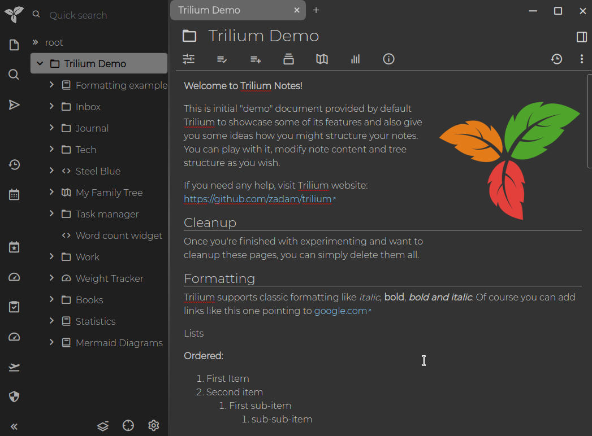
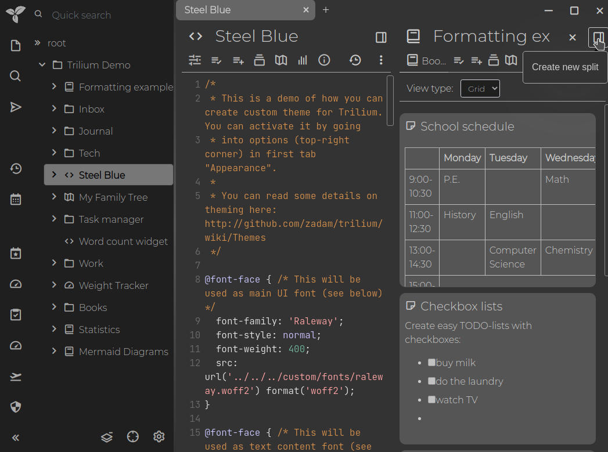
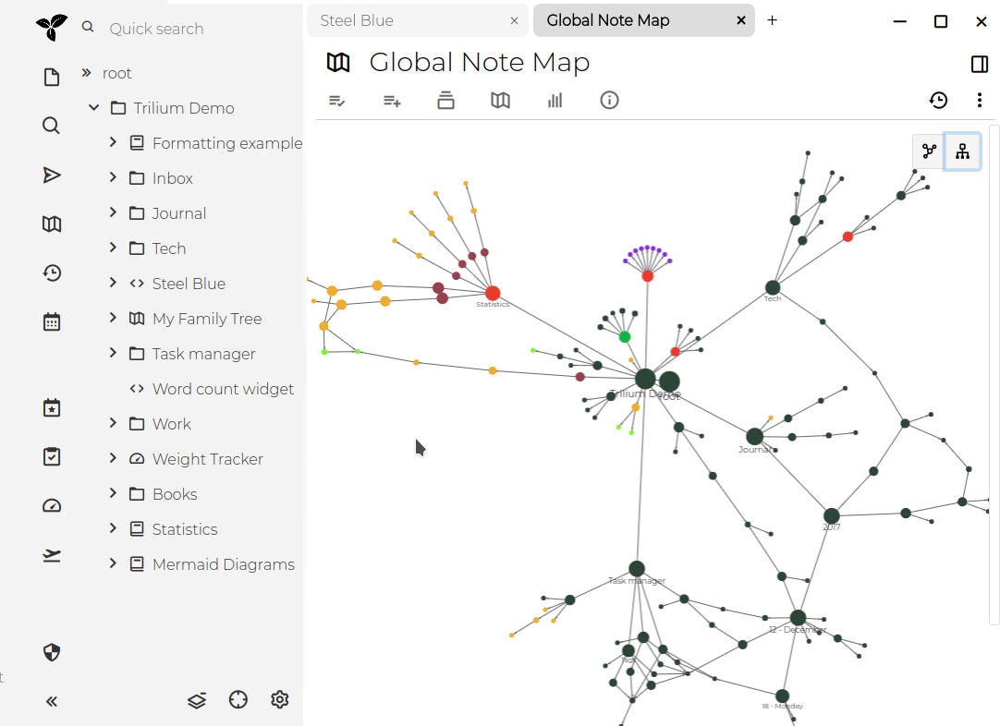
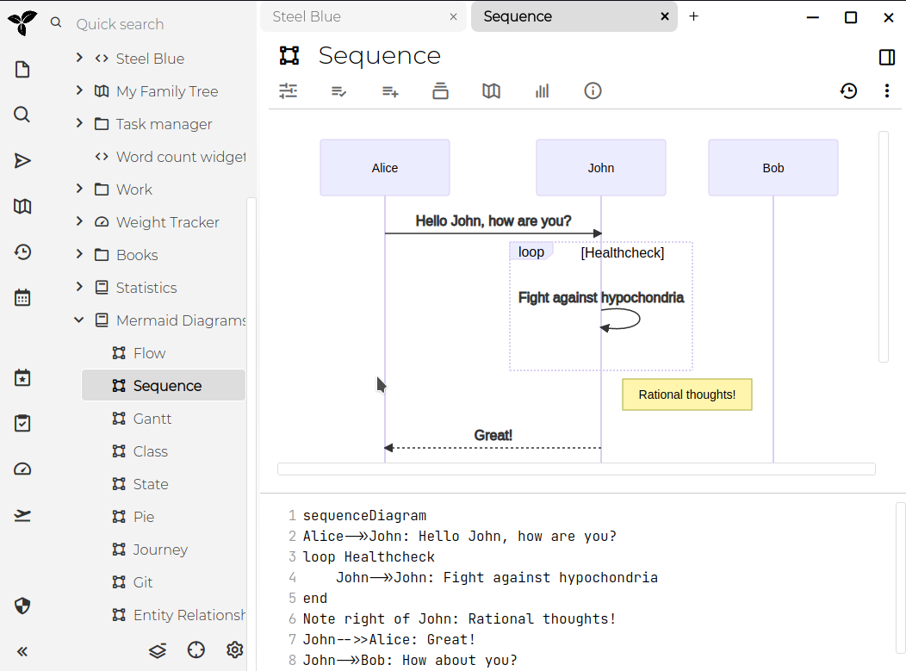
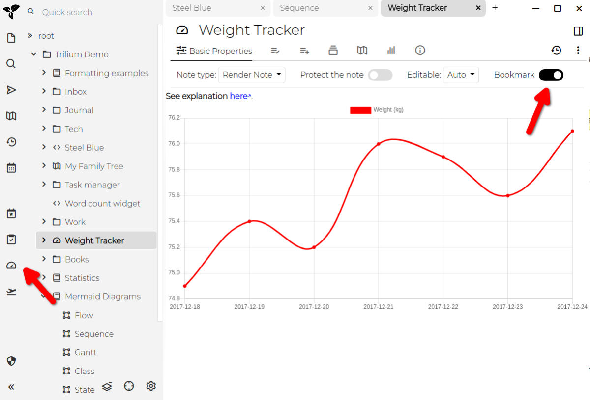

# v0.48

0.48 是一个重大版本，包含许多更改，其中一些是破坏性的：

## 前端主要重新设计



*   右侧面板已移除，这些小组件中的大部分已移至笔记标题下方的新功能区样式小组件中
    *   右侧面板仍可针对脚本激活
*   Trilium 有了新图标（颜色可能还会有进一步变化）

## 垂直分屏窗口

<figure class="image"></figure>

## 链接图谱重新实现

现在也支持笔记的层级视图：

<figure class="image"></figure>

## Mermaid 图表

感谢 [@abitofevrything](https://github.com/abitofevrything) 的贡献！

<figure class="image"></figure>

## 基础书签支持

<figure class="image"></figure>

## 其他更改

*   后端的持久化/实体层进行了大规模重构 - “repository” 与笔记缓存统一，这应能为许多操作带来性能提升
*   搜索和 SQL 查询笔记现在默认不再创建“已保存”笔记
*   添加了下划线标题样式并将其设为默认
*   将 CKEditor 更新至 30.0.0

## 迁移

### 备份恢复

Trilium v0.48 目前处于测试阶段，可能包含严重错误。

在迁移到 0.48 之前，Trilium 将自动备份到 `~/trilium-data/backup/backup-before-migration.db`。如果出现问题，您可以按照此指南恢复此备份：[https://github.com/zadam/trilium/wiki/Backup#restoring-backup](https://github.com/zadam/trilium/wiki/Backup#restoring-backup)

### 仅支持从 0.47.X 直接升级

只有从 0.47.X 才能直接升级到 0.48。如果您想从更旧的版本升级，需要先升级到 0.47.X，然后再升级到 0.48。这是因为后端进行了大规模重构，导致旧的迁移脚本无法使用。

### 所有后端脚本笔记应避免使用异步

在旧版本中，由于 SQLite 驱动的原因，后端操作使用了 async/await。但 Trilium 最近迁移到了同步（且更快）的 `better-sqlite3`。因此，在事务中包装的后端脚本笔记应转换为同步变体。

例如，旧脚本如下：

```
const todayDateStr = api.formatDateISO(new Date());

const todayNote = await api.runOnBackend(async todayDateStr => {
    const dateNote = await api.getDayNote(todayDateStr);
    
    ({note: logNote} = await api.createNote(dateNote.noteId, 'log'));
}, [todayDateStr]);

api.activateNote(todayNote.noteId);
```

所有 `await`（和 `async`）都应在后端代码中消失，但在从前端调用后端时（这仍然是异步的）应保留：

```
const todayDateStr = api.formatDateISO(new Date());

const todayNote = await api.runOnBackend(todayDateStr => {
    const dateNote = api.getDayNote(todayDateStr);
    
    ({note: logNote} = api.createNote(dateNote.noteId, 'log'));
}, [todayDateStr]);

api.activateNote(todayNote.noteId);
```

### 迁移自定义主题

随着重新设计，您可能需要调整您的自定义主题 - 请查看[默认主题](https://github.com/zadam/trilium/blob/master/src/public/stylesheets/theme-light.css)中修改后的可用 CSS 变量列表。如果您的主题也使用了 CSS 选择器，那么这些选择器可能也需要重写。

主题使用 `#appTheme` 标签进行标注，以前此标签可以包含值也可以不包含值 - 在此版本中，该值是必需的，因此请将标签定义为例如 `#appTheme=my-theme-name`。

此外，CSS 主题的加载方式也与以前不同 - 以前所有主题都在启动时加载，哪个主题处于活动状态由活动的 CSS 类决定。主题当时是这样加前缀的：

```
body.theme-steel-blue {
    --main-font-family: 'Raleway' !important;
    --main-font-size: normal;

    --tree-font-family: inherit;
    --tree-font-size: normal;
	...
}

body.theme-steel-blue .note-detail-editable-text, body.theme-steel-blue .note-detail-readonly-text {
    font-size: 120%;
}
```

这种前缀不再需要（也不再起作用）。请像这样移除前缀：

```
:root {
    --main-font-family: 'Raleway';
    --main-font-size: normal;
    
    --tree-font-family: 'Raleway';
    --tree-font-size: normal;
    ...
}

body .note-detail-editable-text, body .note-detail-readonly-text {
    font-size: 120%;
}
```