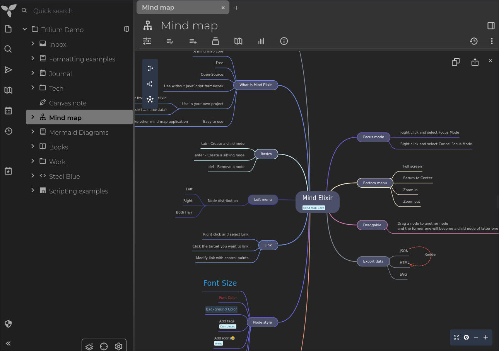

# v0.90.5-beta

此版本带来了一些生活质量改进以及错误修复。然而，主要的亮点是对本地化支持的增强以及一种新的笔记类型。

## 🌍 国际化

得益于 `@Nriver` 的努力，已添加对国际化的初步支持。更具体地说，以下语言现在有了部分翻译：

*   西班牙语，由 `@hasecilu` 提供
*   中文，由 `@Nriver` 提供
*   罗马尼亚语。

请注意，目前只有客户端被翻译，在应用程序完全翻译之前仍有许多任务需要处理。

## 💡 新笔记类型：思维导图

思维导图通常是快速记录想法和与团队进行头脑风暴的快速方法。TriliumNext 在开源库 [Mind Elixir](https://mind-elixir.com/) 的帮助下引入了这种新的笔记类型。

请注意，集成仍处于初期阶段，因此在稳定之前可能存在错误和功能缺失。该库本身支持不少 Trilium 中尚未实现的功能：使用 KaTeX 的数学表达式、图片、链接。如果用户需要，这些功能可能会在后续过程中实现。

<figure class="image"></figure>

> **注意**：为使笔记类型完全正常工作（例如共享笔记），如果您使用的是服务器实例，理想情况下也应更新服务器端。

## ⚙️ 构建

内部构建工具已更新，导致以下更改：

*   对于 macOS 用户，现在也有 `.dmg` 安装方法。`@JYC333`
    *   还有一个可用于 macOS 的 ARM 原生版本，但由于缺乏公证（以绕过“Trilium Notes.app”已损坏的错误），需要 [额外的步骤才能使其运行](https://github.com/TriliumNext/Notes/issues/329)。
*   对于 Windows 和 Linux，我们现在也有 `amd64` 构建。
    *   请注意，由于缺乏设备，这些版本尚未得到积极测试，因此如果您遇到任何问题，请随时提出。

在 Docker 方面，[为 amd64 重新引入了基于 Alpine 的 Docker 容器](https://github.com/TriliumNext/Notes/pull/366)，由 `@perfectrain` 提供。

### 🐞 错误修复

*   [v0.90.4 docker 不从环境读取 USER\_UID 和 USER\_GID](https://github.com/TriliumNext/Notes/issues/331)
*   [Android 手机上出现无效的 CSRF 令牌](https://github.com/TriliumNext/Notes/issues/318)
*   [列表中间距过大](https://github.com/TriliumNext/Notes/issues/341)
*   [scrollbar-color 使滚动条显示为原生样式](https://github.com/TriliumNext/Notes/issues/350)
*   Firefox 上滚动条不可见
*   [笔记标题文本框边框问题](https://github.com/TriliumNext/Notes/issues/358)
*   [从块编辑器点击“包含笔记”时焦点未设置到输入字段](https://github.com/TriliumNext/Notes/issues/365)
*   [修复查找小组件的一个错误](https://github.com/TriliumNext/Notes/pull/377)，由 `@SiriusXT` 提供
*   [启动 Trilium 时出现“主进程发生 JavaScript 错误”](https://github.com/TriliumNext/Notes/issues/368)（改进了错误处理）。
*   [在只读模式下点击内部 trilium 链接时，笔记工具提示未被移除](https://github.com/TriliumNext/Notes/issues/375)
*   [如果点击/右键点击启动器栏中打开笔记的其他按钮，日历下拉菜单不会关闭](https://github.com/TriliumNext/Notes/issues/384)

### ✨ 改进

*   [改进了启动栏中的日历按钮](https://github.com/TriliumNext/Notes/issues/374)，增加了更便捷的月份和年份选择支持。
*   [使一周的第一天可配置](https://github.com/TriliumNext/Notes/issues/247)（支持星期日和星期一）
    *   可在 选项 → 外观 → 本地化 → 一周的第一天 中调整。
    *   该选项与服务器同步，客户端会立即更新。
*   移除了诸如 FancyTree 和 Bootstrap 等硬编码库。这将使我们以后能够升级到最新版本。`@JYC333`
*   [在 Web 版本中隐藏特定于 Electron 的设置](https://github.com/TriliumNext/Notes/issues/345)
*   [添加一个开关，将当前笔记提升为模板](https://github.com/TriliumNext/Notes/issues/348)
*   在选项中禁用共享开关
*   [从任务栏打开新窗口](https://github.com/TriliumNext/Notes/pull/373)，由 `@SiriusXT` 提供
*   按 F2 编辑分支前缀现在仅在笔记树中有效，以避免与思维导图等其他交互元素冲突，同时因为该选项本身并非最常用的选项，无需全局快捷键。

## 新贡献者

*   [@JYC333](https://github.com/JYC333) 在 [#294](https://github.com/TriliumNext/Notes/pull/294) 中做出了他们的首个贡献
*   [@hasecilu](https://github.com/hasecilu) 在 [#349](https://github.com/TriliumNext/Notes/pull/349) 中做出了他们的首个贡献
*   [@SiriusXT](https://github.com/SiriusXT) 在 [#377](https://github.com/TriliumNext/Notes/pull/377) 中做出了他们的首个贡献