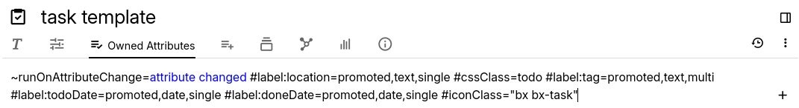

# 属性

<figure class="image"></figure>

在 Trilium 中，属性是分配给笔记的键值对，用于提供额外的元数据或功能。属性主要有两种类型：

1.  <a class="reference-link" href="Attributes/Labels.md">标签</a> 可用于多种用途，例如存储元数据或配置笔记的行为。标签也是可搜索的，有助于增强笔记检索。
    
    更多信息（包括预定义标签），请参阅 <a class="reference-link" href="Attributes/Labels.md">标签</a>。
2.  <a class="reference-link" href="Attributes/Relations.md">关系</a> 定义笔记之间的连接，类似于链接。这些可用于元数据和脚本编写目的。
    
    更多信息（包括预定义关系列表），请参阅 <a class="reference-link" href="Attributes/Relations.md">关系</a>。

这些属性在组织、分类和增强笔记功能方面发挥着至关重要的作用。

## 属性类型

从概念上讲，属性有两种类型（适用于标签和关系）：

1.  **系统属性**  
    顾名思义，这些属性具有特殊含义，因为它们会被 Trilium 解释。例如，`color` 属性将更改笔记在<a class="reference-link" href="../Basic%20Concepts%20and%20Features/UI%20Elements/Note%20Tree.md">笔记树</a>和链接中显示的颜色，而 `iconClass` 将更改笔记的图标。
2.  **用户自定义属性**  
    这些是用户可以使用的自由格式的标签或关系。它们可以纯粹用于分类目的（尤其是与<a class="reference-link" href="../Basic%20Concepts%20and%20Features/Navigation/Search.md">搜索</a>结合使用时），也可以通过使用<a class="reference-link" href="../Scripting.md">脚本</a>赋予其含义。

实际上，Trilium 并不直接区分属性是系统属性还是用户自定义属性。如果标签或关系与内置名称之一匹配（例如前面提到的 `iconClass`），则被视为系统属性。在创建<a class="reference-link" href="Attributes/Promoted%20Attributes.md">提升属性</a>时请记住这一点，以免意外更改系统属性（除非有意为之）。

## 查看属性列表

当前笔记的标签和关系都显示在<a class="reference-link" href="../Basic%20Concepts%20and%20Features/UI%20Elements/Ribbon.md">功能区</a>的_自有属性_部分中，可以在其中查看和编辑。继承的属性显示在功能区的_继承属性_部分中，只能查看。

在属性列表中，标签以 `#` 字符为前缀，而关系以 `~` 字符为前缀。

## 属性定义和提升属性

<a class="reference-link" href="Attributes/Promoted%20Attributes.md">提升属性</a>为属性创建了类似表单的编辑体验，使属性的组织和管理更加容易。

## 多重性

Trilium 中的属性可以是“多值的”，这意味着多个同名的属性可以共存。这可以与<a class="reference-link" href="Attributes/Promoted%20Attributes.md">提升属性</a>结合使用，以便轻松添加它们。

## 属性继承

Trilium 支持属性继承，允许子笔记继承其父笔记的属性。更多信息，请参阅<a class="reference-link" href="Attributes/Attribute%20Inheritance.md">属性继承</a>。