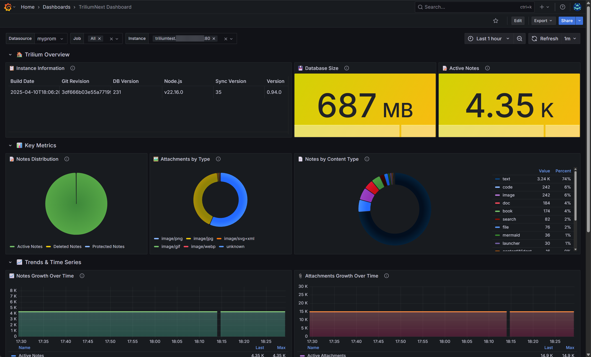
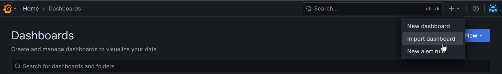
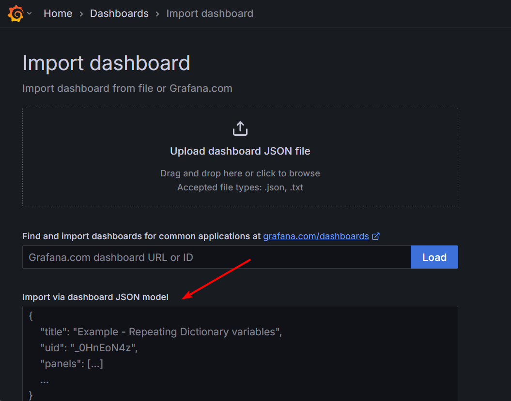

# 指标

Trilium 指标 API 提供关于您的 Trilium 实例的全面监控数据，专为 Prometheus 等外部监控系统设计。

## **端点**

*   **URL**： `/etapi/metrics`
*   **方法**： `GET`
*   **身份验证**： 需要 ETAPI 令牌
*   **默认格式**： Prometheus 文本格式

## **身份验证**

您需要一个 ETAPI 令牌才能访问指标端点。通过以下方式获取：

```
# 获取 ETAPI 令牌
curl -X POST http://localhost:8080/etapi/auth/login \
  -H "Content-Type: application/json" \
  -d '{"password": "your_password"}'

```

## **用法**

### **Prometheus 格式（默认）**

```
curl -H "Authorization: YOUR_ETAPI_TOKEN" \
  http://localhost:8080/etapi/metrics

```

以 Prometheus 文本格式返回指标：

```
# HELP trilium_info Trilium instance information
# TYPE trilium_info gauge
trilium_info{version="0.91.6",db_version="231",node_version="v18.17.0"} 1 1701432000

# HELP trilium_notes_total Total number of notes including deleted
# TYPE trilium_notes_total gauge
trilium_notes_total 1234 1701432000

```

### **JSON 格式**

```
curl -H "Authorization: YOUR_ETAPI_TOKEN" \
  "http://localhost:8080/etapi/metrics?format=json"

```

以 JSON 格式返回详细指标，用于调试或自定义集成。

## **可用指标**

### **实例信息**

*   `trilium_info` - 带有标签的版本和构建信息

### **数据库指标**

*   `trilium_notes_total` - 笔记总数（包括已删除的）
*   `trilium_notes_deleted` - 已删除的笔记数量
*   `trilium_notes_active` - 活跃笔记数量
*   `trilium_notes_protected` - 受保护笔记数量
*   `trilium_attachments_total` - 附件总数
*   `trilium_attachments_active` - 活跃附件数量
*   `trilium_revisions_total` - 笔记修订总数
*   `trilium_branches_total` - 活跃分支数量
*   `trilium_attributes_total` - 活跃属性数量
*   `trilium_blobs_total` - 二进制大对象记录总数
*   `trilium_etapi_tokens_total` - 活跃的 ETAPI 令牌数量
*   `trilium_embeddings_total` - 笔记嵌入（如果可用）

### **分类指标**

*   `trilium_notes_by_type{type="text|code|image|file"}` - 按类型分类的笔记
*   `trilium_attachments_by_type{mime_type="..."}` - 按 MIME 类型分类的附件

### **统计信息**

*   `trilium_database_size_bytes` - 数据库大小（字节）
*   `trilium_oldest_note_timestamp` - 最早笔记的时间戳
*   `trilium_newest_note_timestamp` - 最新笔记的时间戳
*   `trilium_last_modified_timestamp` - 最后修改时间戳

## **Prometheus 配置**

添加到您的 `prometheus.yml`：

```
scrape_configs:
  - job_name: 'trilium'
    static_configs:
      - targets: ['localhost:8080']
    metrics_path: '/etapi/metrics'
    bearer_token: 'YOUR_ETAPI_TOKEN'
    scrape_interval: 30s

```

## **错误响应**

*   `400` - 无效的格式参数
*   `401` - 缺少或无效的 ETAPI 令牌
*   `500` - 内部服务器错误

## **Grafana 仪表板**

<figure class="image"></figure>

您还可以使用为 TriloniNext 创建的 Grafana 仪表板 - 只需从 <a class="reference-link" href="Metrics/grafana-dashboard.json">grafana-dashboard.json</a> 获取 JSON，然后按照以下截图导入仪表板：

<figure class="image"></figure>

然后粘贴 JSON，并点击加载：

<figure class="image"></figure>