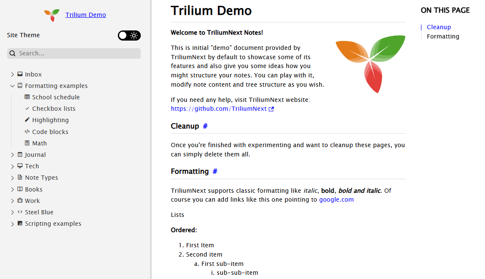
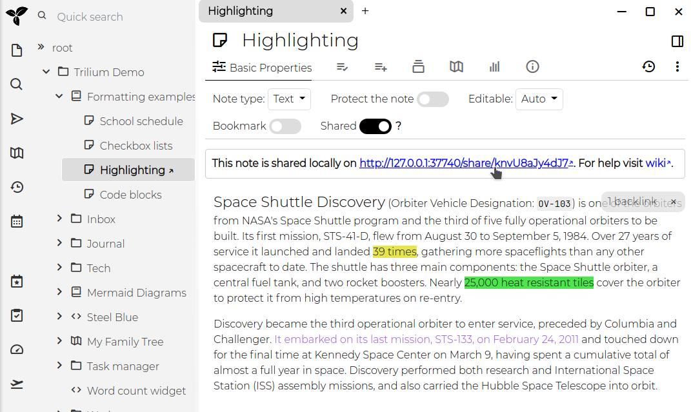

# 分享
Trilium 允许你将选定的笔记分享为**可公开访问**的只读文档。此功能对于直接从你的 Trilium 笔记中发布内容特别有用，使其可以在线供他人访问。

<figure class="image"></figure>

## 功能、交互和限制

*   按笔记标题搜索。
*   根据用户浏览器设置自动切换深色/浅色模式。
*   移动端友好布局，带有侧边栏。
*   可折叠的树形结构，使用与应用程序相同的笔记图标。
*   可自定义的徽标。
*   深色/浅色模式切换按钮，同时存储用户偏好。
*   快速导航按钮（上一篇和下一篇笔记）。
*   显示笔记的最后更新日期。

### 按笔记类型

<table class="ck-table-resized">
    <colgroup>
        <col style="width:19.92%;">
        <col style="width:41.66%;">
        <col style="width:38.42%;">
    </colgroup>
    <thead>
        <tr>
            <th>&nbsp;</th>
            <th>支持的功能</th>
            <th>限制</th>
        </tr>
    </thead>
    <tbody>
        <tr>
            <th><a class="reference-link" href="../Note%20Types/Text.md">文本</a></th>
            <td><ul><li>目录。</li><li>代码块的语法高亮，前提是选择了语言（如果启用了“自动检测”则不起作用）。</li><li>数学公式渲染。</li><li><a href="../Note%20Types/Text/Include%20Note.md">包含笔记</a>（仅当被包含的笔记也被分享时）。</li></ul></td>
            <td><ul><li>内联 Mermaid 图表不会被渲染。</li></ul></td>
        </tr>
        <tr>
            <th><a class="reference-link" href="../Note%20Types/Code.md">代码</a></th>
            <td><ul><li>基本支持（以等宽字体显示笔记内容）。</li></ul></td>
            <td><ul><li>无语法高亮。</li></ul></td>
        </tr>
        <tr>
            <th><a class="reference-link" href="../Note%20Types/Saved%20Search.md">保存的搜索</a></th>
            <td>不支持。</td>
            <td>&nbsp;</td>
        </tr>
        <tr>
            <th><a class="reference-link" href="../Note%20Types/Relation%20Map.md">关系图</a></th>
            <td>不支持。</td>
            <td>&nbsp;</td>
        </tr>
        <tr>
            <th><a class="reference-link" href="../Note%20Types/Note%20Map.md">笔记地图</a></th>
            <td>不支持。</td>
            <td>&nbsp;</td>
        </tr>
        <tr>
            <th><a class="reference-link" href="../Note%20Types/Render%20Note.md">渲染笔记</a></th>
            <td>不支持。</td>
            <td>&nbsp;</td>
        </tr>
        <tr>
            <th><a class="reference-link" href="../Collections.md">集合</a></th>
            <td><ul><li>子笔记以固定格式显示。&nbsp;</li></ul></td>
            <td><ul><li>不支持更高级的视图类型，例如日历视图。</li></ul></td>
        </tr>
        <tr>
            <th><a class="reference-link" href="../Note%20Types/Mermaid%20Diagrams.md">Mermaid 图表</a></th>
            <td><ul><li>图表以矢量图像形式显示。</li></ul></td>
            <td><ul><li>不支持进一步交互。</li></ul></td>
        </tr>
        <tr>
            <th><a class="reference-link" href="../Note%20Types/Canvas.md">画布</a></th>
            <td><ul><li>图表以矢量图像形式显示。</li></ul></td>
            <td><ul><li>不支持进一步交互。</li></ul></td>
        </tr>
        <tr>
            <th><a class="reference-link" href="../Note%20Types/Web%20View.md">网页视图</a></th>
            <td>不支持。</td>
            <td>&nbsp;</td>
        </tr>
        <tr>
            <th><a class="reference-link" href="../Note%20Types/Mind%20Map.md">思维导图</a></th>
            <td>图表以矢量图像形式显示。</td>
            <td><ul><li>不支持进一步交互。</li></ul></td>
        </tr>
        <tr>
            <th><a class="reference-link" href="../Collections/Geo%20Map.md">地理地图</a></th>
            <td>不支持。</td>
            <td>&nbsp;</td>
        </tr>
        <tr>
            <th><a class="reference-link" href="../Note%20Types/File.md">文件</a></th>
            <td>基本交互（下载文件）。</td>
            <td><ul><li>不支持进一步交互。</li></ul></td>
        </tr>
    </tbody>
</table>

虽然分享功能很强大，但它也有一些限制：

*   **代码笔记**：无语法高亮。
*   **静态笔记树**
*   **受保护的笔记**：无法分享。
*   **包含笔记**：不支持。

其中一些限制可能会在未来的更新中得到解决。

## 前提条件

要使用分享功能，你必须拥有 Trilium 的 <a class="reference-link" href="../Installation%20%26%20Setup/Server%20Installation.md">服务器安装</a>。这是必要的，因为笔记将从服务器托管。

## 分享笔记

1.  **启用分享**：要分享笔记，请在笔记界面中切换 `Shared` 开关。启用分享后，将出现一个 URL，你可以点击它来访问共享笔记。
    
    
2.  **访问共享笔记**：提供的链接将在浏览器中打开该笔记。如果你的服务器未配置公共 IP，URL 将指向 `localhost (127.0.0.1)`。

## 分享笔记子树

当你分享一个笔记时，实际上你分享的是它下面的整个笔记子树。如果该笔记有子笔记，它们也将包含在分享内容中。例如，分享“Formatting”子树将显示一个带有基本导航的页面，用于浏览该子树中的所有笔记。

## 查看和管理共享笔记

你可以通过点击<a class="reference-link" href="../Basic%20Concepts%20and%20Features/UI%20Elements/Global%20menu.md">全局菜单</a>中的“Show Shared Notes Subtree”来查看所有共享笔记的列表。这允许你管理和浏览你已公开的所有笔记。

## 安全注意事项

*   共享笔记发布在开放互联网上，除非笔记受密码保护，否则任何拥有 URL 的人都可以访问。
*   URL 的随机性并不提供安全性，因此切勿通过此功能分享敏感信息。
*   Trilium 采取预防措施来保护你的公开分享实例免于泄露非共享笔记的信息，包括打开一个单独的只读连接到<a class="reference-link" href="Database.md">数据库</a>。根据你的威胁模型，使用<a class="reference-link" href="Sharing/Exporting%20static%20HTML%20for%20web%20publishing.md">导出静态 HTML 用于 Web 发布</a>并使用经过实战检验的 Web 服务器（如 Nginx 或 Apache）来提供静态内容可能更合理。

### 密码保护

要使用用户名和密码保护共享笔记，你可以使用 `#shareCredentials` 属性。将此标签添加到笔记中，格式为 `#shareCredentials="username:password"`。要保护整个子树，请确保该标签是[可继承的](Attributes/Attribute%20Inheritance.md)。

## 高级分享选项

### 自定义共享笔记的外观

默认设计应该是一个良好的起点，但你可以使用自己的 CSS 进行自定义：

*   **自定义 CSS**：通过向笔记添加 `~shareCss` 关系，将 CSS <a class="reference-link" href="../Note%20Types/Code.md">代码</a>笔记链接到共享页面。如果你希望此样式应用于整个子树，请使该标签可继承。你可以通过添加 `#shareHiddenFromTree` 标签来从树形导航中隐藏 CSS 代码笔记。
*   **省略默认 CSS**：对于大量的样式更改，使用 `#shareOmitDefaultCss` 标签以避免与 Trilium 的[默认样式表](../Basic%20Concepts%20and%20Features/Themes.md)冲突。

### 添加 JavaScript

你可以使用 `~shareJs` 关系将自定义 JavaScript 注入共享笔记。这允许你访问笔记属性或使用 `fetchNote()` API 遍历笔记树，该 API 根据笔记的 ID 检索笔记数据。

### 添加自定义 HTML

你可以使用 `~shareHtml` 关系将自定义 HTML 片段注入共享页面的特定位置。HTML 笔记应包含你要注入的原始 HTML 内容，你可以通过向 HTML 片段笔记本身添加 `#shareHtmlLocation` 标签来控制其出现位置。

`#shareHtmlLocation` 标签接受格式为 `location:position` 的值：

*   **位置**：`head`、`body`、`content`
*   **方位**：`start`、`end`

例如：

*   `#shareHtmlLocation=head:start` - 在 `<head>` 部分的开头注入 HTML
*   `#shareHtmlLocation=head:end` - 在 `<head>` 部分的末尾注入 HTML（默认）
*   `#shareHtmlLocation=body:start` - 在 `<body>` 部分的开头注入 HTML
*   `#shareHtmlLocation=content:start` - 在内容区域的开头注入 HTML
*   `#shareHtmlLocation=content:end` - 在内容区域的末尾注入 HTML

如果未指定位置，HTML 将默认注入到 `content:end`。

示例：

```javascript
const currentNote = await fetchNote();
const parentNote = await fetchNote(currentNote.parentNoteIds[0]);

for (const attr of parentNote.attributes) {
    console.log(attr.type, attr.name, attr.value);
}
```

### 自定义分享模板

要完全重新设计分享，可以创建或使用现有的[自定义分享模板](Sharing/Custom%20share%20template.md)。

### 创建人类可读的 URL 别名

共享笔记通常具有类似 `http://domain.tld/share/knvU8aJy4dJ7` 的 URL，其中最后一部分是笔记的 ID。你可以通过向单个笔记添加 `#shareAlias` 标签（例如 `#shareAlias=highlighting`）使这些 URL 更加用户友好。这会将 URL 更改为 `http://domain.tld/share/highlighting`。

**重要**：

1.  确保别名是唯一的。
2.  不支持在别名中使用斜杠（`/`）来创建子路径。

> [!TIP]
> *   要轻松识别没有分享别名的页面，请使用 `#!shareAlias` 运行<a class="reference-link" href="../Basic%20Concepts%20and%20Features/Navigation/Search.md">搜索</a>。
> *   为了能够更快地输入分享别名，请考虑使用<a class="reference-link" href="Attributes/Promoted%20Attributes.md">提升属性</a>（例如 `#label:shareAlias(inheritable)="promoted,alias=Slug,single,text"`）。

### 设置自定义 favicon

要自定义共享页面的 favicon，请创建一个 `~shareFavicon` 关系，指向包含 favicon 的文件笔记（例如 `.ico` 格式）。

### 将笔记分享为根

你可以通过添加 `#shareRoot` 标签将特定笔记或文件夹指定为共享内容的根。访问 `[http://domain.tld/share](http://domain/share)` 时将链接到此笔记，从而更容易将 Trilium 用作一个功能齐全的网站。

> [!TIP]
> 考虑将此与 `#shareIndex` 标签结合使用，该标签将显示所有共享笔记的列表。

### 显示共享笔记的索引

访问分享时，子笔记将显示在左侧的树中。但由于可以分享多个笔记树，显示所有不同分享树的列表可能会很有用。

为此，创建一个共享文本笔记并应用 `shareIndex` 标签。查看时，共享根列表将显示在笔记底部。

### 链接到外部网站

有时在共享笔记旁边包含指向外部网站的链接很有用——例如在共享导航或索引中。为此，请向笔记添加 `#shareExternalLink` 标签，其值为目标 URL（例如 `#shareExternalLink="https://example.com"`）。

任何指向此笔记的链接随后将重定向到外部网站并在新的浏览器标签页中打开，而不是打开笔记自己的共享页面。这适用于：

*   `#shareIndex` 标签生成的列表；
*   父笔记下显示的“Subpages”列表；
*   其他共享笔记中指向此笔记的内联链接。

URL 必须是绝对路径并包含协议（例如 `https://`）。

> [!NOTE]
> 该笔记仍然存在于分享树中，其自身页面仍可通过其直接 URL 访问——该标签仅改变指向它的链接的行为。

## 属性参考

<table class="ck-table-resized">
    <colgroup>
        <col style="width:18.38%;">
        <col style="width:81.62%;">
    </colgroup>
    <thead>
        <tr>
            <th>属性</th>
            <th>描述</th>
        </tr>
    </thead>
    <tbody>
        <tr>
            <td><code>#shareHiddenFromTree</code></td>
            <td>此笔记从左侧导航树中隐藏，但仍可通过其 URL 访问</td>
        </tr>
        <tr>
            <td><code>#shareExternalLink</code></td>
            <td>当链接指向此笔记时（来自分享索引、子页面列表或其他共享笔记中的内联链接），它将在新标签页中重定向到给定的外部 URL，而不是笔记的共享页面。值为绝对 URL，例如 <code>https://example.com</code>。</td>
        </tr>
        <tr>
            <td><code>#shareAlias</code></td>
            <td>定义一个别名，使用该别名笔记将在 <code>https://your_trilium_host/share/[your_alias]</code> 下可用</td>
        </tr>
        <tr>
            <td><code>#shareOmitDefaultCss</code></td>
            <td>将省略默认分享页面 CSS。当你进行大量样式更改时使用。</td>
        </tr>
        <tr>
            <td><code>#shareRoot</code></td>
            <td>标记在 /share 根路径上提供的笔记。</td>
        </tr>
        <tr>
            <td><code>#shareDescription</code></td>
            <td>定义要添加到 HTML meta 标签中用于描述的文本</td>
        </tr>
        <tr>
            <td><code>#shareRaw</code></td>
            <td>笔记将以其原始格式提供，不带 HTML 包装。另请参阅&nbsp;<a class="reference-link" href="Sharing/Serving%20directly%20the%20content%20of%20a%20note.md">直接提供笔记内容</a>&nbsp;以了解无需设置属性的替代方法。</td>
        </tr>
        <tr>
            <td><code>#shareDisallowRobotIndexing</code></td>
            <td><p>向网络爬虫指示此笔记的页面不应被索引，通过：</p><ul><li>设置 <code>X-Robots-Tag: noindex</code> HTTP 头。</li><li>设置 <code>noindex, follow</code> meta 标签。</li></ul></td>
        </tr>
        <tr>
            <td><code>#shareCredentials</code></td>
            <td>要求凭据才能访问此共享笔记。值应为 <code>username:password</code> 格式。不要忘记使其可继承以应用于子笔记/图像。</td>
        </tr>
        <tr>
            <td><code>#shareIndex</code></td>
            <td>带有此标签的笔记将列出所有共享笔记的根。</td>
        </tr>
        <tr>
            <td><code>#shareHtmlLocation</code></td>
            <td>定义通过 <code>~shareHtml</code> 关系注入的自定义 HTML 应放置的位置。应用于 HTML 片段笔记本身。格式：<code>location:position</code>，其中 location 为 <code>head</code>、<code>body</code> 或 <code>content</code>，position 为 <code>start</code> 或 <code>end</code>。默认为 <code>content:end</code>。</td>
        </tr>
    </tbody>
</table>

### 自定义徽标

可以调整显示在左侧窗格左上角的徽标。

| 属性 | 描述 |
| --- | --- |
| `~shareLogo` | 设置为用作徽标的图像的关系。该图像必须是分享树的一部分（如有需要可以隐藏）。 |
| `#shareLogoWidth` | 为徽标设置的宽度（以像素为单位，不带单位）。默认值为 `53`。 |
| `#shareLogoHeight` | 为徽标设置的高度（以像素为单位，不带单位）。默认值为 `40`。 |
| `#shareRootLink` | 按下徽标时要导航到的 URL。 |

### 自定义 OpenGraph

| 属性 | 描述 |
| --- | --- |
| `#shareOpenGraphColor` | 这会调整 `theme-color` meta 属性。 |
| `#shareOpenGraphURL` | 这会调整 `og:url` 和 `twitter:url` meta 属性。 |
| `#shareOpenGraphDomain` | 调整 `twitter:domain` meta 属性。 |
| `#shareOpenGraphImage`   <br>`~shareOpenGraphImage` | 可以是标签，这种情况下值按原样传递，也可以是指向图像<a class="reference-link" href="../Note%20Types/File.md">文件</a>的关系。这控制 `og:image` meta 属性。 |

## 致谢

自 v0.95.0 起，引入了一个新主题（并默认启用），它极大地改善了分享功能的视觉效果及其功能（如移动端支持、深色/浅色模式、可折叠树等）。此主题是 [zerebos](https://github.com/zerebos) 的 [Trilium Rocks!](https://github.com/zerebos/trilium.rocks) 的改编版本。