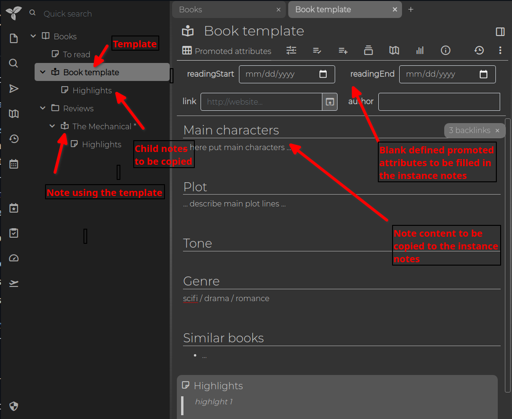
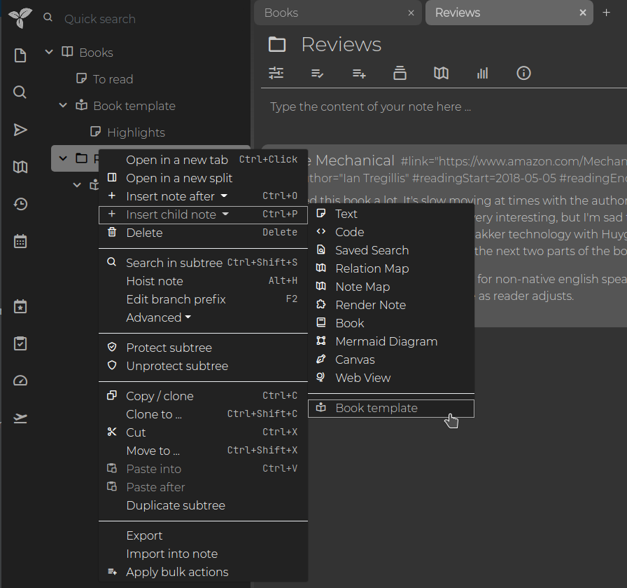

# 模板

Trilium 中的模板为其他笔记（称为实例笔记）提供预定义结构。为笔记分配模板会带来三个主要效果：

1.  **属性继承**：模板笔记中的所有属性都会被实例笔记[继承](Attributes/Attribute%20Inheritance.md)。即使带有 `#isInheritable=false` 的属性也会被实例笔记继承，不过只有可继承的属性才会被实例笔记的子笔记进一步继承。
2.  **内容复制**：如果实例笔记在分配模板时为空，模板笔记的内容会被复制到实例笔记中。
3.  **子笔记复制**：模板的所有子笔记都会被深度复制到实例笔记中。

## 示例

一个典型的例子是“书籍”模板笔记，它可能包含：

*   **提升属性**：如出版年份、作者等（参见[提升属性](Attributes/Promoted%20Attributes.md)）。
*   **大纲**：书评大纲，包括主题、结论等部分。
*   **子笔记**：用于存放摘录、总结等的附加笔记。

## 实例笔记

实例笔记是与模板笔记相关联的笔记。这种关系意味着实例笔记的内容从模板初始化，并且模板中的所有属性都被继承。

通过用户界面创建实例笔记：

要使模板出现在菜单中，模板笔记必须带有 `#template` 标签。不要将其与 `~template` 关系混淆，后者用于将实例笔记链接到模板笔记。如果您使用[工作区](../Basic%20Concepts%20and%20Features/Navigation/Workspaces.md)，还可以用 `#workspaceTemplate` 标记模板，使其仅在工作区中显示。

在笔记创建后，也可以通过创建指向所需模板笔记的 `~template` 关系来添加或更改模板。

要为子笔记指定模板，可以使用指向相应模板笔记的 `~child:template` 关系。层级深度没有限制——您可以使用 `~child:child:template`、`~child:child:child:template` 等。

> [!IMPORTANT]
> 在父笔记创建后更改模板层级不会追溯应用于新创建的子笔记。
> 例如，如果您最初使用 `~child:template`，之后切换到 `~child:child:template`，它不会自动将新模板应用于孙笔记。只有笔记创建时存在的结构才会被考虑。

## 关于笔记类型

默认情况下，新创建的笔记是<a class="reference-link" href="../Note%20Types/Text.md">文本</a>笔记。如果父笔记定义了指向不同类型（例如代码笔记）模板的 `child:template`，行为取决于新笔记的创建方式：

*   如果没有显式选择笔记类型（例如在<a class="reference-link" href="../Basic%20Concepts%20and%20Features/UI%20Elements/Note%20Tree.md">笔记树</a>中点击 + 按钮），则应用模板，新笔记采用模板的类型和内容。
*   如果显式选择了笔记类型（例如<a class="reference-link" href="../Basic%20Concepts%20and%20Features/UI%20Elements/Note%20Tree.md">笔记树</a> → _在之后插入笔记_ / _插入子笔记_）：
    *   如果所选类型与模板类型匹配，则应用模板。
    *   如果所选类型不同，则完全忽略模板——新笔记是所选类型的空笔记。

从创建菜单中选择特定模板始终优先于 `child:template`。

## 补充说明

从视觉角度来看，模板可以定义 `#iconClass` 和 `#cssClass` 属性，使所有实例笔记（例如书籍）能够显示特定的图标和 CSS 样式。

您可以在<a class="reference-link" href="Database/Demo%20Notes.md">演示笔记</a>中进一步探索此概念，包括<a class="reference-link" href="../Note%20Types/Relation%20Map.md">关系图</a>、<a class="reference-link" href="Advanced%20Showcases/Task%20Manager.md">任务管理器</a>和<a class="reference-link" href="Advanced%20Showcases/Day%20Notes.md">日记笔记</a>等示例。

此外，请参阅<a class="reference-link" href="Default%20Note%20Title.md">默认笔记标题</a>以了解创建标题模板的信息。可以通过为模板笔记创建 `#titleTemplate` 来组合使用笔记模板和标题模板。