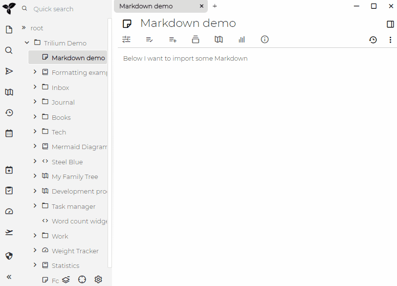
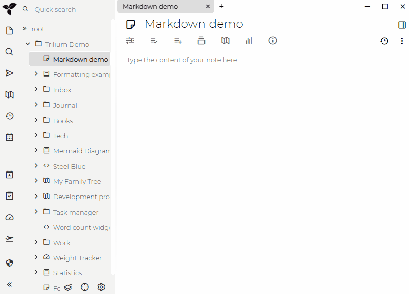
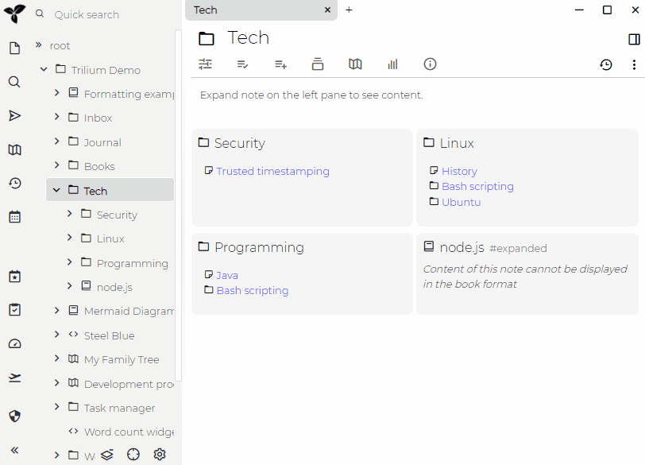
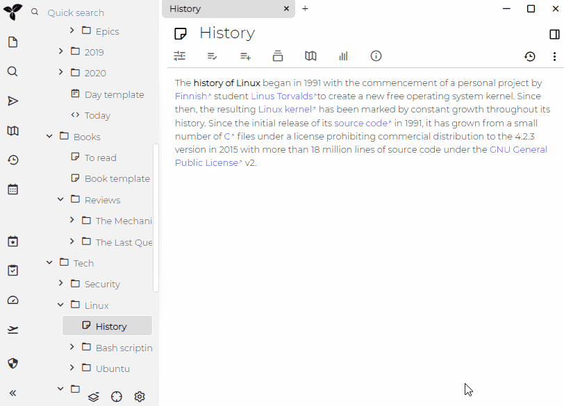

# Markdown
Trilium 支持 Markdown 的导入和导出，并尽可能保持高兼容性。

## 导入

### 剪贴板导入

如果你只想从剪贴板导入一段 Markdown，可以通过编辑器块菜单进行操作：

### 文件导入

你也可以从文件中导入 Markdown 文件：

*   单个 Markdown 文件（扩展名为 .md）
*   整个 Markdown 文件树（打包成 [.zip](https://en.wikipedia.org/wiki/Tar_\(computing\)) 归档文件）
    *   Markdown 文件需要打包成 ZIP 归档文件，因为浏览器无法读取目录，只能读取单个文件。
    *   你可以使用例如 [7-zip](https://www.7-zip.org) 将 Markdown 文件目录打包成 ZIP 文件

## 导出

### 子树导出

你可以将整个子树导出为 ZIP 归档文件，该文件的目录结构将模拟子树结构：

### 单个笔记导出

如果你只想导出单个笔记而不包含其子树，可以通过笔记操作菜单进行操作：

### 导出受保护的笔记

如果你想导出受保护的笔记，请先进入受保护会话！这将以未加密的形式导出笔记，因此如果你重新导入到 Trilium，请务必重新保护这些笔记。

## 支持的语法

请参阅专门页面：<a class="reference-link" href="Markdown/Supported%20syntax.md">支持的语法</a>