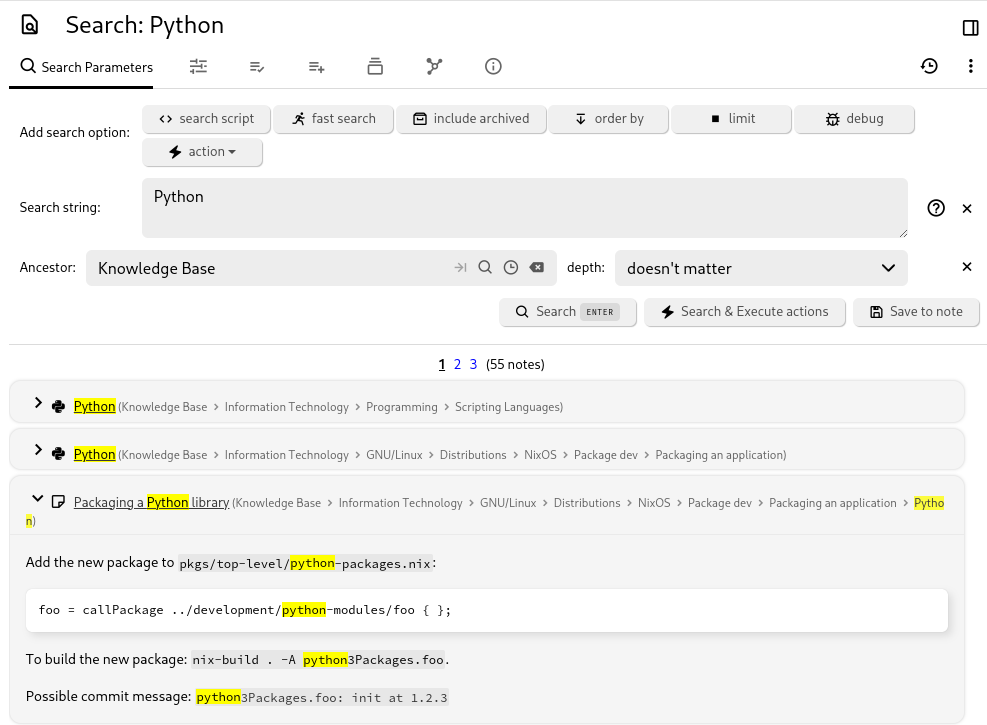

# 搜索
<figure class="image"></figure>

笔记搜索使您能够通过搜索笔记的标题、内容或[属性](../../Advanced%20Usage/Attributes.md)中的文本来查找笔记。您还可以选择保存搜索，这将创建一个特殊的搜索笔记，该笔记在导航树中可见，并将搜索结果作为子项包含在内。

## 访问搜索

*   从<a class="reference-link" href="../UI%20Elements/Launch%20Bar.md">启动栏</a>中，查找专用的搜索按钮。
*   要将搜索限制在某条笔记及其子笔记中，请从<a class="reference-link" href="../UI%20Elements/Note%20Tree/Note%20tree%20contextual%20menu.md">笔记树上下文菜单</a>中选择 _从子树中搜索_，或按 <kbd>Ctrl</kbd>+<kbd>Shift</kbd>+<kbd>S</kbd>。

## 交互操作

要搜索笔记，请点击工具栏上的放大镜图标或按下键盘[快捷键](../Keyboard%20Shortcuts.md)。

1.  在 _搜索字符串_ 字段中设置要搜索的文本。
    1.  除了按字面意思搜索单词外，还可以搜索笔记的属性或特性。
    2.  有关更多信息，请参见下面的示例。
2.  要将搜索限制在某条笔记及其子笔记中，请在 _祖先_ 中设置一条笔记。
    1.  如果从[提升笔记](Note%20Hoisting.md)或[工作区](Workspaces.md)触发搜索，此值也会被预填。
    2.  要搜索整个数据库，请保持该值为空。
3.  要将搜索限制在少数几个层级（例如，查找子笔记但不查找子-子笔记），请将 _深度_ 字段设置为提供的值之一。
4.  除此之外，还可以通过 _添加搜索选项_ 按钮配置搜索，如下一节所述。
5.  按 _搜索_ 触发搜索。结果显示在搜索配置面板下方。
6.  _搜索并执行操作_ 按钮仅在至少添加了一个操作时相关（如下一节所述）。
7.  _保存到笔记_ 将使用搜索配置创建一个新笔记。有关更多信息，请参见<a class="reference-link" href="../../Note%20Types/Saved%20Search.md">已保存的搜索</a>。

## 搜索选项

从“添加搜索选项”部分点击要应用的搜索选项。

*   对于每个选中的搜索选项，搜索配置将更新以显示输入项。每个搜索选项都有自己的配置。
*   要移除搜索选项，只需按右侧的 X 按钮。

可用的选项有：

1.  搜索脚本
    1.  此功能允许编写一个<a class="reference-link" href="../../Note%20Types/Code.md">代码</a>笔记来独立处理搜索。
2.  快速搜索
    1.  搜索不会查看笔记的内容，但仍会查看笔记标题、属性、关系（基于搜索查询）。
    2.  对于大型[数据库](../../Advanced%20Usage/Database.md)，此方法可以显著加快搜索速度。
3.  包含已归档
    1.  <a class="reference-link" href="../Notes/Archived%20Notes.md">已归档笔记</a>也将包含在结果中，否则它们将被忽略。
4.  排序方式
    1.  允许更改结果排序的标准，例如按创建日期或字母顺序排序，而不是按相关性（默认）排序。
    2.  也可以更改结果的顺序（升序或降序）。
5.  限制
    1.  将结果限制在给定的最大值内。
    2.  如果结果数量可能很大，这有助于限制数量，代价是无法查看所有结果。
6.  调试
    1.  这将在服务器日志中打印附加信息（参见<a class="reference-link" href="../../Troubleshooting/Error%20logs.md">错误日志</a>），说明搜索表达式是如何被解析的。
    2.  在详细了解搜索功能后，此功能对于确定复杂搜索查询为何无法按预期工作尤其有用。
7.  操作
    1.  除了仅搜索之外，还可以对搜索匹配到的笔记应用操作，例如添加标签或关系。
    2.  与其他搜索配置不同，这里可以多次应用相同的操作（即，以便能够向笔记添加多个标签）。
    3.  提供的操作与<a class="reference-link" href="../../Advanced%20Usage/Bulk%20Actions.md">批量操作</a>中的操作相同，这是在<a class="reference-link" href="../UI%20Elements/Note%20Tree.md">笔记树</a>中直接操作笔记的替代方法。
    4.  定义操作后，首先按 _搜索_ 检查匹配的笔记，然后按 _搜索并执行操作_ 触发操作。

### 简单笔记搜索示例

*   `rings tolkien`：全文搜索，查找同时包含“rings”和“tolkien”的笔记。
*   `"The Lord of the Rings" Tolkien`：全文搜索，其中“The Lord of the Rings”必须完全匹配。
*   `note.content *=* rings OR note.content *=* tolkien`：查找内容中包含“rings”或“tolkien”的笔记。
*   `towers #book`：结合全文和属性搜索，查找包含“towers”且具有“book”标签的笔记。
*   `towers #book or #author`：搜索包含“towers”且具有“book”或“author”标签的笔记。
*   `towers #!book`：搜索包含“towers”但不具有“book”标签的笔记。
*   `#book #publicationYear = 1954`：查找具有“book”标签且“publicationYear”设置为1954的笔记。
*   `#genre *=* fan`：查找“genre”标签包含子字符串“fan”的笔记。其他运算符包括 `*=`* 表示“包含”，`=*` 表示“以...开头”，`*=` 表示“以...结尾”，`!=` 表示“不等于”。
*   `#book #publicationYear >= 1950 #publicationYear < 1960`：使用数字运算符查找所有在20世纪50年代出版的书籍。
*   `#dateNote >= TODAY-30`：查找“dateNote”标签在过去30天内的笔记。支持的日期值包括 NOW +- 秒，TODAY +- 天，MONTH +- 月，YEAR +- 年。
*   `~author.title *=* Tolkien`：查找与标题包含“Tolkien”的作者相关的笔记。
*   `#publicationYear %= '19[0-9]{2}'`：使用 '%=' 运算符匹配正则表达式。此功能自 Trilium 0.52 起可用。
*   `note.content %= '\\d{2}:\\d{2} (PM|AM)'`：查找提及时间的笔记。正则表达式中的反斜杠必须转义。

### 模糊搜索

Trilium 支持模糊搜索运算符，可以查找包含拼写错误或拼写变体的结果：

*   `#title ~= trilim`：模糊精确匹配 - 即使您输入了“trilim”（带拼写错误），也能找到标题如“Trilium”的笔记。
*   `#content ~* progra`：模糊包含匹配 - 查找包含如“program”、“programmer”、“programming”等单词的笔记，即使有轻微拼写错误。
*   `note.content ~* develpment`：尽管有拼写错误，也能找到包含“development”的笔记。

**关于模糊搜索的重要说明：**

*   模糊搜索要求搜索词至少包含3个字符。
*   最大编辑距离为2个字符（所需的字符更改次数）。
*   变音符号会被规范化（例如，“café”匹配“cafe”）。
*   模糊匹配最适合查找包含轻微拼写错误或拼写变体的内容。

### 高级用例

*   `~author.relations.son.title = 'Christopher Tolkien'`：搜索具有“author”关系指向某笔记，且该笔记具有指向“Christopher Tolkien”的“son”关系的笔记。这可以通过以下笔记结构建模：
    *   书籍
        *   指环王
            *   标签：“book”
            *   关系：“author”指向“J. R. R. Tolkien”笔记
    *   人物
        *   J. R. R. Tolkien
            *   关系：“son”指向“Christopher Tolkien”笔记
            *   Christopher Tolkien
*   `~author.title *= Tolkien OR (#publicationDate >= 1954 AND #publicationDate <= 1960)`：使用布尔表达式和括号对表达式进行分组。请注意，以括号开头的表达式需要前置“表达式分隔符”（# 或 ~）。
*   `note.parents.title = 'Books'`：查找父笔记名为“Books”的笔记。
*   `note.parents.parents.title = 'Books'`：查找祖父笔记名为“Books”的笔记。
*   `note.ancestors.title = 'Books'`：查找祖先笔记名为“Books”的笔记。
*   `note.children.title = 'sub-note'`：查找子笔记名为“sub-note”的笔记。

### 使用笔记属性搜索

笔记具有可用于搜索的属性，例如 `noteId`、`dateModified`、`dateCreated`、`isProtected`、`type`、`title`、`text`、`content`、`rawContent`、`ownedLabelCount`、`labelCount`、`ownedRelationCount`、`relationCount`、`ownedRelationCountIncludingLinks`、`relationCountIncludingLinks`、`ownedAttributeCount`、`attributeCount`、`targetRelationCount`、`targetRelationCountIncludingLinks`、`parentCount`、`childrenCount`、`isArchived`、`contentSize`、`noteSize` 和 `revisionCount`。

这些属性可以通过 `note.` 前缀访问，例如 `note.type = code AND note.mime = 'application/json'`。

### 排序与限制

```
#author=Tolkien orderBy #publicationDate desc, note.title limit 10
```

此示例将：

1.  查找具有作者标签“Tolkien”的笔记。
2.  按 `publicationDate` 降序对结果排序。
3.  如果出版日期相同，则使用 `note.title` 作为次级排序。
4.  将结果限制为前10条笔记。

### 否定

某些查询只能通过否定来表达：

```
#book AND not(note.ancestor.title = 'Tolkien')
```

此查询查找所有不在“Tolkien”子树中的书籍笔记。

## 渐进式搜索策略

Trilium 使用渐进式搜索策略，首先执行精确匹配，然后在需要时添加模糊匹配。

### 渐进式搜索的工作原理

1.  **阶段 1 - 精确匹配**：当您搜索时，Trilium 首先查找搜索词的精确匹配。这处理了绝大多数搜索（90%以上）并几乎立即返回结果。
2.  **阶段 2 - 模糊回退**：如果阶段 1 没有找到足够多的高质量结果（少于5个具有良好相关性评分的结果），Trilium 会自动添加模糊匹配以查找包含拼写错误或拼写变体的结果。
3.  **结果排序**：无论单个分数如何，精确匹配总是出现在模糊匹配之前。这确保了当您搜索“project”时，包含确切单词“project”的笔记会出现在包含类似单词如“projects”或“projection”的笔记之前。

### 渐进式搜索行为

*   **速度**：大多数搜索仅使用精确匹配即可完成。
*   **排序**：精确匹配出现在模糊匹配之前。
*   **回退**：当精确匹配返回少于5个结果时，模糊匹配被激活。
*   **标识**：结果会指示它们是精确匹配还是模糊匹配。

### 搜索性能

搜索系统规格：

*   内容大小限制：每条笔记10MB（之前为50KB）。
*   模糊匹配的编辑距离计算。
*   快速搜索中的无限滚动。

## 底层原理

### 标签和关系快捷方式

按标签搜索的“完整”语法是：

```
note.labels.publicationYear = 1954
```

对于关系：

```
note.relations.author.title *=* Tolkien
```

然而，常见的标签和关系搜索有快捷语法：

```
#publicationYear = 1954
~author.title *=* Tolkien
```

### 分隔全文和属性部分

搜索语法允许将全文搜索与基于属性的搜索相结合。例如，`tolkien #book` 包含：

1.  全文标记 - `tolkien`
2.  属性表达式 - `#book`

Trilium 通过查找表示属性和特性的特定特殊字符或单词（例如 #、~、note.）来检测全文搜索和属性/特性搜索之间的分隔。如果您需要在全文搜索中包含这些字符，请使用反斜杠对其进行转义，以便将它们作为常规文本处理：

```
"note.txt" 
\#hash 
#myLabel = 'Say "Hello World"'
```

### 转义特殊字符

特殊字符可以用引号括起来或用反斜杠转义，以便在全文搜索中使用：

```
"note.txt"
\#hash
#myLabel = 'Say "Hello World"'
```

支持三种类型的引号：单引号、双引号和反引号。

### 类型强制转换

标签值在技术上是字符串，但可以强制转换以进行数字比较：

```
note.dateCreated =* '2019-05'
```

这将查找2019年5月创建的笔记。数字运算符如 `#publicationYear >= 1960` 会将字符串值转换为数字进行比较。

## 从 URL 自动触发搜索

您可以通过在 URL 中包含[URL 编码](https://meyerweb.com/eric/tools/dencoder/)的搜索字符串来打开 Trilium 并自动触发搜索：

`http://localhost:8080/#?searchString=abc`

## 搜索配置

### 参数

| 参数 | 值 | 描述 |
| --- | --- | --- |
| `MIN_FUZZY_TOKEN_LENGTH` | 3 | 模糊匹配的最小字符数 |
| `MAX_EDIT_DISTANCE` | 2 | 允许的最大字符更改次数 |
| `RESULT_SUFFICIENCY_THRESHOLD` | 5 | 触发模糊回退前所需的最小精确结果数 |
| `MAX_CONTENT_SIZE` | 10MB | 搜索处理的最大笔记内容大小 |

### 限制

*   为避免性能问题，被搜索的笔记内容限制为每条笔记10MB。
*   超过此限制的笔记仍将包含在标题和属性搜索中。
*   模糊匹配要求标记至少包含3个字符。