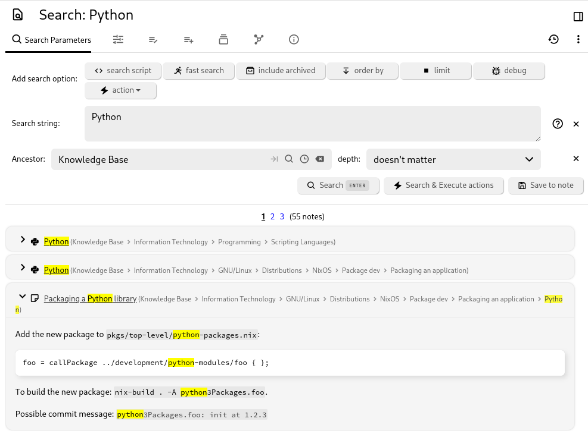

# 搜索
<figure class="image"></figure>

笔记搜索使您能够通过搜索笔记标题、内容或[属性](../../Advanced%20Usage/Attributes.md)中的文本来查找笔记。您还可以选择保存搜索，这将创建一个特殊的搜索笔记，该笔记在导航树中可见，并将搜索结果作为子项包含其中。

## 搜索类型

有多种类型的搜索，它们都使用相同的搜索机制和查询语言：

*   <a class="reference-link" href="Quick%20search.md">快速搜索</a>，可在<a class="reference-link" href="../UI%20Elements/Launch%20Bar.md">启动栏</a>中找到，用于小规模的一次性搜索。
    
    *   结果显示在弹出窗口中，并且具有无限滚动功能。
*   _完整搜索_ 是更高级的搜索机制。
    
    *   结果显示在单独的页面中，并且具有多种高级功能（搜索脚本、快速搜索、包含已归档笔记、排序方式、限制）。
    *   可以对结果应用<a class="reference-link" href="../../Advanced%20Usage/Bulk%20Actions.md">批量操作</a>，例如添加标签/关系。
    *   结果是分页的，并且可以以任何<a class="reference-link" href="../../Collections.md">集合</a>视图（例如网格、列表、日历、表格）显示。
*   某些<a class="reference-link" href="../../Collections.md">集合</a>（如看板视图）具有专用于该集合的搜索栏。
    
    *   在这种情况下，结果直接显示在集合中而不是弹出窗口中，并且仅限于该集合，但查询语言保持不变。

> [!NOTE]
> [跳转到笔记](Jump%20to%20%26%20command%20palette.md)是一个类似的概念，但它主要用于按标题搜索笔记，而不是按内容。不过，如果结果不理想，它也提供了全文搜索的方式。

## 访问搜索

*   从<a class="reference-link" href="../UI%20Elements/Launch%20Bar.md">启动栏</a>中，查找专用的搜索按钮。
*   要将搜索限制在某个笔记及其子笔记中，请从<a class="reference-link" href="../UI%20Elements/Note%20Tree/Note%20tree%20contextual%20menu.md">笔记树上下文菜单</a>中选择 _从子树搜索_，或按 <kbd>Ctrl</kbd>+<kbd>Shift</kbd>+<kbd>S</kbd>。
*   转到<a class="reference-link" href="Jump%20to%20%26%20command%20palette.md">跳转到 &amp; 命令面板</a>，查找内容后按 _全文搜索_（或 <kbd>Ctrl</kbd>+<kbd>Enter</kbd>）。

## 交互

要搜索笔记，请点击工具栏上的放大镜图标或按键盘[快捷键](../Keyboard%20Shortcuts.md)。

1.  在 _搜索字符串_ 字段中设置要搜索的文本。
    1.  除了按字面搜索词语外，还可以搜索笔记的属性或特性。
    2.  有关更多信息，请参阅下面的示例。
2.  要将搜索限制在某个笔记及其子笔记中，请在 _祖先_ 中设置一个笔记。
    1.  如果搜索是从[提升笔记](Note%20Hoisting.md)或[工作区](Workspaces.md)触发的，此值也会被预先填充。
    2.  要搜索整个数据库，请将该值留空。
3.  要将搜索限制在仅几个层级（例如，在子笔记中查找但不在一笔记的子子笔记中查找），请将 _深度_ 字段设置为提供的值之一。
4.  除此之外，还可以通过 _添加搜索选项_ 按钮配置搜索，如下文所述。
5.  按 _搜索_ 触发搜索。结果显示在搜索配置窗格下方。
6.  _搜索并执行操作_ 按钮仅在至少添加了一个操作时才有意义（如下文所述）。
7.  _保存到笔记_ 将创建一个包含搜索配置的新笔记。有关更多信息，请参阅<a class="reference-link" href="../../Note%20Types/Saved%20Search.md">保存的搜索</a>。

## 功能

### 自动补全

为了帮助处理语法，Trilium 提供了自动补全功能，可以通过按 <kbd>Ctrl</kbd>+<kbd>Space</kbd> 触发。

自动补全提供：

*   基本运算符，如 `*=` 和关键字（`limit`、`not`）。
*   类似对象的字段，如 `note` 或 `~relation`，通过输入 `.` 触发。
*   上下文枚举，如 `note.type = "` 或 `note.mime = "`。
*   通过输入 `#` 显示[标签](../../Advanced%20Usage/Attributes/Labels.md)名称，用户自定义的标签优先显示。
    
    *   齿轮图标表示系统属性。
    *   输入标签名称后，值也会根据数据库中存在的值进行自动补全。
*   通过输入 `~` 显示[关系](../../Advanced%20Usage/Attributes/Relations.md)名称。
*   通过输入 `@` 并查找笔记，可以轻松插入[笔记 ID](../../Advanced%20Usage/Note%20ID.md)。
    
    *   如果笔记 ID 符合有效语法，它将显示为笔记的标签块而不是原始 ID。
    *   这对于使用笔记 ID 的查询特别有用，例如按模板搜索：`~template.noteId = @`

### 语法高亮

搜索输入框具有语法高亮功能，使已识别的字段（如 `note.`）和运算符（如 `NOT`）更加醒目。

### 错误高亮与检查

搜索还会分两个阶段检查错误，错误将显示为红色波浪线：

*   检查器错误，用于识别常见的错误模式并提供修复方法。
*   搜索错误，由服务器检查，但不指示错误发生的具体位置。

### 多行

冗长或复杂的搜索可以使用换行符进行格式化，类似于 SQL 查询。换行符被视为与空格相同。

要添加新行，请按 <kbd>Shift</kbd>+<kbd>Enter</kbd>。

> [!NOTE]
> 多行仅适用于完整搜索，其他输入（如快速搜索或集合过滤器）为单行。

## 搜索选项

从“添加搜索选项”部分点击要应用的搜索选项。

*   对于每个选中的搜索选项，搜索配置将更新以显示相应条目。每个搜索选项都有自己的配置。
*   要移除搜索选项，只需按右侧的 X 按钮。

可用的选项有：

1.  搜索脚本
    1.  此功能允许编写一个<a class="reference-link" href="../../Note%20Types/Code.md">代码</a>笔记来自行处理搜索。
2.  快速搜索
    1.  搜索不会查找笔记的内容，但仍会查找笔记标题和属性、关系（基于搜索查询）。
    2.  对于大型[数据库](../../Advanced%20Usage/Database.md)，此方法可以显著加快搜索速度。
3.  包含已归档
    1.  <a class="reference-link" href="../Notes/Archived%20Notes.md">已归档笔记</a>也将包含在结果中，否则它们将被忽略。
4.  排序方式
    1.  允许更改结果的排序标准，例如按创建日期或字母顺序排序，而不是按相关性（默认）。
    2.  还可以更改结果的顺序（升序或降序）。
5.  限制
    1.  将结果限制为给定的最大值。
    2.  如果结果数量可能很多，这可以帮助减少结果，代价是无法查看所有结果。
6.  调试
    1.  这将在服务器日志中打印额外信息（参见<a class="reference-link" href="../../Troubleshooting/Error%20logs.md">错误日志</a>），关于搜索表达式是如何解析的。
    2.  在详细了解搜索功能后，此功能特别有用，可以确定为什么复杂的搜索查询不能按预期工作。
7.  操作
    1.  除了搜索之外，还可以对搜索匹配到的笔记应用操作，例如添加标签或关系。
    2.  与其他搜索配置不同，这里可以多次应用相同的操作（即为了能够向笔记应用多个标签）。
    3.  提供的操作与<a class="reference-link" href="../../Advanced%20Usage/Bulk%20Actions.md">批量操作</a>中的操作相同，后者是在<a class="reference-link" href="../UI%20Elements/Note%20Tree.md">笔记树</a>中直接操作笔记的替代方案。
    4.  定义操作后，先按 _搜索_ 检查匹配的笔记，然后按 _搜索并执行操作_ 触发操作。

## 查看搜索结果

结果显示在搜索窗格下方，以**摘要卡片**列表的形式呈现。每张卡片显示笔记标题和匹配文本的简短摘录。

搜索还会高亮显示标题或内容中匹配的词语：

*   实线绿色下划线表示直接匹配；
*   虚线橙色下划线表示部分匹配（由模糊搜索匹配）。

此外：

*   **结果总数**始终显示，因此您可以立即判断查询的范围有多广。
*   **每页大小选择器**让您选择每页显示多少结果。您的选择会被记住并在设备间同步（存储在 `searchResultsPageSize` 选项中），因此您不必在每个设备上重新设置。
*   **点击结果**会打开笔记并直接跳转到第一个匹配项。笔记内查找栏会预先填入您的搜索词，因此您可以使用查找控件逐步浏览剩余的匹配项。
*   如果匹配项位于**折叠的部分**中（例如折叠的标题），该部分会自动展开，以便匹配项可见。

## 简单笔记搜索示例

*   `rings tolkien`：全文搜索，查找同时包含 "rings" 和 "tolkien" 的笔记。
*   `"The Lord of the Rings" Tolkien`：全文搜索，其中 "The Lord of the Rings" 必须精确匹配。
*   `note.content *=* rings OR note.content *=* tolkien`：查找内容中包含 "rings" 或 "tolkien" 的笔记。
*   `towers #book`：结合全文搜索和属性搜索，查找包含 "towers" 且具有 "book" 标签的笔记。
*   `towers #book or #author`：搜索包含 "towers" 且具有 "book" 或 "author" 标签的笔记。
*   `towers #!book`：搜索包含 "towers" 且不具有 "book" 标签的笔记。
*   `#book #publicationYear = 1954`：查找具有 "book" 标签且 "publicationYear" 设置为 1954 的笔记。
*   `#genre *=* fan`：查找 "genre" 标签包含子字符串 "fan" 的笔记。其他运算符包括 `*=*` 表示"包含"，`=*` 表示"开头是"，`*=` 表示"结尾是"，`!=` 表示"不等于"。
*   `#book #publicationYear >= 1950 #publicationYear < 1960`：使用数值运算符查找所有在 1950 年代出版的书籍。
*   `#dateNote >= TODAY-30`：查找 "dateNote" 标签在最近 30 天内的笔记。支持的日期值包括 NOW +- 秒、TODAY +- 天、MONTH +- 月、YEAR +- 年。
*   `~author.title *=* Tolkien`：查找与标题包含 "Tolkien" 的作者相关的笔记。
*   `#publicationYear %= '19[0-9]{2}'`：使用 '%=' 运算符匹配正则表达式（regex）。此功能自 Trilium 0.52 起可用。
*   `note.content %= '\\d{2}:\\d{2} (PM|AM)'`：查找提到时间的笔记。正则表达式中的反斜杠必须转义。

## 高级用例

*   `~author.relations.son.title = 'Christopher Tolkien'`：搜索具有 "author" 关系指向一个笔记，而该笔记具有 "son" 关系指向 "Christopher Tolkien" 的笔记。可以用以下笔记结构来建模：
    *   Books
        *   Lord of the Rings
            *   标签："book"
            *   关系："author" 指向 "J. R. R. Tolkien" 笔记
    *   People
        *   J. R. R. Tolkien
            *   关系："son" 指向 "Christopher Tolkien" 笔记
            *   Christopher Tolkien
*   `~author.title *= Tolkien OR (#publicationDate >= 1954 AND #publicationDate <= 1960)`：使用布尔表达式和括号来分组表达式。请注意，以括号开头的表达式需要前置一个"表达式分隔符"（# 或 ~）。
*   `note.parents.title = 'Books'`：查找父笔记名为 "Books" 的笔记。
*   `note.parents.parents.title = 'Books'`：查找祖父笔记名为 "Books" 的笔记。
*   `note.ancestors.title = 'Books'`：查找祖先笔记名为 "Books" 的笔记。
*   `note.children.title = 'sub-note'`：查找子笔记名为 "sub-note" 的笔记。

另请参阅<a class="reference-link" href="Search/Under%20the%20hood.md">底层原理</a>以获取更多语法参考。

### 使用笔记属性搜索

笔记具有可在搜索中使用的属性，如 `noteId`、`dateModified`、`dateCreated`、`isProtected`、`type`、`title`、`text`、`content`、`rawContent`、`ownedLabelCount`、`labelCount`、`ownedRelationCount`、`relationCount`、`ownedRelationCountIncludingLinks`、`relationCountIncludingLinks`、`ownedAttributeCount`、`attributeCount`、`targetRelationCount`、`targetRelationCountIncludingLinks`、`parentCount`、`childrenCount`、`isArchived`、`contentSize`、`noteSize` 和 `revisionCount`。

这些属性可以通过 `note.` 前缀访问，例如 `note.type = code AND note.mime = 'application/json'`。

### 排序和限制

```
#author=Tolkien orderBy #publicationDate desc, note.title limit 10
```

此示例将：

1.  查找作者标签为 "Tolkien" 的笔记。
2.  按 `publicationDate` 降序排列结果。
3.  如果出版日期相同，则使用 `note.title` 作为次要排序依据。
4.  将结果限制为前 10 条笔记。

### 否定

某些查询只能用否定来表达：

```
#book AND not(note.ancestors.title = 'Tolkien')
```

此查询查找所有不在 "Tolkien" 子树中的书籍笔记。

## 底层原理

请参阅[专用页面](Search/Under%20the%20hood.md)以了解 Trilium 中渐进式搜索的工作原理，以及一些高级用例。

## 从 URL 自动触发搜索

您可以打开 Trilium 并通过在 URL 中包含搜索[URL 编码](https://meyerweb.com/eric/tools/dencoder/)字符串来自动触发搜索：

`http://localhost:8080/#?searchString=abc`

## 搜索配置

### 参数

| 参数 | 值 | 描述 |
| --- | --- | --- |
| `MIN_FUZZY_TOKEN_LENGTH` | 3 | `~=` 和 `~*` 运算符接受的最小字符数 |
| `MAX_EDIT_DISTANCE` | 2 | 字符更改的上限，仅由 7 个以上字符的词条达到；较短的词条允许更少。参见上文的 _模糊容差_ 部分 |
| `RESULT_SUFFICIENCY_THRESHOLD` | 5 | 模糊回退前的最小精确结果数 |
| `MAX_CONTENT_SIZE` | 10MB | 搜索处理的笔记内容最大大小 |

### 限制

*   搜索的笔记内容限制为每个笔记 10MB，以防止性能问题
*   超过此限制的笔记仍将包含在标题和属性搜索中
*   3 个字符或更少的词条精确匹配；拼写容错从 4 个字符开始