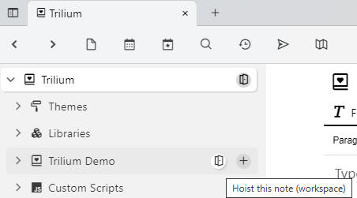
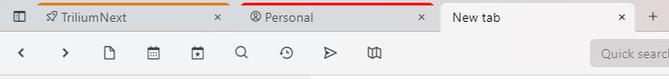

# 工作区

工作区是构建在[笔记提升](Note%20Hoisting.md)之上的一个概念。其核心理念是用户拥有多个不同的关注领域。例如，“个人”和“工作”，这两个领域截然不同且互不干扰。当我专注于工作时，我并不真正关心个人笔记。

目前，工作区包含以下功能：

*   [笔记提升](Note%20Hoisting.md) - 您可以“放大”到工作区子树中，只关注相关的笔记
*   轻松进入工作区：
    
    
*   在标签页中直观识别工作区：  
    

### 配置

| 标签 | 描述 |
| --- | --- |
| `workspace` | 将此笔记标记为工作区，进入工作区的按钮由此控制 |
| `workspaceIconClass` | 定义框图标 CSS 类，当提升到该笔记时，将在标签页中使用 |
| `workspaceTabBackgroundColor` | 当提升到该笔记时，笔记标签页中使用的 CSS 颜色，可使用任何 CSS 颜色格式，例如 "lightblue" 或 "#ddd"。参见 [https://www.w3schools.com/cssref/css\_colors.asp](https://www.w3schools.com/cssref/css_colors.asp)。 |
| `workspaceCalendarRoot` | 使用此标签标记笔记将为<a class="reference-link" href="../../Advanced%20Usage/Advanced%20Showcases/Day%20Notes.md">每日笔记</a>定义一个新的按工作区划分的日历。如果没有这样的笔记，将使用全局日历。 |
| `workspaceTemplate` | 此笔记将出现在创建新笔记时的可用模板选择中，但仅当提升到包含此模板的工作区时 |
| `workspaceSearchHome` | 当提升到该工作区笔记的某个祖先时，新的搜索笔记将作为此笔记的子笔记创建 |
| `workspaceInbox` | 当提升到该工作区笔记的某个祖先时，新笔记的默认收件箱位置。更多信息参见<a class="reference-link" href="../Notes/Note%20Inbox.md">笔记收件箱</a>。 |