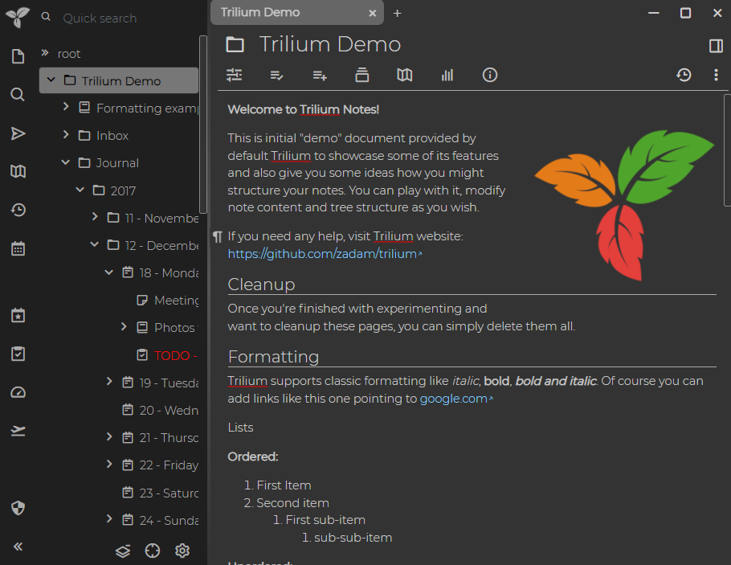
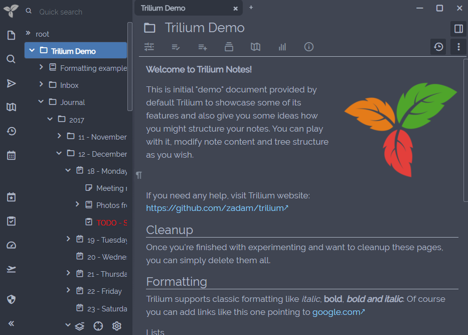
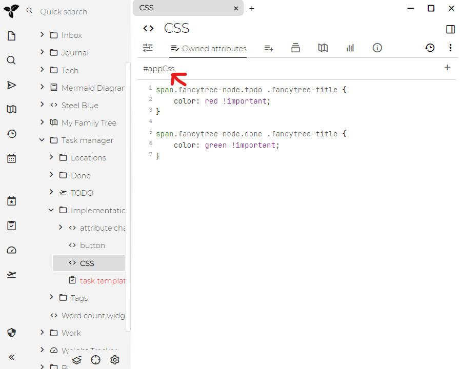

# 主题
## 默认主题

Trilium 自带几个预装的颜色主题，默认是浅色主题。要切换到深色主题或任何其他可用主题，请导航到“选项”菜单（可通过左上角的应用程序图标访问），选择“外观”选项卡，然后选择你偏好的主题。



## 创建自定义 CSS 主题

Trilium 支持自定义用户主题，允许你个性化应用程序的外观。要创建自定义主题，请按照以下步骤操作：

1.  **创建 CSS 代码笔记**：首先创建一个新的 `CSS` 类型的[代码笔记](../Note%20Types/Code.md)。
2.  **使用** `#appTheme` **进行标注**：为你的笔记添加 `#appTheme=my-theme-name` [属性](../Advanced%20Usage/Attributes.md)，其中 `my-theme-name` 是你自定义主题的名称。
3.  **定义你的样式**：在笔记中编写你的自定义 CSS。以下是一个自定义主题的示例：

```
@font-face {
  font-family: 'Raleway';
  font-style: normal;
  font-weight: 400;
  src: url('/custom/fonts/raleway.woff2') format('woff2');
}

:root {
    --main-font-family: 'Raleway' !important;
    --main-font-size: normal;
    --tree-font-family: inherit;
    --tree-font-size: normal;
    --detail-font-family: inherit;
    --detail-font-size: normal;
    --detail-text-font-family: 'Garamond' !important;

    --main-background-color: #404552;
    --main-text-color: #AFB8C6;
    --main-border-color: #AFB8C6;
    --accented-background-color: #383C4A;
    --more-accented-background-color: #2F343F;
    --header-background-color: #383C4A;
    --button-background-color: #2F343F;
    --button-disabled-background-color: #404552;
    --button-border-color: #333;
    --button-text-color: #AFB8C6;
    --button-border-radius: 2px;
    --primary-button-background-color: #6c757d;
    --primary-button-text-color: white;
    --primary-button-border-color: #6c757d;
    --muted-text-color: #86919F;
    --input-text-color: #AFB8C6;
    --input-background-color: #404552;
    --hover-item-text-color: white;
    --hover-item-background-color: #4877B1;
    --active-item-text-color: white;
    --active-item-background-color: #4877B1;
    --menu-text-color: #AFB8C6;
    --menu-background-color: #383C4A;
    --tooltip-background-color: #383C4A;
    --link-color: lightskyblue;
    --modal-background-color: #404552;
    --modal-backdrop-color: black;
    --scrollbar-border-color: rgba(175, 184, 198, 0.5);
}

body .note-detail-text {
    font-size: 120%;
}

body .CodeMirror {
    filter: invert(100%) hue-rotate(180deg);
}
```

### 激活你的自定义主题

创建自定义主题后：

1.  转到“菜单” -> “选项” -> “外观”。
2.  在主题选择下拉菜单中，你应该会看到你的自定义主题，其名称与你通过 `#appTheme` [标签](../Advanced%20Usage/Attributes.md)提供的名称一致。
3.  选择你的自定义主题以激活它。

如果你对主题进行了更改，请按 <kbd>Ctrl</kbd> + <kbd>R</kbd> 重新加载前端以应用更新。

### 分享和导入主题

自定义主题可以导出为 `.tar` 归档文件，并与其他用户共享。但是，从不受信任的来源导入主题时要小心，因为它们可能包含可执行脚本，从而带来安全风险。

一个示例用户主题 _Steel Blue_ 可在演示文档中找到。



### 将自定义 CSS 用于特定目的

除了完整的主题之外，Trilium 还允许使用与主题无关的自定义 CSS。这在脚本编写场景中特别有用，你可能希望修改特定的 UI 元素，例如更改树视图中笔记的颜色。

### 应用自定义 CSS

要使用自定义 CSS：

1.  **创建 CSS 代码笔记**：创建一个新的 `CSS` 类型的 <a class="reference-link" href="../Note%20Types/Code.md">代码</a> 笔记。
2.  **添加** `appCss` **标签**：使用 `#appCss` [标签](../Advanced%20Usage/Attributes.md) 对笔记进行标注。
3.  **编写你的 CSS**：将你的自定义 CSS 规则添加到笔记中。

例如：

```
/* 用于样式化特定元素的自定义 CSS */
.tree-item {
    color: #ff6347; /* 更改树项目颜色 */
}
```

当 Trilium 的前端启动时，所有标记有 `appCss` 的笔记都会自动包含在 HTML 页面的样式元素中。

进行更改后，按 <kbd>Ctrl</kbd> + <kbd>R</kbd> 重新加载前端以应用你的新样式。



### 为树中的特定笔记设置样式

要为树中的某些笔记应用特定样式：

*   **使用** `cssClass` **属性**：为笔记添加 `cssClass` [属性](../Advanced%20Usage/Attributes.md)，并为其分配一个表示所需 CSS 类的值。
*   **定义** `iconClass`：你还可以使用 `iconClass` 属性为笔记定义自定义图标，可以从 [Box Icons](https://boxicons.com) 或你自己的自定义类中选择。

例如，如果你想为特定类型的笔记设置样式，例如包含 PNG 图像的笔记，你可以使用 `type-image mime-image-png` 等类来定位它们。

### 用户提供的主题

提供了一个用户创建主题的图库，展示了 Trilium 社区开发的各种自定义主题。有关更多信息，请查看 <a class="reference-link" href="Themes/Theme%20Gallery.md">主题图库</a>。

### 资源路径管理

在自定义主题或 CSS 中引用内置资源（如图像）时，你可以使用 `vX` 别名来避免硬编码版本号。例如，你可以使用 `/assets/vX/images/icon-grey.png` 而不是指定 `/assets/v0.57.0-beta/images/icon-grey.png`，以使你的主题与 Trilium 的未来版本保持兼容。