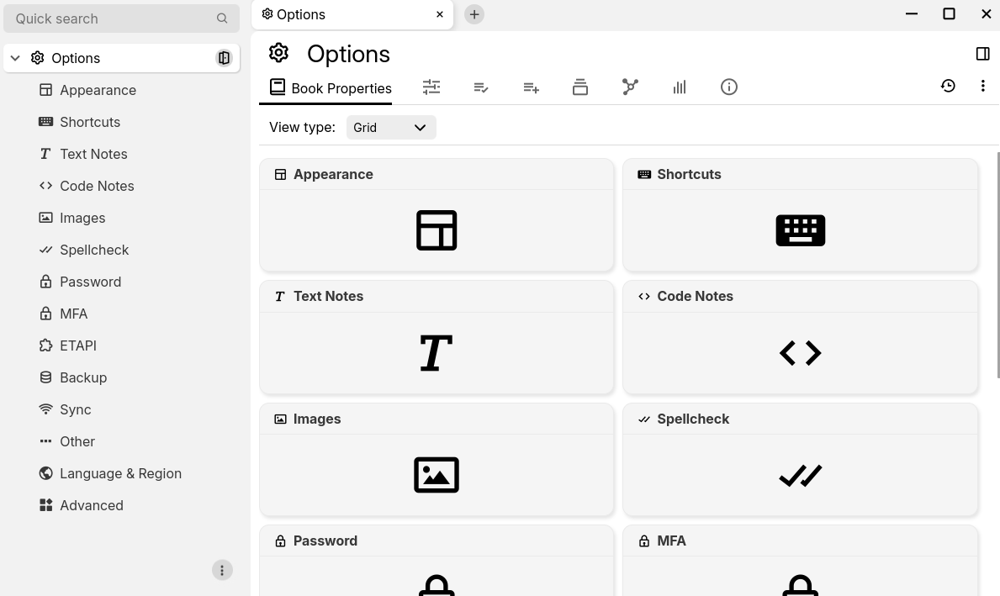

# 选项

<figure class="image image-style-align-center"></figure>

选项部分允许配置 TriliumNext 客户端和服务器。

## 进入选项

可以通过以下方式访问选项：

*   通过[全局菜单](Global%20menu.md)，选择 _选项_ 项。
*   通过[启动栏](Launch%20Bar.md)中的  按钮，如果不需要，该按钮可以选择性地隐藏。
*   可选地，可以定义键盘快捷键，但默认情况下未分配。
*   通过点击此链接：<a class="reference-link" href="#root/_hidden/_options">选项</a>。

进入选项部分后，只需使用<a class="reference-link" href="Note%20Tree.md">笔记树</a>选择其中一个选项类别即可。

## 退出选项

进入选项时，它们会在一个新的[标签页](Tabs.md)中打开。要关闭它们，只需关闭该标签页。

## 使用同步时的选项

当使用<a class="reference-link" href="../../Installation%20%26%20Setup/Synchronization.md">同步</a>时，某些选项将在所有设备间保持同步，而其他选项则可以独立更改。

通常，与外观相关的选项有意保持不同步，以便允许每个客户端进行自定义（布局方向、主题、垂直/水平布局、代码块主题）。