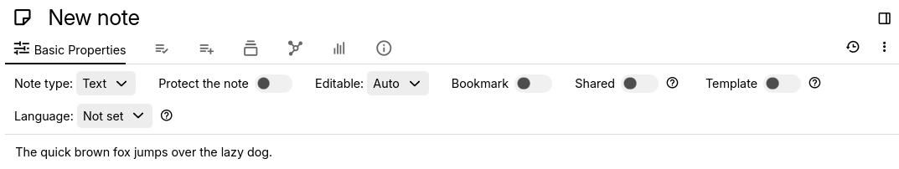

# 功能区

功能区允许更改当前笔记的选项、属性和查看信息。

## 设置

可以更改某些功能区项目在导航到新笔记时是否自动打开。为此，在[设置](Options.md)中，转到_外观_并查找_功能区小组件_部分。

## 格式化

如果您使用的是_固定_格式化工具栏，则文本笔记的所有格式化按钮都将显示在此处。有关更多信息，请参阅[格式化工具栏](../../Note%20Types/Text/Formatting%20toolbar.md)。

## 标签页

### 基本属性

*   _**笔记类型**_ 允许更改笔记的[笔记类型](../../Note%20Types.md)。
    *   通常，仅在笔记为空时才需要更改。
    *   作为更高级的用法，可以更改笔记类型以修改笔记的[源代码](../../Advanced%20Usage/Note%20source.md)。
*   _**保护笔记**_ 切换当前笔记是否加密，并且只能通过进入受保护会话才能访问。有关更多信息，请参阅[受保护的笔记](../Notes/Protected%20Notes.md)。
*   _**可编辑**_ 更改当前笔记是否：
    *   如果笔记太大，自动进入[只读模式](../Notes/Read-Only%20Notes.md)（默认行为）。
    *   始终处于只读模式（但仍可临时编辑）。
    *   无论大小，始终可编辑。
*   _**书签**_ 切换当前笔记是否显示在[启动栏](Launch%20Bar.md)中以便快速访问。有关更多信息，请参阅[书签](../Navigation/Bookmarks.md)。
*   _**共享**_ 切换如果您设置了[服务器实例](../../Installation%20%26%20Setup/Server%20Installation.md)，当前笔记是否可公开访问。有关更多信息，请参阅[共享](../../Advanced%20Usage/Sharing.md)。
*   _**模板**_ 切换当前笔记是否被视为模板，并可用于轻松创建具有相同内容的笔记。有关更多信息，请参阅[模板](../../Advanced%20Usage/Templates.md)。
*   _**语言**_ 更改当前笔记的主要语言，主要用于拼写检查或从右到左支持。有关更多信息，请参阅[内容语言与从右到左支持](../../Note%20Types/Text/Content%20language%20%26%20Right-to-left%20support.md)。

### 自有属性

此部分允许编辑笔记的标签和关系。有关更多信息，请参阅[属性](../../Advanced%20Usage/Attributes.md)。

右侧的加号按钮提供了一种通过图形输入插入标签和关系的简化方式。在此菜单中，还可以定义标签和关系定义（请参阅[提升属性](../../Advanced%20Usage/Attributes/Promoted%20Attributes.md)）。

### 继承属性

此部分显示通过[属性继承](../../Advanced%20Usage/Attributes/Attribute%20Inheritance.md)应用于此笔记的属性。无法从此部分更改属性。

### 笔记路径

此部分显示当前笔记被克隆到的所有位置。此处也可以将当前笔记克隆到新位置（类似于[笔记树](Note%20Tree.md)）。有关更多信息，请参阅[克隆笔记](../Notes/Cloning%20Notes.md)。

### 笔记图谱

笔记图谱显示当前笔记与其他笔记的所有关系，以及子树结构。有关更多信息，请参阅[笔记树](Note%20Tree.md)。

### 相似笔记

此部分列出与当前笔记相似的所有笔记。有关更多信息，请参阅[相似笔记](../Navigation/Similar%20Notes.md)。

### 笔记信息

此部分显示有关当前笔记的信息：

*   笔记的[内部 ID](../../Advanced%20Usage/Note%20ID.md)。
*   [笔记类型](../../Note%20Types.md)及其 MIME 类型（主要用于导出笔记）。
*   创建和修改日期。
*   笔记在[数据库](../../Advanced%20Usage/Database.md)中的估计大小，以及其子项数量和大小。

### 已编辑的笔记

当进入[日记笔记](../../Advanced%20Usage/Advanced%20Showcases/Day%20Notes.md)时，此部分会自动弹出，并显示当天编辑过的笔记。

可以通过转到<a class="reference-link" href="#root/_hidden/_options/_optionsAppearance">外观</a>设置并查找_功能区小组件_部分来禁用此行为。