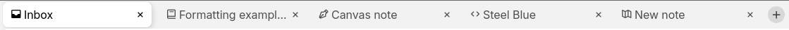
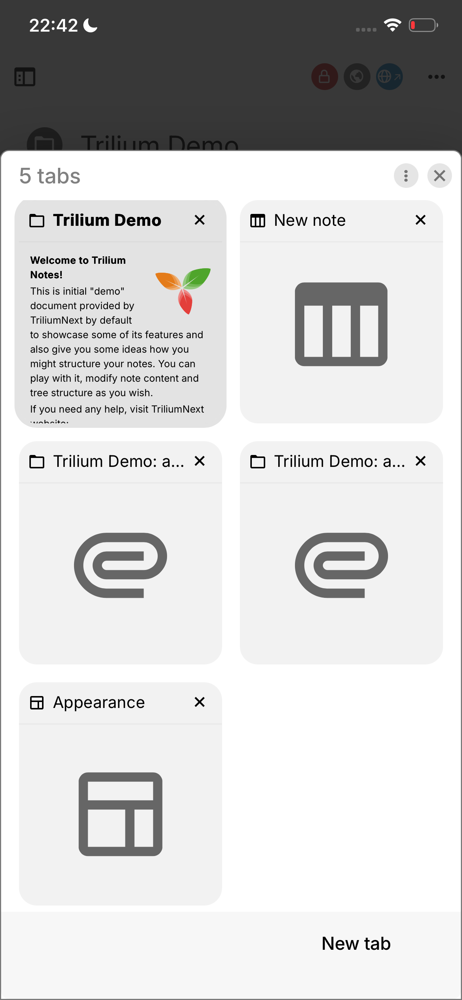

# 标签页

<figure class="image image-style-align-center"></figure>

在 Trilium 中，标签页可以方便地在笔记之间切换。

## 布局

取决于<a class="reference-link" href="Vertical%20and%20horizontal%20layout.md">垂直和水平布局</a>：

*   对于垂直布局，标签页将放置在顶部，但位于<a class="reference-link" href="Note%20Tree.md">笔记树</a>的右侧。
*   对于水平布局，标签页将以全宽放置在顶部，位于[笔记树](Note%20Tree.md)上方，从而可以舒适地显示更多标签页。

## 交互

*   要创建新标签页，请按最后一个标签页右侧的  按钮。
*   要关闭标签页，请按相应的  按钮。
*   对于多任务处理，标签页可以与<a class="reference-link" href="Split%20View.md">分屏视图</a>一起使用。每个标签页可以包含一个或多个笔记，水平显示。
*   可以通过拖放将标签页重新排序到新位置。
*   可以通过向上或向下拖动标签页，在的新窗口中显示现有标签页。无法将标签页重新合并到另一个窗口中。

## 键盘交互

由于标签页是常用功能，因此有多个键盘快捷键可以使用：

*   <kbd>Ctrl</kbd>+<kbd>T</kbd> 打开新标签页。
*   <kbd>Ctrl</kbd>+<kbd>W</kbd> 关闭当前标签页。
*   <kbd>Ctrl</kbd>+<kbd>Shift</kbd>+<kbd>T</kbd> 重新打开最近关闭的标签页。
*   <kbd>Ctrl</kbd>+<kbd>Tab</kbd> 和 <kbd>Ctrl</kbd>+<kbd>Shift</kbd>+<kbd>Tab</kbd> 转到下一个或上一个标签页。
*   <kbd>Ctrl</kbd>+<kbd>1</kbd>、<kbd>Ctrl</kbd>+<kbd>2</kbd>，一直到 <kbd>Ctrl</kbd>+<kbd>9</kbd> 激活第一个、第二个直到第九个标签页。
*   还有一个转到最后一个标签页的快捷键，但默认情况下未分配按键。

## 移动端

<figure class="image image-style-align-right image_resized" style="width:34.12%;"></figure>

<a class="reference-link" href="../../Installation%20%26%20Setup/Mobile%20Frontend.md">移动端前端</a>也支持标签页。

自 v0.102.0 版本起，通过按下<a class="reference-link" href="Launch%20Bar.md">启动栏</a>中的专用标签切换按钮来显示标签页。在此视图中，标签页以网格布局显示，并带有笔记内容的预览。

弹出窗口右上角的上下文菜单按钮允许创建新标签页、重新打开最近关闭的标签页以及关闭所有标签页。

<a class="reference-link" href="Split%20View.md">分屏视图</a>也会在标签切换器中显示，标签页中会显示两个标题。

> [!NOTE]
> v0.102.0 之前的版本也支持标签页，但它们直接显示在<a class="reference-link" href="Launch%20Bar.md">启动栏</a>上方。决定采用更类似移动端的标签切换器，是因为原始的标签栏无法同时支持太多标签页，并且新设计更符合移动应用程序处理标签页的方式。