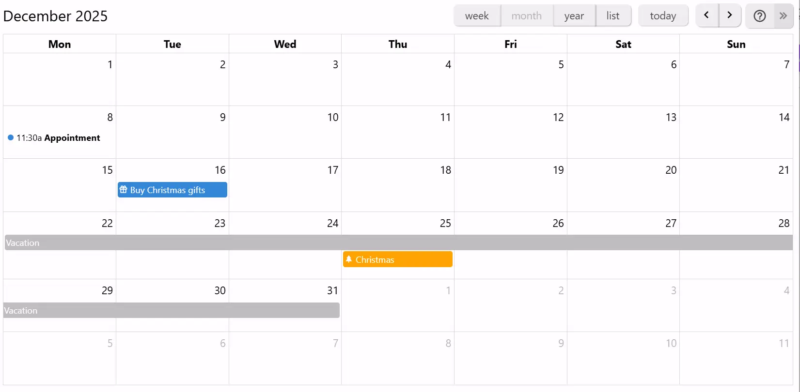
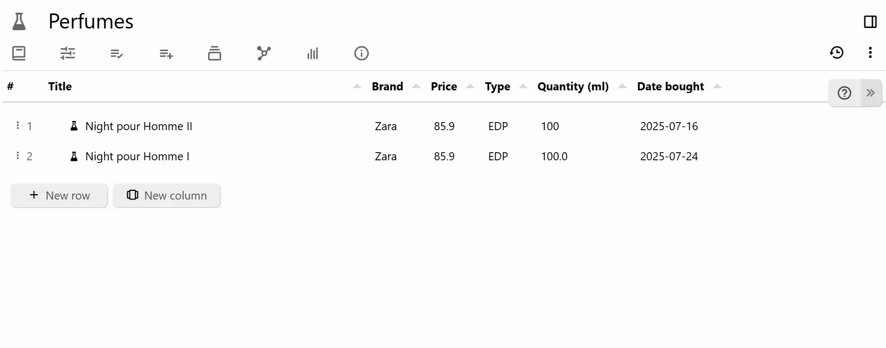
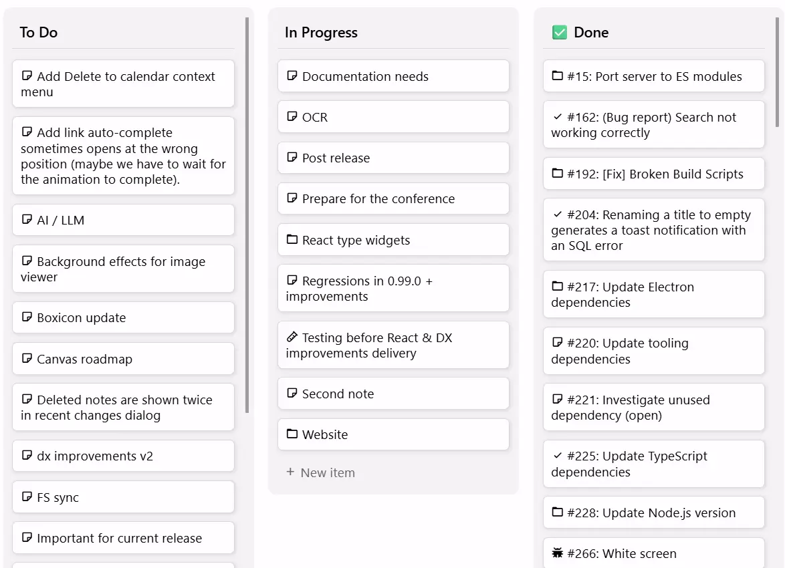
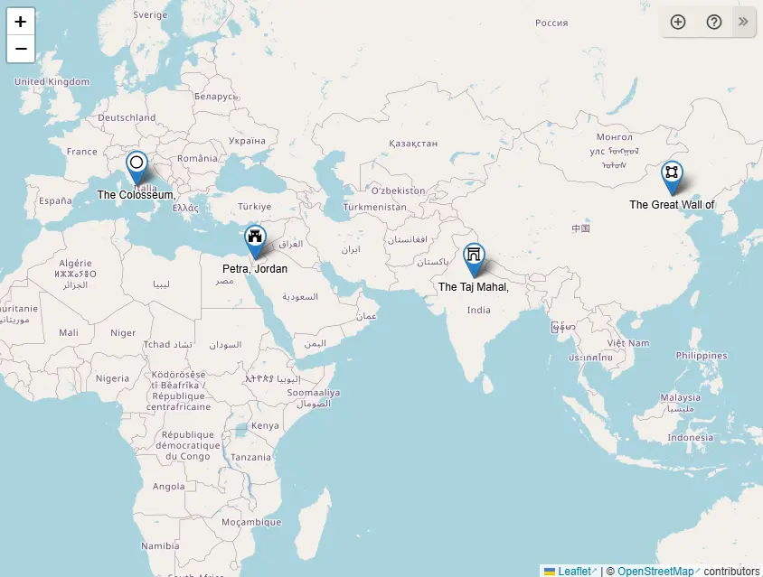
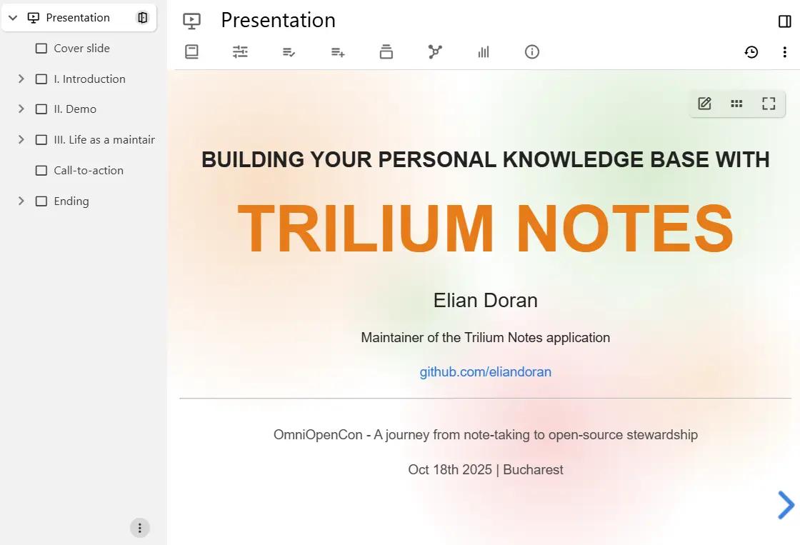

# 集合

集合是一种特殊类型的笔记，它没有内容，而是以多种呈现方式显示其子笔记。

## 主要集合

|  |  |
| --- | --- |
| <figure class="image"></figure> | <a class="reference-link" href="Collections/Calendar.md">日历</a>         以周、月或年日历的形式显示笔记，笔记以事件的形式呈现。通过在日历上拖动即可轻松添加新事件。 |
| <figure class="image"></figure> | <a class="reference-link" href="Collections/Table.md">表格</a>         将每条笔记显示为表格中的一行，同时显示<a class="reference-link" href="Advanced%20Usage/Attributes/Promoted%20Attributes.md">提升属性</a>。这样可以轻松查看笔记的属性，并且方便编辑。 |
| <figure class="image"></figure> | <a class="reference-link" href="Collections/Kanban%20Board.md">看板</a>         以列的形式显示笔记，按标签的值进行分组。可以轻松创建条目和列，或拖动它们来更改状态。 |
| <figure class="image"></figure> | <a class="reference-link" href="Collections/Geo%20Map.md">地理地图</a>         显示地理地图，笔记以地图上的标记形式呈现。通过在地图上点击即可轻松添加新标记。此外还可以添加[形状](Collections/Geo%20Map/Drawing%20shapes.md)，如路径、矩形和圆形，以及 GPX 轨迹。 |
| <figure class="image"></figure> | <a class="reference-link" href="Collections/Presentation.md">演示文稿</a>         将每条笔记显示为一张幻灯片，可以全屏演示并带有平滑过渡效果，也可以导出为 PDF 用于分享。 |

## 经典集合

经典集合为只读模式，将所有子笔记的内容编译为一个连续的视图。这使其非常适合阅读被拆分为较小、可管理片段的大量信息。

*   <a class="reference-link" href="Collections/Grid%20View.md">网格视图</a>是子笔记的默认呈现方式（参见<a class="reference-link" href="Basic%20Concepts%20and%20Features/Notes/Note%20List.md">笔记列表</a>），笔记以磁贴形式显示，标题和内容均可见。
*   <a class="reference-link" href="Collections/List%20View.md">列表视图</a>与<a class="reference-link" href="Collections/Grid%20View.md">网格视图</a>类似，但它将笔记一个接一个地显示，内容可以展开/折叠，并且支持递归。

经典集合使用分页来支持大量笔记。页面大小可以通过 `pageSize` 进行自定义。

## 创建新集合

要创建新集合，请在<a class="reference-link" href="Basic%20Concepts%20and%20Features/UI%20Elements/Note%20Tree.md">笔记树</a>中右键单击，找到 _集合_ 条目并选择所需的类型。

默认情况下，集合带有默认配置，有时甚至包含示例笔记。要完全从头创建集合：

1.  创建一个 _文本_ 类型的新笔记（或任何类型）。
2.  将[笔记类型](Note%20Types.md)更改为 _集合_。
3.  在<a class="reference-link" href="Collections/Collection%20Properties.md">集合属性</a>中，选择所需的视图类型。
4.  查阅相应视图类型的帮助页面，了解如何配置它们。

## 配置

要更改集合的配置，甚至切换到不同的集合（例如从看板切换到日历），请参见笔记顶部的<a class="reference-link" href="Collections/Collection%20Properties.md">集合属性</a>栏。

## 已归档的笔记

默认情况下，[已归档的笔记](Basic%20Concepts%20and%20Features/Notes/Archived%20Notes.md)不会显示在集合中。可以通过前往<a class="reference-link" href="Collections/Collection%20Properties.md">集合属性</a>并勾选 _显示已归档的笔记_ 来更改此行为。

已归档的笔记通常会以灰色显示，与普通笔记区分开来。

## 在笔记树中隐藏子笔记

对于包含大量条目的集合，出于性能考虑和减少杂乱，隐藏笔记树中的条目会很有帮助。这对于独立集合（如地理地图或任务看板）尤其有用。

为此，请前往<a class="reference-link" href="Collections/Collection%20Properties.md">集合属性</a>并选择 _在树中隐藏子笔记_。

## 高级用例

### 为集合添加描述

要在集合之前添加文本，例如用于描述它：

1.  创建一个新集合。
2.  将[笔记类型](Note%20Types.md)从 _集合_ 更改为 _文本_。

现在文本将显示在上方，同时仍然保持集合视图。

这种方法的唯一缺点是<a class="reference-link" href="Collections/Collection%20Properties.md">集合属性</a>将不再显示。在这种情况下，请手动修改属性，或临时切换回 _集合_ 类型进行配置。

### 使用保存的搜索

集合默认只显示子笔记。但是，可以使用<a class="reference-link" href="Basic%20Concepts%20and%20Features/Navigation/Search.md">搜索</a>功能来显示整个树中的笔记，并具有高级查询功能。

为此，只需开始一个<a class="reference-link" href="Basic%20Concepts%20and%20Features/Navigation/Search.md">搜索</a>，然后前往<a class="reference-link" href="Basic%20Concepts%20and%20Features/UI%20Elements/Ribbon.md">功能区</a>中的 _集合属性_ 选项卡，选择所需的集合类型。要保留基于搜索的集合，请使用<a class="reference-link" href="Note%20Types/Saved%20Search.md">保存的搜索</a>。

> [!IMPORTANT]
> 在搜索状态下，所有集合都不会显示搜索结果的子笔记。原因是搜索可能会多次命中同一条笔记，导致结果数量呈指数级增长。

## 底层原理

集合本身只是没有内容的笔记，依赖<a class="reference-link" href="Basic%20Concepts%20and%20Features/Notes/Note%20List.md">笔记列表</a>机制（即在笔记底部列出子笔记的机制）来显示信息。

默认情况下，新集合使用预定义的<a class="reference-link" href="Advanced%20Usage/Templates.md">模板</a>，这些模板安全地存储在<a class="reference-link" href="Advanced%20Usage/Hidden%20Notes.md">隐藏笔记</a>中，用于定义一些基本配置（如视图类型），以及一些<a class="reference-link" href="Advanced%20Usage/Attributes/Promoted%20Attributes.md">提升属性</a>以便于编辑。

集合不会将其配置（例如地图上的位置、表格中隐藏的列）存储在笔记内容本身中，而是作为附件存储。