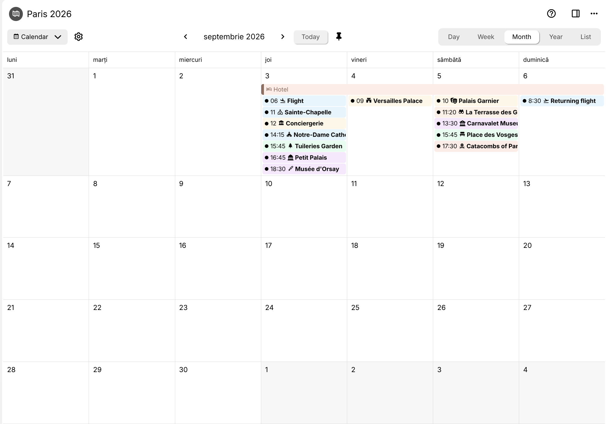
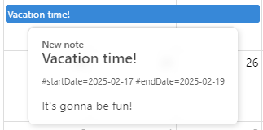
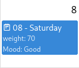
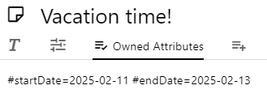
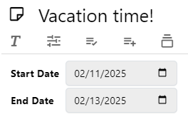
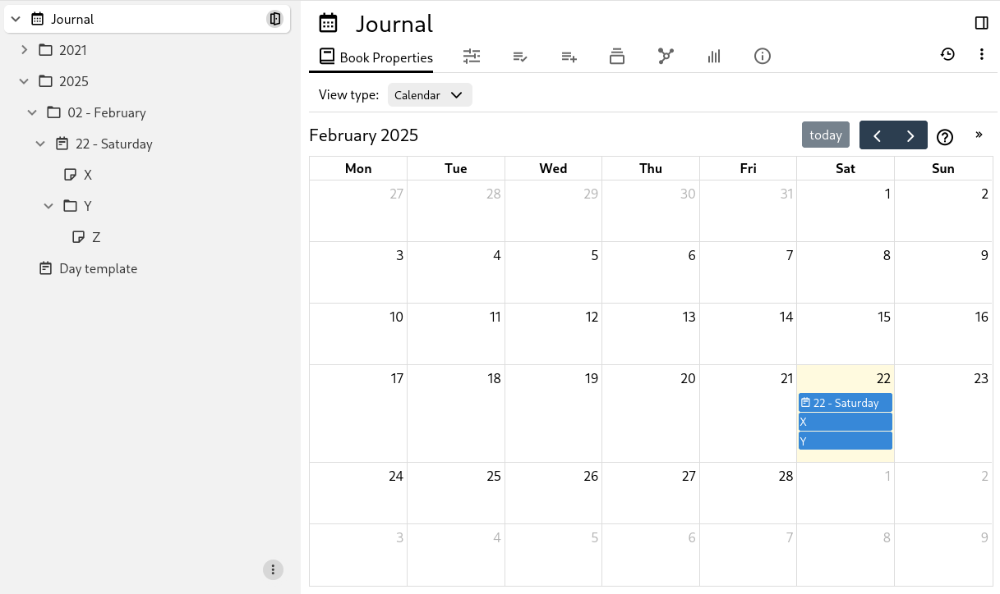
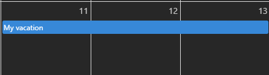
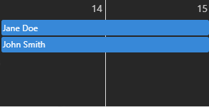
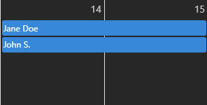

# 日历
<figure class="image"></figure>

日历视图会将每个具有开始日期和可选结束日期的子笔记作为事件显示在日历中。

日历视图有多种显示模式：

*   月视图，显示整个月，可以插入全天事件。同时列出特定时间事件和全天事件。
*   周视图，将一周的7天（如果隐藏周末则为5天）显示为列。此模式允许输入和显示特定时间事件，而不仅仅是全天事件。
*   日视图，仅查看单日。对于密集的日程或移动端视图特别有用。
*   列表视图，按顺序显示给定月份的所有事件。
*   年视图，显示整年以供快速参考。

与其他集合视图类型不同，日历视图还允许某种交互，例如移动事件以及创建新事件。

## 创建日历

右键点击<a class="reference-link" href="../Basic%20Concepts%20and%20Features/UI%20Elements/Note%20Tree.md">笔记树</a>中的现有笔记，选择 _插入子笔记_ 并查找 _日历_。

## 创建新事件/笔记

要创建新事件：

*   首先，点击所需的日期（月视图和年视图）或所需的时间段（日视图）。
*   或者，拖拽跨越多个日期（或时间段）来同时设置开始和结束日期。

在任一情况下，都会出现一个小弹窗，提示输入将要创建的事件的标题和日期时间。

此时，事件尚未创建，以防止意外点击。可选地添加标题，然后按 _创建_ 按钮。如果未提供标题，事件将遵循<a class="reference-link" href="../Advanced%20Usage/Default%20Note%20Title.md">默认笔记标题</a>规则。

创建事件后，它将显示在日历上。要编辑事件内容（包括重复规则），请点击它以打开弹窗视图。

> [!NOTE]
> 从日历创建新笔记时，如果集合笔记上设置了 `~child:template` 关系，则会遵循该关系。

## 与事件交互

*   将鼠标悬停在事件上会显示有关笔记的信息。
    
*   左键单击事件将打开一个专用弹窗，以便快速配置事件或编辑其笔记内容。
*   右键单击将提供更多选项，包括在新分屏或新窗口中打开笔记。
*   在日历上拖放事件以将其移动到另一天。
*   可以通过将鼠标放在事件的右边缘并拖动鼠标来更改事件的长度。

### 弹窗视图

点击事件时，事件附近会显示一个弹窗，其中包含以下信息：

*   事件的标题和图标，均可编辑。
*   用于与事件交互的按钮：
    *   在同一窗格、新标签页等中打开事件。
    *   用于更改事件颜色的颜色选择器。
    *   用于从日历中移除事件的按钮，可以选择删除其对应的笔记。
*   日历特定功能：
    *   全天事件的切换开关。
    *   开始/结束日期和时间选择器。
    *   完整的重复编辑器，使同一事件按周、按月等重复出现。
*   标记的<a class="reference-link" href="../Advanced%20Usage/Attributes/Promoted%20Attributes.md">提升属性</a>（如果有）。
*   可以直接在面板中编辑的笔记内容。

要关闭弹窗：

*   按弹窗右上角的 X 按钮。
*   在日历中，点击弹窗以外的任意位置。
*   或者直接按 <kbd>Escape</kbd> 键。

即使在弹窗视图已经打开的情况下，也可以通过点击事件在事件之间切换。

事件之间可以存在<a class="reference-link" href="../Note%20Types/Text/Links/Internal%20(reference)%20links.md">内部（引用）链接</a>，点击此类链接将自动将日历导航到正确的日期，并将弹窗视图导航到新笔记。

## 移动端交互

当 Trilium 在移动设备上时，与日历的交互略有不同：

*   点击事件会显示弹窗视图，允许编辑事件。
*   长按事件会触发上下文菜单，包括在<a class="reference-link" href="../Basic%20Concepts%20and%20Features/Navigation/Quick%20edit.md">快速编辑</a>中打开的选项。
*   要插入新事件，请触摸并按住空白区域。成功后，空白区域将变色以指示选择。
    *   在释放之前，拖拽跨越多个区域以创建多天事件。
    *   释放时，将出现提示以输入笔记标题。
*   要移动现有事件，请触摸并按住事件，直到其附近的空白区域变色。
    *   此时，可以将事件拖拽到日历上的其他日期。
    *   或者，可以通过点击事件右端的小圆圈来调整事件大小。
    *   要退出编辑模式，只需点击日历上的任意空白区域。

## 配置日历视图

在<a class="reference-link" href="../Basic%20Concepts%20and%20Features/UI%20Elements/Ribbon.md">功能区</a>的 _集合_ 选项卡中，可以调整以下内容：

*   在周视图中隐藏周末。
*   在日历上显示周数。
*   设置时间段持续时间（日/周视图中每个时间行的长度）。
*   设置时间段标签间隔（日/周视图中时间标签在轴上的显示频率）。

## 使用属性配置日历

可以向集合类型添加以下属性：

<table>
    <thead>
        <tr>
            <th>名称</th>
            <th>描述</th>
        </tr>
    </thead>
    <tbody>
        <tr>
            <td><code spellcheck="false">#calendar:hideWeekends</code></td>
            <td>当存在时（无论值如何），将从日历中隐藏周六和周日。</td>
        </tr>
        <tr>
            <td><code spellcheck="false">#calendar:weekNumbers</code></td>
            <td>当存在时（无论值如何），将在日历上显示周数。</td>
        </tr>
        <tr>
            <td><code spellcheck="false">#calendar:initialDate</code></td>
            <td>更改日历打开的日期。当不存在时，日历在当前日期打开。</td>
        </tr>
        <tr>
            <td><code spellcheck="false">#calendar:view</code></td>
            <td><p>在日历中显示哪个视图：</p><ul><li><code spellcheck="false">timeGridDay</code> 用于 <em>日</em> 视图；</li><li><code spellcheck="false">timeGridWeek</code> 用于 <em>周</em> 视图；</li><li><code spellcheck="false">dayGridMonth</code> 用于 <em>月</em> 视图；</li><li><code spellcheck="false">multiMonthYear</code> 用于 <em>年</em> 视图；</li><li><code spellcheck="false">listMonth</code> 用于 <em>列表</em> 视图。</li></ul><p>任何其他值将被忽略，并使用默认视图（月）。</p><p>使用 UI 按钮更改视图时，此标签的值会自动更新。</p></td>
        </tr>
        <tr>
            <td><code spellcheck="false">#calendar:slotDuration</code></td>
            <td>设置日历上每个时间段的时间长度。默认为 <code spellcheck="false">00:15:00</code>（15分钟）。格式必须为“HH:MM:SS”。例如，要创建每10分钟的时间段，可以设置 <code spellcheck="false">#calendar:slotDuration="00:10:00"</code>。</td>
        </tr>
        <tr>
            <td><code spellcheck="false">#calendar:slotLabelInterval</code></td>
            <td>设置日历上的时间段应多久标记一次标签。默认为 <code spellcheck="false">01:00:00</code>（1小时）。格式必须为“HH:MM:SS”。例如，要每30分钟标记一次时间段，可以设置 <code spellcheck="false">#calendar:slotLabelInterval="00:30:00"</code>。</td>
        </tr>
        <tr>
            <td><code spellcheck="false">~child:template</code></td>
            <td>定义日历中新建笔记（通过拖拽或点击）的模板。</td>
        </tr>
    </tbody>
</table>

此外，一周的第一天可以是周日或周一，可以在应用程序设置中调整。

## 使用属性配置日历事件

对于日历中的每个笔记，可以使用以下属性：

| 名称 | 描述 |
| --- | --- |
| `#startDate` | 事件开始的日期，它将显示在日历中。格式为 `YYYY-MM-DD`（年、月、日之间用减号分隔）。 |
| `#endDate` | 类似于 `startDate`，如果事件跨越多个日期，则提及结束日期。该日期是包含在内的，因此结束日也被视为事件的一部分。对于单日事件，此属性可以缺失。 |
| `#startTime` | 事件开始的时间。如果此值缺失，则事件被视为全天事件。格式为 `HH:MM`（24小时制的小时和分钟）。 |
| `#endTime` | 类似于 `startTime`，提及事件结束的时间（与 `endDate`（如果存在）或 `startDate` 相关）。 |
| `#recurrence` | 这是一个可选的 CalDAV `RRULE` 字符串，如果存在，则决定任务是否应重复。请注意，它不包含 `DTSTART` 属性，该属性直接由 `#startDate` 和 `#startTime` 派生。有关有效 `RRULE` 字符串的示例，请参见 [https://icalendar.org/rrule-tool.html](https://icalendar.org/rrule-tool.html) |
| `#color` | 使用指定颜色显示事件（例如 `red`、`gray` 等命名颜色或 `#FF0000` 等十六进制颜色）。这也会更改笔记在其他位置（如笔记树）中的颜色。 |
| `#calendar:color` | **❌️ 自 v0.100.0 起已移除。请改用** `#color`。      <br>  <br>类似于 `#color`，但仅对日历中的事件应用颜色，而不影响笔记树等其他位置。 |
| `#iconClass` | 如果存在，笔记的图标将显示在事件标题的左侧。 |
| `#calendar:title` | 将事件的标题更改为指向笔记的某个属性（而不是标题），可以是标签或关系（不带 `#` 或 `~` 符号）。有关更多信息，请参见 _使用案例_。 |
| `#calendar:displayedAttributes` | 允许在日历中显示一个或多个属性的值，如下所示：           <br>  <br>          <br>  <br>`#weight="70" #Mood="Good" #calendar:displayedAttributes="weight,Mood"`         <br>  <br>它也可以与关系一起使用，在这种情况下，它将显示目标笔记的标题：          <br>  <br>`~assignee=@My assignee #calendar:displayedAttributes="assignee"` |
| `#calendar:startDate` | 允许使用不同的标签来表示开始日期，而不是 `startDate`（例如 `expiryDate`）。标签名称**不得**以 `#` 为前缀。如果笔记未定义该标签，则将使用默认标签。 |
| `#calendar:endDate` | 类似于 `#calendar:startDate`，允许更改用于读取结束日期的属性。 |
| `#calendar:startTime` | 类似于 `#calendar:startDate`，允许更改用于读取开始时间的属性。 |
| `#calendar:endTime` | 类似于 `#calendar:startDate`，允许更改用于读取结束时间的属性。 |

## 日历的工作原理



日历显示集合中所有具有 `#startDate` 的子笔记。可以选择添加 `#endDate`。

可以通过点击事件直接在日历集合中轻松编辑开始日期和结束日期。要在事件笔记本身中编辑日期，可以向集合笔记添加以下属性：

```
#viewType=calendar #label:startDate(inheritable)="promoted,alias=Start Date,single,date"
#label:endDate(inheritable)="promoted,alias=End Date,single,date"
#hidePromotedAttributes 
```

这将导致：



当不在日志中使用时，日历是递归的。也就是说，它不仅会在其子笔记中查找事件，还会在这些子笔记的子级中查找事件。

## 重复

内置的日历视图也支持重复任务（例如，每周、每月以及更复杂的重复规则）。

从 v0.105.0 开始，可以通过点击事件然后选择 _重复_ 选项直接从日历编辑重复规则。

### 使用 RRULE 子集的自定义重复

如果事件弹窗中的现有重复编辑器不够用，可以通过 `#recurrence` 标签手动设置更复杂的规则。

例如，要使笔记在日历上重复：

*   每天 - `#recurrence="FREQ=DAILY;INTERVAL=1"`
*   每3天 - `#recurrence="FREQ=DAILY;INTERVAL=3"`
*   每周 - `#recurrence="FREQ=WEEKLY;INTERVAL=1"`
*   每2周的周一、周三和周五 - `#recurrence="FREQ=WEEKLY;INTERVAL=2;BYDAY=MO,WE,FR"`
*   每3个月 - `#recurrence="FREQ=MONTHLY;INTERVAL=3"`
*   每2个月的第一个周日 - `#recurrence="FREQ=MONTHLY;INTERVAL=2;BYDAY=1SU"`
*   每月的最后一个周五 - `#recurrence="FREQ=MONTHLY;INTERVAL=1;BYDAY=-1FR"`

有关有效 `RRULE` 字符串的其他示例，请参见 [https://icalendar.org/rrule-tool.html](https://icalendar.org/rrule-tool.html)

请注意，重复字符串不包含 iCAL 规范中定义的 `DTSTART` 属性。这直接由 `startDate` 和 `startTime` 属性派生。

如果要覆盖日历用于获取重复字符串的标签，可以使用 `#calendar:recurrence` 属性。例如，可以设置 `#calendar:recurrence=taskRepeats`。然后可以像这样设置重复字符串 `#taskRepeats="FREQ=DAILY;INTERVAL=1"`。

另请注意，重复标签可以像开始和结束日期一样被提升。

> [!WARNING]
> 如果重复字符串无效，将显示一个包含笔记 ID 和标题以及错误重复消息的提示。该笔记将不会添加到日历中。

## 时间段持续时间 & 时间段标签间隔

Trilium 的日历视图由 FullCalendar 驱动，它允许你对日视图和周视图的时间网格外观和行为进行细粒度控制。可用于配置这些视图的两个标签是 `#calendar:slotDuration` 和 `#calendar:slotLabelInterval`。理解每个标签的作用——以及它们如何交互——可以让你根据自己的工作流程定制日历，无论你是按15分钟的增量进行调度，还是按宽泛的小时块来规划你的一天。

这些设置也可以从<a class="reference-link" href="../Basic%20Concepts%20and%20Features/UI%20Elements/Ribbon.md">功能区</a>的 _集合_ 选项卡中调整。

### 时间段持续时间

控制日历上每个时间段的高度——本质上是网格被划分的最小时间单位。较短的持续时间意味着更多的行和更细的粒度；较长的持续时间意味着更少、更粗的行。默认是每15分钟一行。

**示例：**

| 值 | 结果 |
| --- | --- |
| `#calendar:slotDuration="00:15:00"` | 每15分钟一行 |
| `#calendar:slotDuration="00:30:00"` | 每30分钟一行 |
| `#calendar:slotDuration="01:00:00"` | 每小时一行 |

### 标签间隔

控制左侧轴上多久显示一次时间标签。这与时间段大小无关——你可以有非常小的时间段，但只每小时标记一次以保持轴的可读性。默认是每小时显示一个时间标签。

**示例：**

| 值 | 结果 |
| --- | --- |
| `#calendar:slotLabelInterval="00:30:00"` | 每30分钟显示一个时间标签 |
| `#calendar:slotLabelInterval="01:00:00"` | 每小时显示一个时间标签 |

### 有用的组合

| `#calendar:slotDuration` | `#calendar:slotLabelInterval` | 结果 |
| --- | --- | --- |
| `00:15:00` | `01:00:00` | 精细网格，简洁轴——适合繁忙的日程 |
| `00:30:00` | `01:00:00` | 标准日历感觉 |
| `01:00:00` | `01:00:00` | 简单的小时网格——适合日计划 |
| `00:15:00` | `00:30:00` | 精细网格，每30分钟标记一次——平衡的细节 |

### 格式

两个值都使用 `HH:mm:ss` 格式。小时可以到 `24` (`24:00:00`)，而分钟和秒必须在 `00` 到 `59` 之间。最小有意义的持续时间是1分钟 (`00:01:00`)。

## 使用案例

### 与日志/日历一起使用

可以将日历视图集成到带有日笔记的日志中。为此，请将日志笔记（日历根）的笔记类型更改为集合，然后选择日历视图。

在日志模式下，弹窗编辑器将不显示日期、重复、颜色或移除选项，因为日笔记不是可编辑的事件。

基于 `#calendarRoot`（或 `#workspaceCalendarRoot`）属性，日历将知道它处于日志模式并应用以下规则：

*   日历事件现在根据其 `dateNote` 属性而不是 `startDate` 渲染。
*   交互式编辑（例如在空白区域拖拽或调整事件大小）不再可能。
*   点击日期上的空白区域将自动打开该日的笔记，如果不存在则创建它。
*   日笔记的直接子级将显示在日历上，即使它们没有 `dateNote` 属性。子笔记的子级将不会显示。



### 使用不同的属性作为事件标题

默认情况下，事件在日历上通过其笔记标题显示。但是，可以配置显示不同的属性。

为此，将 `#calendar:title` 分配给子笔记（而不是日历/集合笔记），其值为 `name`，其中 `name` 可以是任何标签（注意不要添加 `#` 前缀）。该属性也可以通过继承获得，例如模板属性。如果笔记没有请求的标签，则将使用笔记的标题。

```
#startDate=2025-02-11 #endDate=2025-02-13 #name="My vacation" #calendar:title="name"
```

### 使用关系属性作为事件标题

与使用属性类似，使用 `#calendar:title` 并将其设置为 `name`，其中 `name` 是要使用的关系的名称。

此外，如果存在更多同名关系，它们将显示为来自同一笔记的多个事件。

```
#startDate=2025-02-14 #endDate=2025-02-15 ~for=@John Smith ~for=@Jane Doe #calendar:title="for"
```

请注意，甚至可以在目标笔记（例如“John Smith”）上设置 `#calendar:title`，它将尝试渲染该笔记的属性。请注意，出于安全原因，此处不能使用关系（属性的意外递归可能导致应用程序无限循环）。

```
#calendar:title="shortName" #shortName="John S."
```