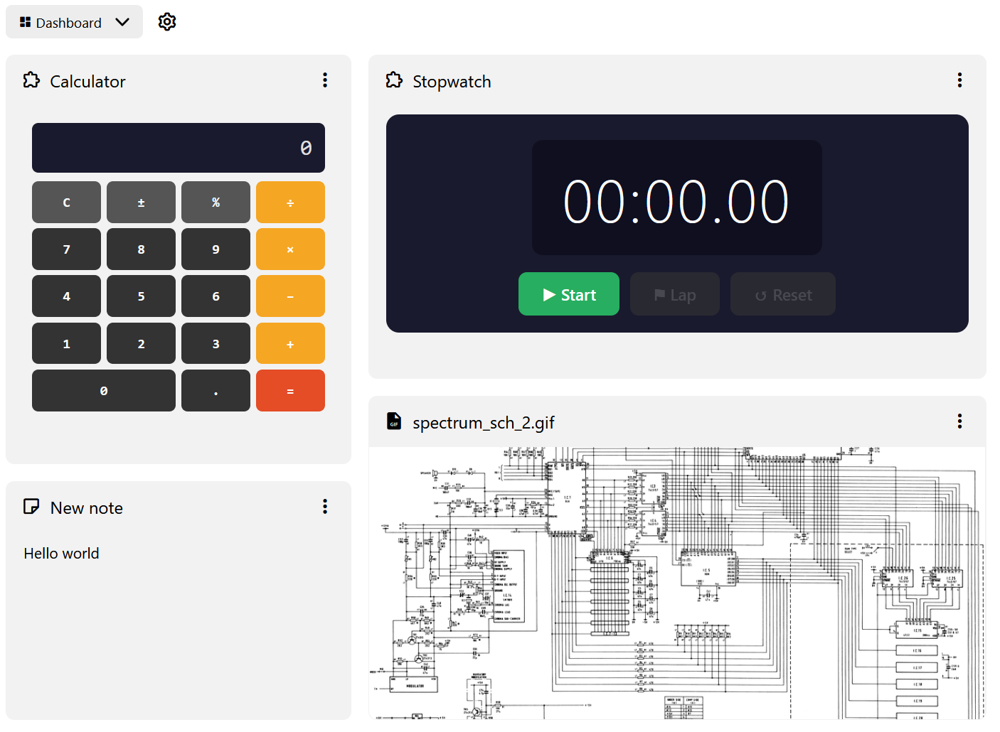

# 仪表板
<figure class="image"></figure>

> [!注意]
> 仪表板目前被视为测试版。这意味着在其稳定之前，其行为可能会发生一些变化。

仪表板是 Trilium v0.104.0 中引入的一种集合。它与 <a class="reference-link" href="Grid%20View.md">网格视图</a> 集合类似，但有一些关键区别：

*   网格布局不是固定的，允许瓦片具有不同的宽度和高度。网格有 12 列和无限行数。
*   每个小组件代表集合的一个子笔记，可以重新排序或调整大小。
*   网格将均匀分布列以填满整个屏幕。
    *   如果可用空间过小（例如在分屏或移动设备中），列将折叠，以便所有小组件一个接一个地显示。
    *   当列折叠时，小组件无法重新排序或调整大小。
*   与 <a class="reference-link" href="Grid%20View.md">网格视图</a> 不同，小组件不可点击，这允许它们具有交互性。

## 小组件类型

仪表板使用与 <a class="reference-link" href="Grid%20View.md">网格视图</a> 或 <a class="reference-link" href="../Basic%20Concepts%20and%20Features/Notes/Note%20List.md">笔记列表</a> 相同的渲染机制，这意味着每个笔记都可以被渲染，例如：

*   静态内容，通过 <a class="reference-link" href="../Note%20Types/Text.md">文本</a> 或 <a class="reference-link" href="../Note%20Types/Code.md">代码</a>。
*   图片，通过 <a class="reference-link" href="../Note%20Types/File.md">文件</a>、<a class="reference-link" href="../Note%20Types/Mermaid%20Diagrams.md">Mermaid 图表</a>、<a class="reference-link" href="../Note%20Types/Mind%20Map.md">思维导图</a>。
*   交互式小组件，通过 <a class="reference-link" href="../Note%20Types/Render%20Note.md">渲染笔记</a>。
*   网页可以通过 <a class="reference-link" href="../Note%20Types/Web%20View.md">网页视图</a> 显示，并可通过上下文菜单刷新。
*   <a class="reference-link" href="../Collections.md">集合</a> 在仪表板内以交互方式渲染。

> [!提示]
> 通过使用 <a class="reference-link" href="../Note%20Types/Render%20Note.md">渲染笔记</a> 实现的交互式小组件是仪表板的主要用例。使用 <a class="reference-link" href="../AI.md">AI</a> 对话，可以轻松创建这些小组件，因为 AI 会被告知如何编写它们。

## 添加新小组件

有两种方法可以向仪表板添加小组件：

*   创建任何类型的子笔记，仪表板将自动拾取并将其添加到网格中。
*   从 <a class="reference-link" href="../Basic%20Concepts%20and%20Features/UI%20Elements/Note%20Tree.md">笔记树</a> 中，将现有笔记拖到仪表板上，它将被放置在那里。这会将笔记[克隆](../Basic%20Concepts%20and%20Features/Notes/Cloning%20Notes.md)到集合中。