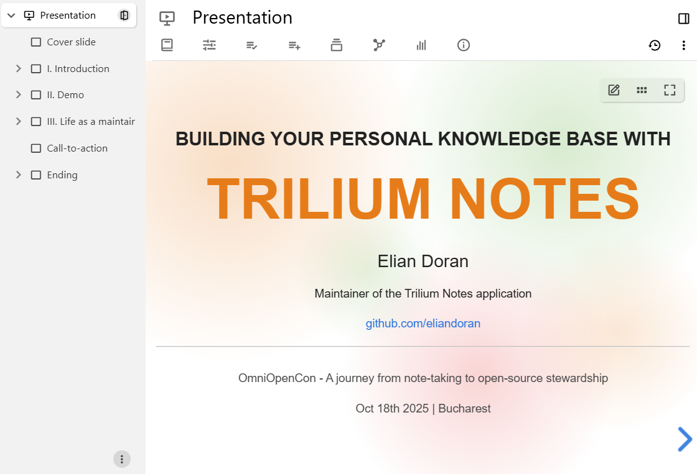
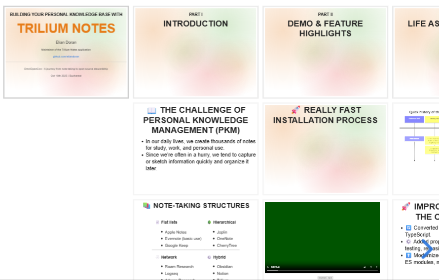

# 演示文稿

<figure class="image"></figure>

演示文稿视图允许直接在 Trilium 中创建幻灯片放映。

### 创建新的演示文稿

在<a class="reference-link" href="../Basic%20Concepts%20and%20Features/UI%20Elements/Note%20Tree.md">笔记树</a>中右键点击现有笔记，选择 _插入子笔记_，然后查找 _演示文稿_。

## 工作原理

*   每张幻灯片都是集合的一个子笔记。
*   子笔记的顺序决定了幻灯片的顺序。
*   与传统演示软件不同，幻灯片可以水平和垂直布局（更多信息见下文）。
*   直接子笔记将水平布局，而这些子笔记的子笔记将垂直布局。嵌套层级超过两层的子笔记将被忽略。

## 交互与导航

在浮动按钮区域（右上角）：

*   编辑按钮，用于转到当前幻灯片对应的笔记。
*   按下概览按钮（或 <kbd>O</kbd> 键）可显示幻灯片的鸟瞰视图。再次按下该按钮可将其禁用。
*   按下“开始演示”按钮可全屏显示演示文稿。

支持以下键盘快捷键：

*   按 <kbd>←</kbd> 和 <kbd>→</kbd>（或 <kbd>H</kbd> 和 <kbd>L</kbd>）转到左侧或右侧的幻灯片（水平）。
*   按 <kbd>↑</kbd> 和 <kbd>↓</kbd>（或 <kbd>K</kbd> 和 <kbd>J</kbd>）转到上方或下方的幻灯片（垂直）。
*   按 <kbd>Space</kbd> 和 <kbd>Shift</kbd> + <kbd>Space</kbd> 按顺序转到下一张/上一张幻灯片。
*   还有更多，按 <kbd>?</kbd> 可显示包含所有支持的键盘组合的弹出窗口。

## 垂直幻灯片与嵌套

与 Microsoft PowerPoint 等传统演示软件不同，Trilium 中的幻灯片可以水平或垂直布局，以创建层次感或更好地按主题组织幻灯片。

这种水平/垂直组织方式会影响过渡效果（尤其是“幻灯片”过渡），但在导航中最为明显。

*   按 <kbd>←</kbd> 和 <kbd>→</kbd> 将水平导航幻灯片，从而跳过当前幻灯片下的垂直笔记。这对于跳过整个章节/相关幻灯片非常有用。
*   按 <kbd>↑</kbd> 和 <kbd>↓</kbd> 将在当前层级垂直导航幻灯片。
*   按 <kbd>Space</kbd> 和 <kbd>Shift</kbd> + <kbd>Space</kbd> 将按顺序转到下一张/上一张幻灯片，无论方向如何。这通常是演示时使用的组合键。
*   幻灯片右下角的箭头也会反映此导航方案。

<figure class="image image-style-align-right image_resized" style="width:55.57%;"></figure>

集合的所有直接子笔记将水平布局。如果直接子笔记也有子笔记，则这些子笔记将作为垂直幻灯片放置。

在以下示例中，笔记结构如下：

*   演示文稿集合
    *   Trilium Notes（演示页面）
    *   “介绍”幻灯片
        *   “个人知识管理的挑战”
        *   “笔记记录结构”
    *   “演示与功能亮点”幻灯片
        *   “非常快速的安装过程”
        *   视频幻灯片

## 自定义

在集合级别，可以调整：

*   整个演示文稿的主题，可通过转到<a class="reference-link" href="Collection%20Properties.md">集合属性</a>并查找 _主题_ 选项，将其设置为预定义主题之一。
*   目前无法创建自定义主题，尽管已有此计划。
*   请注意，无法通过<a class="reference-link" href="../Theme%20development/Custom%20app-wide%20CSS.md">自定义应用级 CSS</a> 更改 CSS，因为幻灯片是隔离渲染的（在影子 DOM 中）。

在幻灯片级别：

*   可以使用[预定义的提升属性](../Advanced%20Usage/Attributes/Promoted%20Attributes.md)调整幻灯片的背景颜色，或手动将 `#slide:background` 设置为十六进制颜色。
*   更复杂的背景可以通过渐变实现。没有对应的 UI；必须通过 `#slide:background` 设置为 CSS 渐变定义，例如：`linear-gradient(to bottom, #283b95, #17b2c3)`。

## 提示与技巧

*   文本笔记通常遵循格式（粗体、斜体、前景色和背景色）和字体大小。代码块和表格也可以使用。
*   尝试使用不仅仅是文本笔记，演示文稿使用与[共享笔记](../Advanced%20Usage/Sharing.md)和<a class="reference-link" href="../Basic%20Concepts%20and%20Features/Notes/Note%20List.md">笔记列表</a>相同的机制，因此应该能够全屏显示<a class="reference-link" href="../Note%20Types/Mermaid%20Diagrams.md">Mermaid 图表</a>、<a class="reference-link" href="../Note%20Types/Canvas.md">画布</a>和<a class="reference-link" href="../Note%20Types/Mind%20Map.md">思维导图</a>（无交互性）。
    *   如果幻灯片有自定义背景，请考虑为<a class="reference-link" href="../Note%20Types/Canvas.md">画布</a>使用透明背景（转到画布中的汉堡菜单，按下按钮选择自定义颜色并输入 `transparent`）。
    *   对于<a class="reference-link" href="../Note%20Types/Mermaid%20Diagrams.md">Mermaid 图表</a>，其中一些具有预定义背景，可以通过 frontmatter 更改。例如，对于 XY 图表：

        ```
        ---
        config:
            themeVariables:
                xyChart:
                    backgroundColor: transparent
        ---
        ```

## 底层机制

演示文稿视图使用 [Reveal.js](https://revealjs.com/) 来处理幻灯片的导航和布局。