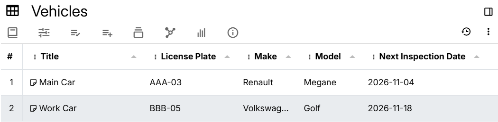

# 表格
<figure class="image"></figure>

表格视图以网格形式显示信息，其中行是单个笔记，列是<a class="reference-link" href="../Advanced%20Usage/Attributes/Promoted%20Attributes.md">提升属性</a>。此外，这些值是可编辑的。

## 工作原理

表格结构表示如下：

*   每个子笔记是表格中的一行。
*   如果子行也有子笔记，它们将显示在展开器下（嵌套笔记）。
*   每一列是在集合笔记上定义的[提升属性](../Advanced%20Usage/Attributes/Promoted%20Attributes.md)。
    *   实际上，提升和未提升的属性都支持，但要求使用标签/关系定义。
    *   提升属性通常定义为可继承的，以便显示在子笔记中，但这不是必需的。
*   如果有多个同名的属性定义，则只显示一个。
*   如果一个属性定义有多个值，它们将全部归入单个列下，并使用标签指示各个值。

还有一些预定义的列：

*   当前项目编号，由 `#` 符号标识。
    *   这只是对笔记进行计数，并受排序影响。
*   <a class="reference-link" href="../Advanced%20Usage/Note%20ID.md">笔记 ID</a>，表示 Trilium 内部使用的唯一 ID。
*   笔记的标题。

## 交互

### 创建新表格

右键点击<a class="reference-link" href="../Basic%20Concepts%20and%20Features/UI%20Elements/Note%20Tree.md">笔记树</a>中的现有笔记，选择 _插入子笔记_，然后查找 _表格_。

### 添加列

每一列是在集合笔记上定义的[提升或未提升属性](../Advanced%20Usage/Attributes/Promoted%20Attributes.md)。

要创建新列，可以：

*   点击表格底部的 _添加新列_。
*   右键点击现有列，选择向左/向右添加列。
*   右键点击列标题的空白区域，在 _新列_ 部分选择 _标签_ 或 _关系_。

### 添加新行

每一行实际上是一个笔记，它是集合笔记的子笔记。

要创建新笔记，可以：

*   点击表格底部的 _添加新行_。
*   右键点击现有行，选择 _在上方插入行、插入子笔记_ 或 _在下方插入行_。

默认情况下，它将尝试编辑新创建笔记的标题。

或者，可以从<a class="reference-link" href="../Basic%20Concepts%20and%20Features/UI%20Elements/Note%20Tree.md">笔记树</a>或[脚本](../Scripting.md)创建笔记。

### 上下文菜单

有多个菜单：

*   右键点击列，可以：
    *   按所选列排序并重置排序。
    *   隐藏所选列或调整每列的可见性。
    *   在列的左侧或右侧添加新列。
    *   编辑当前列。
    *   删除当前列。
*   右键点击列右侧的空间，可以：
    *   调整每列的可见性。
    *   添加新列。
*   右键点击行，可以：
    *   在新标签页、分屏、新窗口中打开该行对应的笔记，或快速编辑它。
    *   在所选行的上方或下方插入新笔记。仅当表格未排序时，这些选项才可用。
    *   为所选行插入新的子笔记。
    *   删除该行。

### 编辑数据

只需点击行内的单元格即可更改其值。更改不仅会反映在表格中，还会作为相应笔记的属性。

*   编辑将遵循提升属性的类型，例如显示普通文本框、数字选择器或日期选择器。
*   也可以更改笔记的标题。
*   编辑关系也是可能的。
    *   只需点击关系，它将变为可编辑状态。输入文本以查找笔记并点击它。
    *   要移除关系，请从文本框中删除笔记的标题，然后点击单元格外部。

### 编辑列

可以通过右键点击列并选择 _编辑列_ 来编辑列。这基本上会更改集合级别的标签/关系定义。

如果更改了列的 _名称_ 字段，将触发批量操作，其中相应的标签/关系将在所有子笔记中重命名。

## 处理数据

### 按列排序

默认情况下，笔记的顺序与<a class="reference-link" href="../Basic%20Concepts%20and%20Features/UI%20Elements/Note%20Tree.md">笔记树</a>中的顺序匹配。但是，可以按列的值对数据进行排序：

*   要执行此操作，只需点击一列。
*   要在升序或降序排序之间切换，只需再次点击同一列。列旁边的箭头将指示排序方向。
*   要禁用排序并恢复原始顺序，请右键点击标题中的任意列，然后选择 _清除排序_。

### 重新排序和隐藏列

*   可以通过拖动列标题来重新排序列。
*   可以通过右键点击列并点击与列对应的项目来隐藏或显示列。

### 重新排序行

可以拖动笔记来更改其顺序。为此，将鼠标移到行号附近三个垂直点上，然后将鼠标拖动到所需位置。

这也将更改笔记在<a class="reference-link" href="../Basic%20Concepts%20and%20Features/UI%20Elements/Note%20Tree.md">笔记树</a>中的顺序。

重新排序有一些限制：

*   如果父笔记具有 `#sorted`，则重新排序将被禁用。
*   如果使用嵌套表格，则重新排序也将被禁用。
*   目前，即使使用列排序，也可以重新排序笔记，但结果可能不一致。

### 嵌套树

如果集合的子笔记也有自己的子笔记，则它们将按层级结构显示。

在每个元素的标题旁边将有一个用于展开或折叠的按钮。默认情况下，所有项目都是展开的。

由于嵌套并不总是可取的，因此可以将嵌套限制在特定级别数，甚至完全禁用它。为此，可以：

*   转到<a class="reference-link" href="Collection%20Properties.md">集合属性</a>并查找 _最大嵌套深度_ 部分。
    *   要禁用嵌套，请输入 0 并按回车键。
    *   要限制在特定深度，请输入所需数字（例如 2 仅显示子级和孙级）。
    *   要重新启用无限嵌套，请删除数字并按回车键。
*   手动将 `maxNestingDepth` 设置为所需值。

限制：

*   在此模式下，无法重新排序笔记。

## 限制

*   不支持按特定条件过滤行。对于该用例，请考虑在搜索中使用表格视图。

## 在搜索中使用

可以通过添加 `#viewType=table` 属性，在<a class="reference-link" href="../Note%20Types/Saved%20Search.md">已保存搜索</a>中使用表格视图。

与在集合中使用不同，已保存搜索不限于笔记的子层级结构，并借助<a class="reference-link" href="../Basic%20Concepts%20and%20Features/Navigation/Search.md">搜索</a>的强大功能，允许进行高级查询。

但是，也有一些限制：

*   无法重新排序笔记。
*   无法添加新行。

通过将列定义为<a class="reference-link" href="../Advanced%20Usage/Attributes/Promoted%20Attributes.md">提升属性</a>到<a class="reference-link" href="../Note%20Types/Saved%20Search.md">已保存搜索</a>笔记，可以支持列。

也支持编辑。