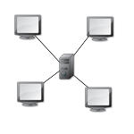
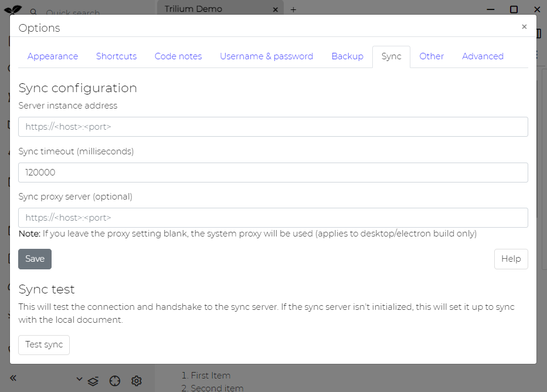
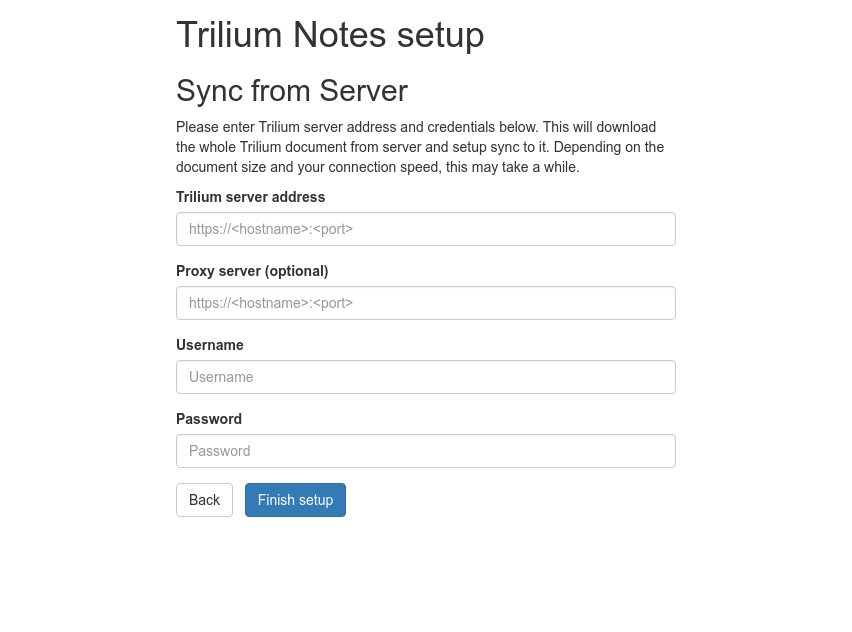
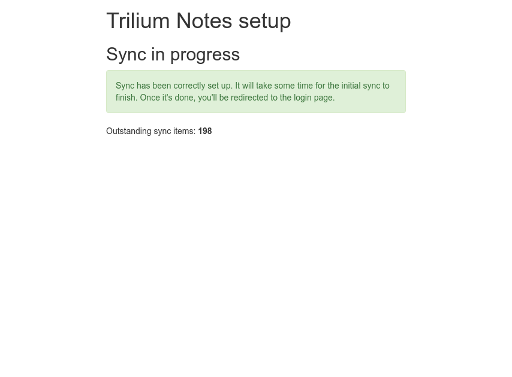

# 同步

Trilium 是一款离线优先的笔记应用，所有数据均存储在桌面客户端的本地。不过，它也提供了与服务器实例设置同步的选项，允许多个桌面客户端与中央服务器进行同步。这形成了一个星型拓扑结构：



在这种设置中，一个中央服务器（称为 _同步服务器_）和多个 _客户端_（或 _桌面_）实例与同步服务器进行同步。一旦配置完成，同步将自动持续进行，无需手动干预。

## 设置同步

### 安全注意事项

安全地设置服务器至关重要，且可能较为复杂。使用有效的 [TLS 证书](Server%20Installation/HTTPS%20(TLS).md)（HTTPS）而非未加密的 HTTP 连接来确保安全性并避免潜在漏洞，这一点非常关键。

### 将桌面实例与同步服务器同步

当您已拥有 Trilium 桌面实例并希望在您的网络主机上设置同步服务器时，可使用此方法。

1.  **服务器部署**：确保您的服务器实例已部署但尚未初始化。
2.  **桌面配置**：打开您的桌面实例，导航至 选项 -> 同步 选项卡 -> 同步配置，并将“服务器实例地址”设置为您的同步服务器地址。点击保存。



1.  **测试同步**：点击“测试同步”按钮以验证与同步服务器的连接。如果成功，客户端将开始将所有数据推送到服务器实例。此过程可能需要一些时间，但您可以继续使用 Trilium。定期检查服务器实例以确认同步何时完成。完成后，您应该在服务器上看到登录界面。

### 从同步服务器同步桌面实例

当您已拥有同步服务器并希望配置新的桌面实例与其同步时，可使用此方法。

1.  **桌面设置**：按照[桌面安装页面](Desktop%20Installation.md)进行操作。
2.  **初始配置**：在提示时，选择与同步服务器设置同步的选项。



1.  **服务器详细信息**：配置 Trilium 服务器地址，并输入正确的用户名和密码进行身份验证。
2.  **完成设置**：点击“完成设置”按钮。如果成功，您将看到以下界面：



一旦同步完成，您将被自动重定向到 Trilium 应用程序。

### 桌面到桌面同步

此方法允许两个桌面实例之间进行同步，而无需<a class="reference-link" href="Server%20Installation.md">服务器安装</a>。

> [!WARNING]
> 自 v0.104.0 起，需要启用局域网访问才能允许此同步功能。有关如何执行此操作的信息，请参阅<a class="reference-link" href="Desktop%20Installation/Network%20Access.md">网络访问</a>。

## 代理配置

支持两种代理设置：

*   **显式代理配置**：在 选项 / 同步 中设置代理服务器。仅支持无需身份验证的代理服务器。
*   **系统代理设置**：如果未显式配置代理服务器，Trilium 将使用系统代理设置。

## 故障排除

### 日期/时间同步

为了成功同步，客户端和服务器必须具有相同的日期和时间，容差最多为五分钟。

### 证书问题

使用 TLS 时，Trilium 将验证服务器证书。如果验证失败（例如，由于自签名证书或某些公司代理），您可以通过将 `NODE_TLS_REJECT_UNAUTHORIZED` 环境变量设置为 `0` 来运行 Trilium 客户端：

```
export NODE_TLS_REJECT_UNAUTHORIZED=0
```

这将禁用 TLS 证书验证，从而显著降低安全性并使设置面临中间人攻击的风险。强烈建议使用有效签名的服务器证书。较新版本的 Trilium 包含一个名为 `trilium-no-cert-check.sh` 的脚本用于此目的。

### 冲突解决

如果您在同步前在多个实例上编辑了同一条笔记，Trilium 通过保留较新的更改并丢弃较旧的更改来解决冲突。较旧的版本仍可在[笔记修订](../Basic%20Concepts%20and%20Features/Notes/Note%20Revisions.md)中访问，以便在需要时恢复数据。

### 哈希检查

每次同步后，Trilium 会在客户端和同步服务器上计算所有同步数据的哈希值。如果存在差异，Trilium 将自动启动恢复机制来解决该问题。