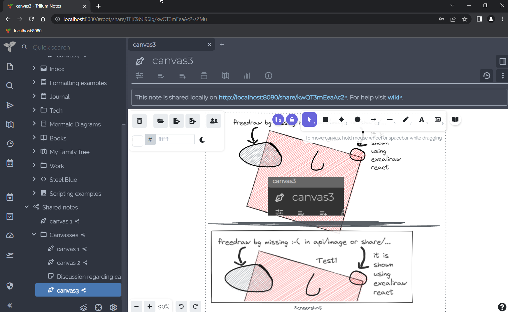

# Canvas
<figure class="image"></figure>

自 Trilium v0.52 起可用。

Canvas 笔记使用 Excalidraw 库，允许在无限画布上使用鼠标、笔或触摸进行手写笔记。它还支持基本的图表绘制、文本和图形输入。

## 交互

*   可以从<a class="reference-link" href="../Basic%20Concepts%20and%20Features/UI%20Elements/Floating%20buttons.md">浮动按钮</a>部分将笔记切换为<a class="reference-link" href="../Basic%20Concepts%20and%20Features/Notes/Read-Only%20Notes.md">只读</a>。

## 嵌入笔记

自 v0.104.0 起，Canvas 支持以类似于<a class="reference-link" href="Text/Include%20Note.md">包含笔记</a>功能的方式嵌入笔记，该功能适用于<a class="reference-link" href="Text.md">文本</a>笔记。

要嵌入笔记：

*   从<a class="reference-link" href="../Basic%20Concepts%20and%20Features/UI%20Elements/Note%20Tree.md">笔记树</a>中，将项目拖到画布上。
*   手动操作，选择 _更多工具_ → _网页嵌入_ 并粘贴笔记的链接（例如 `root/MujWAc9fQ1nj`）。

在画布中嵌入笔记遵循与<a class="reference-link" href="Text/Include%20Note.md">包含笔记</a>相同的规则：某些笔记会渲染为图像（例如<a class="reference-link" href="Mind%20Map.md">思维导图</a>），而某些笔记则完全交互式渲染，例如<a class="reference-link" href="../Collections.md">集合</a>。