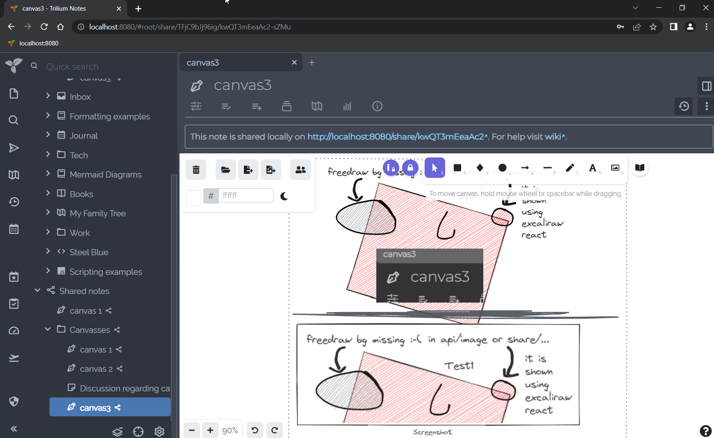

# 画布
<figure class="image"></figure>

画布笔记使用 Excalidraw 库，允许在无限画布上用鼠标、笔或触摸进行手写笔记。它还支持基本的图表绘制、文本和图形输入。

## 交互

*   可以从<a class="reference-link" href="../Basic%20Concepts%20and%20Features/UI%20Elements/Note%20menu.md">笔记菜单</a>将笔记切换为[只读](../Basic%20Concepts%20and%20Features/Notes/Read-Only%20Notes.md)。

## 笔宽

画笔以属性面板中所选_描边宽度_的一半进行绘制，适合手写。若要以完整宽度绘制，请在<a class="reference-link" href="../Basic%20Concepts%20and%20Features/UI%20Elements/Options.md">选项</a> → _其他_中关闭_细笔画描边_。已绘制的笔画会保持其宽度。

## 嵌入笔记

自 v0.104.0 起，画布支持以类似于<a class="reference-link" href="Text/Include%20Note.md">包含笔记</a>功能的方式嵌入笔记（适用于<a class="reference-link" href="Text.md">文本</a>笔记）。

要嵌入笔记：

*   从<a class="reference-link" href="../Basic%20Concepts%20and%20Features/UI%20Elements/Note%20Tree.md">笔记树</a>中，将项目拖到画布上。
*   手动操作，选择_更多工具_ → _网页嵌入_并粘贴笔记的链接（例如 `root/MujWAc9fQ1nj`）。

在画布中嵌入笔记遵循与<a class="reference-link" href="Text/Include%20Note.md">包含笔记</a>相同的规则：某些笔记会渲染为图像（例如<a class="reference-link" href="Mind%20Map.md">思维导图</a>），而某些则会完全交互式渲染，例如<a class="reference-link" href="../Collections.md">集合</a>。

## 链接到笔记

1.  从<a class="reference-link" href="../Basic%20Concepts%20and%20Features/UI%20Elements/Note%20Tree.md">笔记树</a>中右键单击要链接的笔记，然后选择_高级 → 复制笔记路径到剪贴板_。
2.  在画布笔记中，右键单击一个元素并选择_添加链接_（或按 <kbd>Ctrl</kbd>+<kbd>K</kbd>）。粘贴链接并按 <kbd>Enter</kbd>。
3.  元素的右上角会出现一个  图标，点击后将导航到链接的笔记。

## 在文本笔记中绘图

要在<a class="reference-link" href="Text.md">文本</a>笔记中绘图而不是在单独的笔记中绘图，请在 _插入_菜单中使用 _绘图画布_插入绘图画布。参见<a class="reference-link" href="Text/Include%20Note.md">包含笔记</a>中的_绘图画布_。