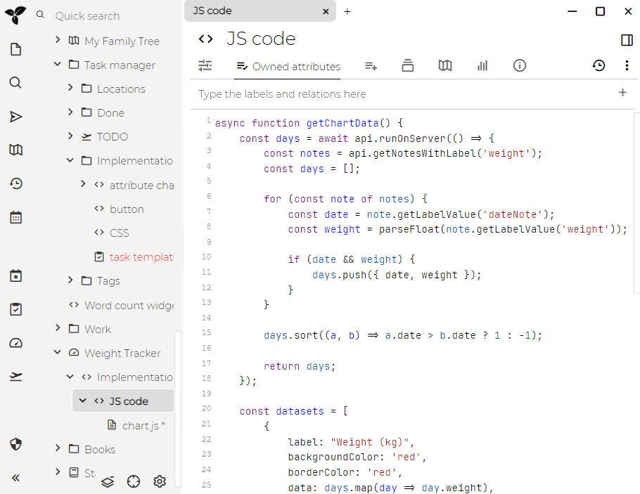
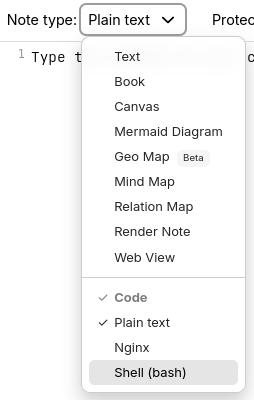

# 代码

Trilium 支持创建“代码”笔记，即包含某种形式正式代码的笔记——无论是编程语言（C++、JavaScript）、结构化数据（JSON、XML）还是其他类型的代码（CSS 等）。

这可以用于以下几个方面：

*   计算机程序员可以将代码片段作为带有语法高亮的笔记存储
*   JavaScript 代码笔记可以在 Trilium 中执行以获得一些额外功能
    *   我们称此类 JavaScript 代码笔记为“脚本”——参见 <a class="reference-link" href="../Scripting.md">脚本</a>
*   JSON、XML 等可以用作结构化数据的存储（通常与脚本结合使用）

对于可以嵌入到[文本](Text.md)笔记中的较短代码片段，请参阅[代码块](Text/Developer-specific%20formatting/Code%20blocks.md)。

## 调整代码笔记的语言

在[功能区](../Basic%20Concepts%20and%20Features/UI%20Elements/Ribbon.md)中，找到 _笔记类型_ 选择器并点击它以显示可能的笔记类型。在其中会有一个名为 _代码_ 的部分，选择其中任何一种语言。

## 调整语言列表

Trilium 支持多种语言的语法高亮，但默认只显示其中一部分。可以通过进入[选项](../Basic%20Concepts%20and%20Features/UI%20Elements/Options.md)，然后选择 _代码笔记_ 并找到 _下拉菜单中可用的 MIME 类型_ 部分来调整支持的语言。只需勾选任何项目即可将其添加到列表中，或取消勾选以将其从列表中移除。

请注意，语言列表不会立即刷新，您需要手动[刷新应用程序](../Troubleshooting/Refreshing%20the%20application.md)。

语言列表也与[文本](Text.md)笔记的[代码块](Text/Developer-specific%20formatting/Code%20blocks.md)功能共享。

## 自动换行

长行可以显示在多行上：

*   全局适用于所有代码笔记，通过 <a class="reference-link" href="../Basic%20Concepts%20and%20Features/UI%20Elements/Options.md">选项</a> → _代码笔记_。
*   对于特定笔记，通过进入 <a class="reference-link" href="../Basic%20Concepts%20and%20Features/UI%20Elements/Note%20buttons.md">笔记按钮</a> 中的菜单并选择 _自动换行_ 并选择适当的选项：
    *   _自动_，以遵循代码笔记的全局自动换行设置。
    *   _开_ 或 _关_，以更改此笔记的自动换行状态，无论全局选项如何。

> [!NOTE]
> 自动换行也可以通过 `#wrapLines` [标签](../Advanced%20Usage/Attributes/Labels.md) 在笔记级别进行调整，该标签也可以被继承。

## 使用状态栏调整选项

> [!NOTE]
> 此功能仅适用于 <a class="reference-link" href="../Basic%20Concepts%20and%20Features/UI%20Elements/New%20Layout.md">新布局</a>。对于旧布局，可以使用 `#tabWidth` 属性在笔记级别调整标签宽度，但重新缩进不可用。

编辑器底部的状态栏显示当前的缩进设置和语言。点击缩进指示器会打开一个包含三个部分的菜单：

1.  **缩进使用** — 在空格和制表符之间切换（`#indentWithTabs`）。如果激活了按笔记覆盖，则会出现“重置为默认值”选项。
2.  **显示宽度** — 从预设宽度（1、2、3、4、6、8）中选择。更改将保存为按笔记的 `#tabWidth` 标签。
3.  **重新缩进内容至** — 将现有缩进转换为不同的样式。例如，将文件从 4 个空格重新缩进为 2 个空格，或从空格转换为制表符。这会重写每行的前导空白，同时保留对齐余数。

点击语言指示器可以更改笔记的 MIME 类型。

### 重新缩进

当您重新缩进内容时，编辑器会：

*   使用当前样式测量每行前导空白的视觉列宽
*   计算缩进级别和任何对齐余数
*   以目标样式重建前导空白
*   保留非前导空白、空行和没有缩进的内容

## 配色方案

自 Trilium 0.94.0 起，可以通过进入 <a class="reference-link" href="../Basic%20Concepts%20and%20Features/UI%20Elements/Options.md">选项</a> → 代码笔记并找到 _外观_ 部分来自定义代码笔记的颜色。

> [!NOTE]
> **为什么只有少数几个主题，而文本笔记的代码块主题却有很多？**
> 原因是代码笔记使用的技术与文本笔记中使用的技术不同，因此主题选择更加有限。如果您找到想要使用的 CodeMirror 6（不是 5）主题，请告诉我们，我们可能会考虑将其添加到默认主题集中。目前无法添加新主题（至少现在是这样），因为主题是在 JavaScript 中定义的，而不是在 CSS 级别。