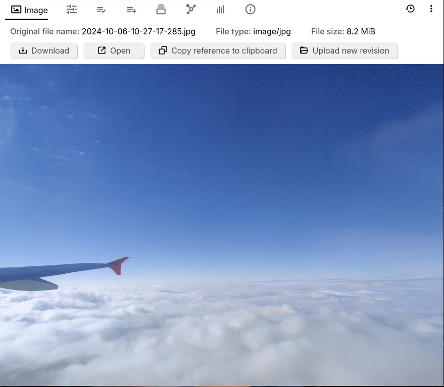
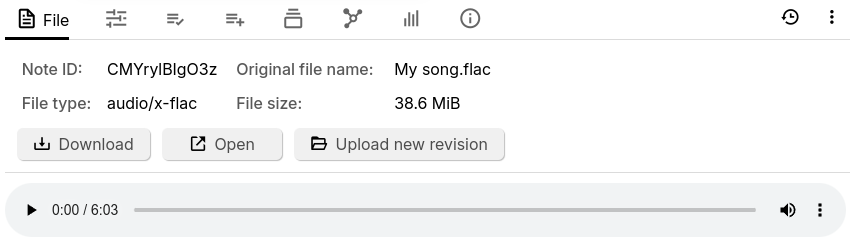
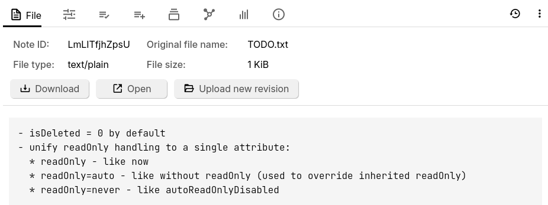
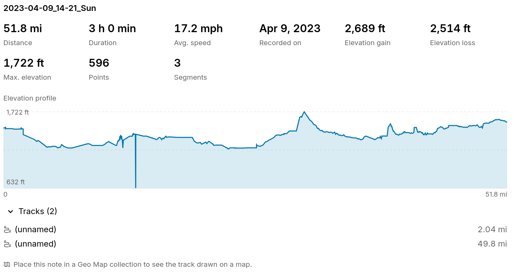
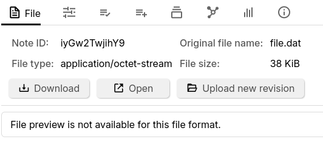
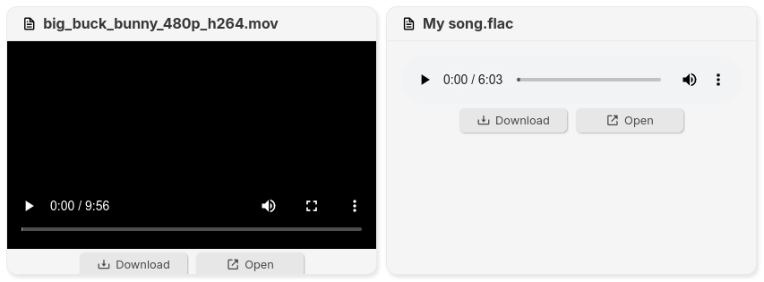

# 文件

_文件_ 笔记类型可用于附加各种外部文件，例如图片、视频或 PDF 文档。

## 上传文件

由于这些文件来自外部来源，因此无法直接创建 _文件_ 笔记类型：

*   将文件拖入<a class="reference-link" href="../Basic%20Concepts%20and%20Features/UI%20Elements/Note%20Tree.md">笔记树</a>。
*   右键点击笔记并选择 _导入到笔记_，然后指向其中一个受支持的文件。

## 支持的文件类型

### PDF

PDF 可以上传到 Trilium，它们将显示实时预览，并完全支持各种功能，例如目录、注释，以及记住最后阅读的页面。有关更多信息，请参阅专门的<a class="reference-link" href="File/PDFs.md">PDF</a>页面。

## Office 文档

Trilium 为 Office 文档提供预览，例如 Word (`.docx`)、Excel (`.xlsx`) 和 PowerPoint (`.pptx`)。有关更多信息，请参阅专门的<a class="reference-link" href="File/Office%20documents.md">Office 文档</a>。

### 图片

<figure class="image image-style-align-center image_resized" style="width:50%;"></figure>

交互：

*   _复制引用到剪贴板_，用于在<a class="reference-link" href="Text.md">文本</a>笔记中嵌入图片。
    *   有关更多信息，请参阅<a class="reference-link" href="Text/Images/Image%20references.md">图片引用</a>。
    *   或者，按下<a class="reference-link" href="../Basic%20Concepts%20and%20Features/UI%20Elements/Floating%20buttons.md">浮动按钮</a>中的相应按钮。

### 视频

请参阅<a class="reference-link" href="File/Audio%20%26%20Video.md">音频与视频</a>。

### 音频

<figure class="image image-style-align-center image_resized" style="width:50%;"></figure>

添加受支持的音频文件将显示一个基本的音频播放器，可用于播放该文件。

交互：

*   可以使用专用按钮播放/暂停音频。
*   拖动鼠标或点击进度条可以快进/快退歌曲。
*   可以设置音量。
*   可以通过音量旁边的上下文菜单调整播放速度。

### 文本文件

<figure class="image image-style-align-center image_resized" style="width:50%;"></figure>

被识别为包含文本的文件将显示其内容的预览。此类文件的一个常见用例是嵌入文本文件，其内容不一定对用户感兴趣，例如第三方库或生成的内容，如果需要，可以下载这些文件。

请注意，通常文本文件会作为<a class="reference-link" href="Text.md">文本</a>或<a class="reference-link" href="Code.md">代码</a>笔记被[导入](../Basic%20Concepts%20and%20Features/Import%20%26%20Export.md)。要绕过此行为并创建 _文件_ 笔记类型，请使用 _导入到笔记_ 功能，并取消选中 _将 HTML、Markdown 和 TXT 作为文本笔记导入_，以及 _将可识别的代码文件作为代码笔记导入_。

由于使用文件而不是笔记的用例之一是显示大文件，因此内容预览仅限于相对较少的字符数。要查看完整文件，请考虑在外部应用程序中打开它。

### GPS 轨迹

Trilium 显示 `.gpx` 格式的 GPS 轨迹信息，例如距离、时长、海拔剖面、轨迹、标记点。

当 `.gpx` 笔记被放入<a class="reference-link" href="../Collections/Geo%20Map.md">地理地图</a>时，轨迹本身也会显示在地图上。

<figure class="image"></figure>

### 未知文件类型

<figure class="image image-style-align-center image_resized" style="width:50%;"></figure>

如果文件无法被识别为上述任何受支持的文件类型，它将被视为未知文件。在这种情况下，所有默认交互（例如下载或在外部打开文件）都可用，但不会有内容预览。

## 交互

*   无论文件类型如何，在<a class="reference-link" href="../Basic%20Concepts%20and%20Features/UI%20Elements/Ribbon.md">功能区</a>的 _图片_ 或 _文件_ 选项卡中都会显示一系列按钮。
    *   _下载_，将下载文件以供本地使用。
    *   _打开_，将使用系统默认应用程序打开文件。
    *   上传新修订版以替换为新文件。
*   **无法**更改 _文件_ 笔记的笔记类型。
*   从[笔记菜单](../Basic%20Concepts%20and%20Features/UI%20Elements/Note%20buttons.md)转换为[附件](../Basic%20Concepts%20and%20Features/Notes/Attachments.md)。

## 与其他笔记的关系

*   文件也会根据其类型显示在<a class="reference-link" href="../Basic%20Concepts%20and%20Features/Notes/Note%20List.md">笔记列表</a>中：
    
    
*   非图片文件可以通过<a class="reference-link" href="Text/Include%20Note.md">包含笔记</a>功能作为只读小组件嵌入到文本笔记中。
*   图片文件可以通过<a class="reference-link" href="Text/Images/Image%20references.md">图片引用</a>像普通图片一样嵌入到文本笔记中。

## 文件大小限制

单个文件不能大于 374 MiB。有关更多信息，请参阅<a class="reference-link" href="../Basic%20Concepts%20and%20Features/Import%20%26%20Export.md">导入与导出</a>中的 _最大导入大小_。