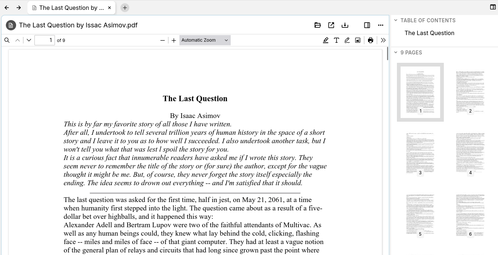

# PDF 文件

<figure class="image image_resized" style="width:74.34%;"></figure>

PDF 文件可以上传到 Trilium 中，无需先下载即可直接显示。

自 v0.102.0 版本起，PDF 将使用 Trilium 内置的 PDF 查看器进行渲染，该查看器是基于 [Mozilla 的 PDF.js 查看器](https://mozilla.github.io/pdf.js/)（同样内置于 Mozilla Firefox 浏览器中）的定制版本。此前的版本则使用浏览器的默认 PDF 查看器进行渲染。

## 功能特性

*   在重启或笔记导航之间，会保持上次查看的页面和滚动位置。
*   支持批注（文本、高亮）以及评论。这些内容会自动保存。
*   支持填写表单。
*   支持打印或下载。
*   可以另存为[模板](../../Advanced%20Usage/Templates.md)，PDF 的内容将被复制到新笔记中。此功能结合批注或已填写的表单使用时尤为实用。
*   与<a class="reference-link" href="../../Basic%20Concepts%20and%20Features/UI%20Elements/New%20Layout.md">新布局</a>中的侧边栏集成，显示带有缩略图的页面列表、目录以及批注列表。
*   基本支持签名（手写签名，非正式的数字签名），类似于批注。签名会被存储，并可在多个文档中重复使用（最多 5 个）。

## 存储最后位置和设置

对于每个 PDF，Trilium 将记住以下信息：

*   当前页面。
*   当前页面内的滚动位置。
*   页面的旋转角度。

这在阅读大型文档时非常有用，因为位置会被自动记住。此操作在后台进行，但仅在停止任何滚动操作几秒钟后才会记录。

> [!TIP]
> 从技术上讲，关于滚动位置和旋转角度的信息存储在<a class="reference-link" href="../../Basic%20Concepts%20and%20Features/Notes/Attachments.md">附件</a>部分中，位于一个名为 `pdfHistory.json` 的专用附件里。

## 批注

自 v0.102.0 版本起，可以对 PDF 进行批注。为此，请在 PDF 工具栏右侧查找批注按钮（）。

自 v0.103.0 版本起：

*   如果笔记被标记为<a class="reference-link" href="../../Basic%20Concepts%20and%20Features/Notes/Read-Only%20Notes.md">只读笔记</a>，则批注功能将被禁用。
*   也可以添加评论，这类似于高亮，但还会附加文本。
*   <a class="reference-link" href="../../Basic%20Concepts%20and%20Features/UI%20Elements/Right%20Sidebar.md">右侧边栏</a>也会显示批注（高亮、评论）列表，但仅在<a class="reference-link" href="../../Basic%20Concepts%20and%20Features/UI%20Elements/New%20Layout.md">新布局</a>中可用。

### 支持的批注类型

支持以下批注方法：

*   **高亮**  
    允许使用预定义颜色之一高亮文本。
    *   粗细也可以调整。
    *   也可以高亮空白区域，使该功能更像一支较粗的笔。
*   **文本**  
    允许添加任意文本，并可自定义颜色和大小。
*   **画笔**  
    允许在文档上自由绘制，可调整颜色、粗细和不透明度。
*   **图片**  
    允许将 Trilium 外部的图片直接插入到文档中。

### 编辑现有批注

尽管批注存储在 PDF 本身中，但它们是可以编辑的。要编辑批注，请按下上一节中的某个批注按钮进入编辑模式，然后点击现有的批注。这将显示一个工具栏，其中包含自定义批注的选项（例如更改颜色），以及删除批注的可能性。

### 批注如何存储

批注直接存储在 PDF 中。当进行修改时，Trilium 将用新的 PDF 替换旧的 PDF。

由于修改会自动保存，因此在修改批注后无需手动保存文档。

“内嵌批注”的好处是，在下载（供 Trilium 外部使用）或共享笔记时，这些批注也可以访问。

缺点是整个 PDF 需要发送回服务器，这可能会降低大型文档的性能。如果您遇到此系统的任何问题，请随时[报告问题](../../Troubleshooting/Reporting%20issues.md)。

## 填写表单

与批注类似，Trilium 自 v0.102.0 版本起也支持表单。如果文档包含可填写的字段，这些字段将以彩色背景标示。

只需在表单中输入文本，它们就会被自动保存。

## 侧边栏导航

> [!NOTE]
> 此功能仅在启用<a class="reference-link" href="../../Basic%20Concepts%20and%20Features/UI%20Elements/New%20Layout.md">新布局</a>时可用。如果您使用的是旧布局，仍可通过在 PDF 查看器工具栏中查找侧边栏按钮来使用这些功能。

请参阅<a class="reference-link" href="../../Basic%20Concepts%20and%20Features/UI%20Elements/Right%20Sidebar/Outline%20tab.md">大纲标签页</a>中关于 PDF 的专门章节。

## 分享功能

PDF 也可以使用<a class="reference-link" href="../../Advanced%20Usage/Sharing.md">分享</a>功能进行共享。这也将使用 Trilium 定制的 PDF 查看器。

如果您在服务器上使用反向代理，并且对分享功能有严格的访问限制，请确保 `[host].com/pdfjs` 目录是可访问的。请注意，该目录位于 `/share` 路由之外，这与应用程序的其余部分一致。