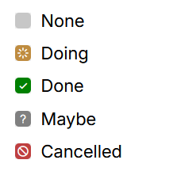

# Markdown

Trilium 一直通过其[导入功能](../Basic%20Concepts%20and%20Features/Import%20%26%20Export/Markdown.md)支持 Markdown，但该文件要么被转换为<a class="reference-link" href="Text.md">文本</a>笔记（转换为 Trilium 的内部 HTML 格式），要么被保存为仅具有语法高亮的<a class="reference-link" href="Code.md">代码</a>笔记。

此笔记类型为分屏视图，即源代码和文档预览并排显示。有关更多信息，请参阅<a class="reference-link" href="../Basic%20Concepts%20and%20Features/UI%20Elements/Note%20types%20with%20split%20view.md">分屏视图的笔记类型</a>。

## 设计原理

此笔记类型的目标是填补一个空白：渲染 Markdown 但不去改变其结构或空白，否则这些内容在导入/导出时不可避免地会被更改。

即使 Markdown 现在通过预览机制得到了特殊处理，Trilium 的核心仍然是所见即所得编辑器，因此 Markdown 不会取代文本笔记。

> [!NOTE]
> 关于 Markdown 实现的功能请求将被考虑，但如果它们超出 Trilium 的范围，则不会实现。Markdown 集成的核心方面之一是它复用了应用程序其他功能中已有的组件。

## 功能特性

### 源代码视图窗格

*   Markdown 语法的语法高亮。
*   代码块内代码的嵌套语法高亮。
*   编辑较大文档时，预览会随源代码编辑器同步滚动。

### 预览窗格

Trilium 的 Markdown 格式支持以下功能，并会显示在预览窗格中：

*   所有标准及 GitHub 风格的语法（基本格式、表格、块引用）。
*   也支持基本 HTML（例如使用 `<details>` 和 `<summary>` 的可折叠块）。
*   带有语法高亮的代码块。
    
    *   必须指定语言才能应用语法高亮（例如 ` ```js `）。
    *   代码块将遵循<a class="reference-link" href="../Basic%20Concepts%20and%20Features/UI%20Elements/Options.md">选项</a>中<a class="reference-link" href="Text.md">文本</a>部分的文本换行设置。
*   <a class="reference-link" href="Text/Block%20quotes%20%26%20admonitions.md">块引用与警示框</a>
*   <a class="reference-link" href="Text/Math%20Equations.md">数学公式</a>（行内和块级）
*   使用 ` ```mermaid ` 的<a class="reference-link" href="Mermaid%20Diagrams.md">Mermaid 图表</a>
*   <a class="reference-link" href="Text/Include%20Note.md">嵌入笔记</a>（没有内置的 Markdown 语法，但 HTML 语法可以正常工作）：
    
    ```html
    <section class="include-note" data-note-id="vJDjQm0VK8Na" data-box-size="expandable">
        &nbsp;
    </section>
    ```
    
    *   这些也可以通过 `/include` 命令或专用的键盘快捷键（默认未分配）快速创建。
*   通过其 HTML 语法或类似 _Wikilinks_ 的格式（仅限<a class="reference-link" href="../Advanced%20Usage/Note%20ID.md">笔记 ID</a>）实现的<a class="reference-link" href="Text/Links/Internal%20(reference)%20links.md">内部（引用）链接</a>：
    
    ```
    [[Hg8TS5ZOxti6]]
    ```
*   带有扩展任务状态的待办列表：
    
    <table class="ck-table-resized" style="border-style:none">
        <colgroup>
            <col style="width:80.6%;">
            <col style="width:19.4%;">
        </colgroup>
        <tbody>
            <tr>
                <td><pre><code class="language-text-x-markdown">- [ ] None
    - [/] Doing
    - [X] Done
    - [?] Maybe
    - [-] Cancelled</code></pre></td>
                <td><figure class="image image-style-align-right"></figure></td>
            </tr>
        </tbody>
    </table>
    
    任务状态是可定制的：您可以重新排序、创建具有不同颜色和符号的新状态，或删除不需要的状态。有关更多详细信息，请参阅<a class="reference-link" href="../Advanced%20Usage/Customizing%20to-do%20task%20states.md">自定义待办任务状态</a>。
    
    请注意，具有除“None”和“Done”之外任务状态的待办项目是 Trilium 特有的，可能无法与其他 Markdown 软件很好地兼容。
*   通过相应的 Markdown 语法也支持<a class="reference-link" href="Text/Footnotes.md">脚注</a>：
    
    ```
    This is [^1], while this is [^2].
    
    [^1]: the first footnote
    [^2]: the second footnote
    ```
    
    *   这些也可以使用 `/footnote` 命令快速创建。
*   用于<a class="reference-link" href="../Basic%20Concepts%20and%20Features/Notes/Printing%20%26%20Exporting%20as%20PDF.md">打印与导出为 PDF</a> 的分页符：
    
    ```
    <div class="page-break"></div>
    ```
*   高亮（背景颜色）既支持 `==` Markdown 语法，也支持 Trilium 中的标准 HTML 表示：
    
    ```
    ==highlighted==
    <span style="background-color:hsl(0,0%,100%);">Highlighted</span>
    ```

### 链接

支持多种类型的链接：

*   可以使用标准 Markdown 语法编写网页 URL：
    
    ```
    [Wikipedia](https://www.wikipedia.org)
    ```
*   指向其他笔记的[引用链接](Text/Links/Internal%20\(reference\)%20links.md)，带有动态标题，可以手动输入笔记 ID 或通过 _添加链接_ 对话框：
    
    ```
    [[B9oMG6rFvvfq]]
    ```
*   指向其他笔记的[引用链接](Text/Links/Internal%20\(reference\)%20links.md)，带有自定义文本：
    
    ```
    [This is a link](#root/LhtnZxtVsUMp)
    ```

要创建链接，可以：

*   使用上述语法手动输入。
*   按 <kbd>Ctrl</kbd>+<kbd>L</kbd> 或输入 `/link` 命令使用 _添加链接_ 对话框。

<a class="reference-link" href="Text/Link%20Previews.md">链接预览</a>也会被渲染，但目前没有自动插入它们的机制，必须从<a class="reference-link" href="Text.md">文本</a>笔记中复制。

### 键盘快捷键

Markdown 笔记共享<a class="reference-link" href="Text.md">文本</a>笔记的一些键盘快捷键：

*   _剪切到笔记_ (<kbd>Ctrl</kbd>+<kbd>X</kbd>)：将选中内容剪切到一个新的子笔记中。
*   _添加链接_ (<kbd>Ctrl</kbd>+<kbd>L</kbd>)：显示创建外部或引用链接的对话框。
*   _插入日期/时间_ (<kbd>Alt</kbd>+<kbd>T</kbd>)：遵循与文本笔记相同的格式。
*   _嵌入笔记_（默认未分配）：触发与文本笔记相同的插入笔记对话框。

此外，以下格式键盘快捷键可用：

*   <kbd>Ctrl</kbd>+<kbd>B</kbd> 切换**粗体**。
*   <kbd>Ctrl</kbd>+<kbd>I</kbd> 切换_斜体_。
*   <kbd>Ctrl</kbd>+<kbd>M</kbd> 将当前选中内容包裹在行内数学公式（`$`）中。
*   <kbd>Ctrl</kbd>+<kbd>Shift</kbd>+<kbd>X</kbd> 切换~~删除线~~。

### 图片与附件

可以通过四种不同的方法将图片插入到文档中：

*   直接拖放到编辑器区域。
*   从剪贴板粘贴图片。
*   粘贴对另一个[附件](../Basic%20Concepts%20and%20Features/Notes/Attachments.md)的引用（例如 _复制引用到剪贴板_ 按钮）。
*   使用 `/image` 斜杠命令。

对附件的图片引用如下所示：

```

```

### 自动补全

#### 斜杠命令

与<a class="reference-link" href="Text.md">文本</a>笔记一样，Markdown 笔记支持一系列斜杠命令：

*   插入当前日期和时间（`/date`）。
*   [嵌入](Text/Include%20Note.md)另一个笔记（`/include`）。
*   上传并插入图片（`/image`）。
*   插入笔记链接（`/link`）。
*   插入数学公式块（`/math`）。
*   插入[脚注](Text/Footnotes.md)（`/footnote`）。
*   插入 [Mermaid](Mermaid%20Diagrams.md) 图表（`/mermaid`），每个示例模板有一个变体（例如 `/mermaid:flowchart`）。
*   插入可折叠块（`/collapsible`）。
*   插入用于打印的分页符（`/page-break`）。
*   插入表格（`/table`）。
*   创建警示框（例如 `/tip`、`/note`、`/important`、`/caution`、`/warning`）。
*   插入任务项（`/todo:<state>`，例如 `/todo:done`），每个配置的任务状态对应一个。
*   从您的 Markdown/纯文本片段笔记中插入代码片段（`/snippet:<name>`）。

请注意，斜杠命令仅在代码块和行内代码之外有效。

#### 代码块语言自动补全

从 v0.104.0 开始，输入 \`\`\` 插入代码块将自动打开一个建议语言类型列表，这些语言类型具有语法高亮。

语言列表与<a class="reference-link" href="../Basic%20Concepts%20and%20Features/UI%20Elements/Options.md">选项</a>中为<a class="reference-link" href="Code.md">代码</a>笔记设置的语言列表一致，并非 Trilium 支持的全部语言列表。

### 其他功能

*   基于 Markdown 级别的标题，<a class="reference-link" href="Text/Table%20of%20contents.md">目录</a>将显示在<a class="reference-link" href="../Basic%20Concepts%20and%20Features/UI%20Elements/Right%20Sidebar.md">右侧边栏</a>中。
    *   此功能仅在<a class="reference-link" href="../Basic%20Concepts%20and%20Features/UI%20Elements/New%20Layout.md">新布局</a>中可用。

### 共享笔记

当 Markdown 笔记被[公开共享](../Advanced%20Usage/Sharing.md)时，它将像<a class="reference-link" href="Text.md">文本</a>笔记一样以扩展格式渲染。

前面描述的大多数功能都应受支持。如果您遇到任何问题，请随时[报告](../Troubleshooting/Reporting%20issues.md)，并附上示例 Markdown 文件。

## 创建 Markdown 笔记

有两种方法可以创建 Markdown 笔记：

1.  创建新笔记（例如在<a class="reference-link" href="../Basic%20Concepts%20and%20Features/UI%20Elements/Note%20Tree.md">笔记树</a>中），然后选择类型 _Markdown_，就像所有其他笔记类型一样。
2.  创建类型为<a class="reference-link" href="Code.md">代码</a>的笔记，并选择语言为 _Markdown_ 或 _GitHub-Flavored Markdown_。这保持了与您在此功能引入之前现有笔记的兼容性。

> [!NOTE]
> 新的 Markdown 笔记类型和 Markdown 类型的代码笔记之间没有区别；在内部，两者都表示为具有以下 MIME 类型之一的<a class="reference-link" href="Code.md">代码</a>笔记：
> 
> *   `text/markdown`
> *   `text/x-markdown`
> *   `text/x-gfm` (GitHub Flavored Markdown)

## 导入/导出

### 导入

默认情况下，导入单个 Markdown 文件时会自动将其转换为<a class="reference-link" href="Text.md">文本</a>笔记。要避免这种情况并使其作为 Markdown 笔记导入：

*   右键单击<a class="reference-link" href="../Basic%20Concepts%20and%20Features/UI%20Elements/Note%20Tree.md">笔记树</a>，然后选择 _导入到笔记_。
*   正常选择文件。
*   取消选中 _如果元数据不清楚，则将 HTML、Markdown 和 TXT 作为文本笔记导入_。

导入 Trilium ZIP 时，由于其中包含元信息，它将保留 Markdown 类型而不会转换为文本笔记。

### 导出

导出 Markdown 文件时，扩展名会被保留，内容与源代码视图中的内容保持一致（附件处理等一些小的例外情况除外）。

将 Markdown 文件导出为 ZIP 时，选择 HTML 或 Markdown 作为导出格式没有区别，因为这仅影响<a class="reference-link" href="Text.md">文本</a>笔记。

如果 Markdown 笔记包含附件，ZIP 导出将重写指向附件的链接，使其替换为附件的相对路径。导入时，链接会被重新写回。

## 文本笔记和 Markdown 笔记之间的转换

<a class="reference-link" href="Text.md">文本</a>笔记可以转换为 Markdown 笔记，反之亦然。请参阅<a class="reference-link" href="Converting%20between%20note%20types.md">在笔记类型之间转换</a>。

## 同步滚动与块高亮

在编辑窗格中滚动时，预览窗格将尝试同步其位置，以便更容易查看预览。

此外，预览中与源代码视图中光标位置匹配的块会轻微高亮显示。

同步目前是单向的，滚动预览不会同步编辑器位置。

此功能目前无法禁用；如果滚动感觉分散注意力，请考虑暂时切换到编辑器模式，然后在准备好时切换到预览模式。

> [!NOTE]
> 此同步滚动功能基于块，但它是尽力提供的，因为我们底层的 Markdown 库本身不支持此功能，因此我们必须实现自己的算法。请随时[报告问题](../Troubleshooting/Reporting%20issues.md)，但务必提供示例 Markdown 文件以便能够重现问题。