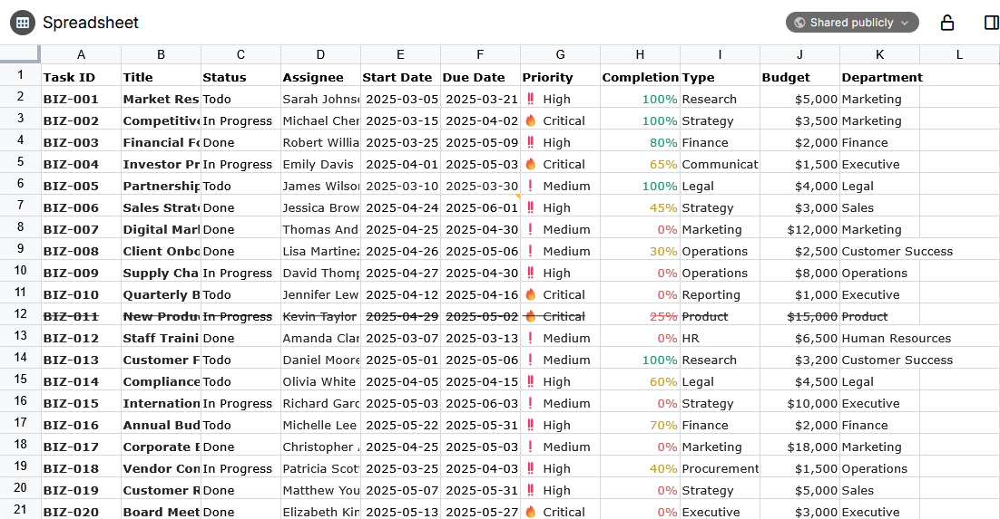

# 电子表格
<figure class="image"></figure>

> [!IMPORTANT]
> 电子表格是 v0.103.0 中引入的一种新笔记类型，目前被视为实验性/测试版。因此，此笔记类型预计会发生重大变化。

电子表格提供了类似于 Microsoft Excel 或 LibreOffice Calc 的熟悉体验，支持公式、数据验证和文本格式化。

## 电子表格 vs. 集合

电子表格与 <a class="reference-link" href="../Collections/Table.md">表格</a> 集合之间存在一些功能重叠。一般来说，表格集合用于跟踪笔记的元信息（例如，人员及其生日的集合），而电子表格由于支持公式，对于计算非常有用。

电子表格还受益于更广泛的功能，例如数据验证、格式化，并且可以处理相对较大的数据集。

## 数据互操作性（导入/导出）

从 v0.104.0 开始，Trilium 在内部格式（Univer）与以下格式之间提供了一定程度的数据互操作性：

*   Microsoft Excel (.xlsx)
    *   保留基本格式（字体、大小、边框、背景）。
    *   公式会被保留，但请注意，并非所有 Excel 函数都受支持，反之亦然（与 Univer 相比）。
    *   支持图片（单元格内或浮动），但不保留旋转。
    *   原生支持多工作表。
*   逗号分隔值 (.csv)
    *   由于是基于文本的格式，任何格式都会丢失。
    *   公式会被计算并转换为最终值。
    *   多工作表电子表格将导出为单个 ZIP 文件，其中每个工作表对应一个 CSV 文件。

[导入和导出](../Basic%20Concepts%20and%20Features/Import%20%26%20Export.md) 均受支持，如下所示：

*   要导入文件，只需将其拖入 <a class="reference-link" href="../Basic%20Concepts%20and%20Features/UI%20Elements/Note%20Tree.md">笔记树</a>，它将被转换为电子表格笔记。
    *   要避免此行为（例如，将 .xlsx 文件作为实际的 <a class="reference-link" href="File.md">文件</a> 导入），请在 [导入对话框](../Basic%20Concepts%20and%20Features/Import%20%26%20Export.md) 中取消选中相应选项。
    *   可以同时导入多个文件，包括 .csv 和 .xlsx 文件的混合。使用 .zip 文件可以保留文件夹结构。
*   与导入不同，导出是基于单个笔记的：
    *   在 <a class="reference-link" href="../Basic%20Concepts%20and%20Features/UI%20Elements/Note%20buttons.md">笔记按钮</a> 中，为 <a class="reference-link" href="../Basic%20Concepts%20and%20Features/UI%20Elements/New%20Layout.md">新布局</a> 选择 _导出到 Excel_ 或 _导出到 CSV_ 选项。
    *   对于旧布局，请在 <a class="reference-link" href="../Basic%20Concepts%20and%20Features/UI%20Elements/Floating%20buttons.md">浮动按钮</a> 区域选择相应的按钮。
    *   如果通过 <a class="reference-link" href="../Basic%20Concepts%20and%20Features/Import%20%26%20Export.md">导入与导出</a> 导出为单个文件，生成的文件将是自定义的 `.triliumsheet` 文件，该文件会原样保留电子表格。
        *   此导出过程有意与正常的 <a class="reference-link" href="../Basic%20Concepts%20and%20Features/Import%20%26%20Export.md">导入与导出</a> 功能不同，因为它会转换为多种兼容性不同的格式。

> [!IMPORTANT]
> 对 .xlsx 和 .csv 文件的导入与导出均基于尽力而为的原则。它不支持高级功能（数据验证、脚本等）。如果您发现特定问题，可以[报告](../Troubleshooting/Reporting%20issues.md)，但所有错误报告必须包含示例文件才能被考虑。

## 支持的功能

电子表格支持以下功能：

*   自 v0.104.0 起，支持位于单元格内或浮动于其上方的图片。
    *   出于性能原因，图片会保存为 <a class="reference-link" href="../Basic%20Concepts%20and%20Features/Notes/Attachments.md">附件</a>。
    *   图片上传遵循与文本 <a class="reference-link" href="Text/Images.md">图片</a> 相同的压缩设置。
*   筛选
*   排序
*   数据验证
*   条件格式
*   注释 / 批注
*   查找 / 替换

我们可能会考虑在某个时候添加 Univer 的[其他功能](https://docs.univer.ai/guides/sheets/features/filter)。如果有可以轻松添加的特定功能，可以在 [GitHub Issues](../Troubleshooting/Reporting%20issues.md) 上进行讨论。

### 分享功能

电子表格可以[分享](../Advanced%20Usage/Sharing.md)，在这种情况下，会尽力对电子表格进行 HTML 渲染：

*   保留基本格式。
*   包含公式的单元格显示预先计算的值，而不是公式。

自 v0.104.0 起：

*   数字和日期格式正确。
*   图片显示在单元格内或浮动于上方，包括旋转。

对于更高级的用例，这很可能无法按预期工作。请随时[报告问题](../Troubleshooting/Reporting%20issues.md)，但请记住，我们可能无法与 Univer 的所有功能实现完全的功能对等。

## 尚不支持的功能

### 关于 Pro 功能

Univer 电子表格还具有 [Pro 计划](https://univer.ai/pro)，该计划增加了相当多的功能，例如图表、打印、数据透视表、导出等。

由于 Pro 计划需要许可证，Trilium 不支持任何高级功能。理论上，Pro 功能可以在试用模式下使用，但有一些限制，我们可能会在某个时候探索这个方向。

### 计划中的功能

有一些功能已在计划中，但尚不支持：

*   Trilium 特定公式（例如，获取笔记标题）。
*   用户自定义公式
*   跨工作簿计算

如果您希望我们致力于这些功能，请考虑[支持我们](https://triliumnotes.org/en/support-us)。

### 移动端支持

v0.104.0 之前的版本没有专门的移动端支持，这意味着在没有鼠标和键盘的情况下交互很困难。从 v0.104.0 开始，我们集成了 Univer 的移动端插件，该插件引入了拖拽平移等功能，使界面在移动设备上更易用。