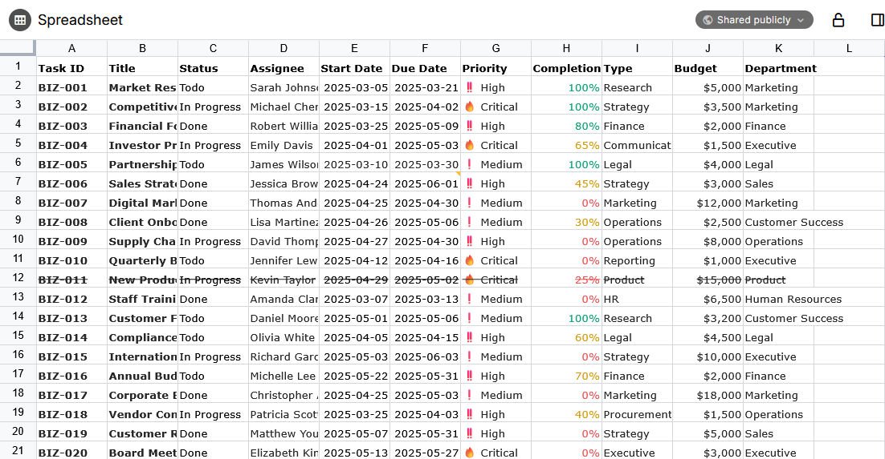

# 电子表格
<figure class="image"></figure>

> [!IMPORTANT]
> 电子表格是 v0.103.0 中引入的一种新笔记类型，目前被视为实验性/测试版。因此，这种笔记类型预计会发生重大变化。

电子表格提供了与 Microsoft Excel 或 LibreOffice Calc 类似的熟悉体验，支持公式、数据验证和文本格式化。

## 电子表格与集合的对比

电子表格与 <a class="reference-link" href="../Collections/Table.md">表格</a> 集合之间存在轻微的重叠。一般来说，表格集合适用于跟踪笔记的元信息（例如一组人员及其生日），而电子表格由于支持公式，非常适合进行计算。

电子表格还受益于更广泛的功能，如数据验证、格式化，并且可以处理相对较大的数据集。

## 数据互操作性（导入/导出）

从 v0.104.0 开始，Trilium 在内部格式（Univer）与以下格式之间提供了一定程度的数据互操作性：

*   Microsoft Excel（.xlsx）
    *   保留基本格式（字体、大小、边框、背景）。
    *   公式会被保留，但请注意并非所有 Excel 函数都受支持，反之亦然（与 Univer 之间）。
    *   图片（单元格内或浮动），不保留旋转。
    *   原生支持多工作表。
*   逗号分隔值（.csv）
    *   由于是纯文本格式，所有格式都会丢失。
    *   公式会被计算并转换为最终值。
    *   多工作表电子表格会导出为单个 ZIP 文件，其中每个工作表对应一个 CSV 文件。

[导入和导出](../Basic%20Concepts%20and%20Features/Import%20%26%20Export.md)均受支持，具体如下：

*   要导入文件，只需将其拖入 <a class="reference-link" href="../Basic%20Concepts%20and%20Features/UI%20Elements/Note%20Tree.md">笔记树</a>，它将被转换为电子表格笔记。
    *   要避免此行为（例如将 .xlsx 文件作为实际的 <a class="reference-link" href="File.md">文件</a> 导入），请在[导入对话框](../Basic%20Concepts%20and%20Features/Import%20%26%20Export.md)中取消勾选相应选项。
    *   可以同时导入多个文件，包括 .csv 和 .xlsx 文件的混合。使用 .zip 文件可以保留文件夹结构。
*   与导入不同，导出是基于单个笔记的：
    *   在 <a class="reference-link" href="../Basic%20Concepts%20and%20Features/UI%20Elements/Note%20buttons.md">笔记按钮</a> 中，为 <a class="reference-link" href="../Basic%20Concepts%20and%20Features/UI%20Elements/New%20Layout.md">新布局</a> 选择 _导出到 Excel_ 或 _导出到 CSV_ 选项。
    *   对于旧布局，请在 <a class="reference-link" href="../Basic%20Concepts%20and%20Features/UI%20Elements/Floating%20buttons.md">浮动按钮</a> 区域中选择相应的按钮。
    *   如果通过 <a class="reference-link" href="../Basic%20Concepts%20and%20Features/Import%20%26%20Export.md">导入和导出</a> 导出为单个文件，生成的文件将是一个自定义的 `.triliumsheet` 文件，会原样保留电子表格。
        *   导出有意采用与常规 <a class="reference-link" href="../Basic%20Concepts%20and%20Features/Import%20%26%20Export.md">导入和导出</a> 功能不同的流程，因为它会转换为多种格式，且兼容程度各不相同。

从 Excel 或其他应用程序粘贴的单元格会保留其格式（字体除外），因此它们会像其他单元格一样使用电子表格的字体。

> [!IMPORTANT]
> .xlsx 和 .csv 文件的导入和导出均以尽力而为的方式支持。它不支持高级功能（数据验证、脚本等）。如果您发现特定问题，可以[报告](../Troubleshooting/Reporting%20issues.md)，但所有错误报告必须包含示例文件才会被考虑。

## 支持的功能

电子表格支持以下功能：

*   从 v0.104.0 开始，图片可以位于单元格内或浮动在上方。
    *   出于性能考虑，图片会保存为 <a class="reference-link" href="../Basic%20Concepts%20and%20Features/Notes/Attachments.md">附件</a>。
    *   图片上传遵循与文本 <a class="reference-link" href="Text/Images.md">图片</a> 相同的压缩设置。
*   筛选
*   排序
*   数据验证
*   条件格式
*   备注/注释
*   查找/替换

我们可能会在某个时候考虑添加 Univer 的[其他功能](https://docs.univer.ai/guides/sheets/features/filter)。如果有某个特定功能可以轻松添加，可以通过 [GitHub Issues](../Troubleshooting/Reporting%20issues.md) 进行讨论。

### 分享功能

电子表格可以[分享](../Advanced%20Usage/Sharing.md)，在这种情况下会对电子表格进行尽力而为的 HTML 渲染：

*   保留基本格式。
*   包含公式的单元格会显示预先计算的值，而不是公式。

从 v0.104.0 开始：

*   数字和日期会正确格式化。
*   图片会显示在单元格内或浮动在上方，包括旋转。

对于更高级的用例，这很可能无法按预期工作。欢迎[报告问题](../Troubleshooting/Reporting%20issues.md)，但请注意我们可能无法与 Univer 的所有功能完全对等。

## 尚不支持的功能

### 关于 Pro 功能

Univer 电子表格还提供 [Pro 计划](https://univer.ai/pro)，它增加了相当多的功能，如图表、打印、数据透视表、导出等。

由于 Pro 计划需要许可证，Trilium 不支持任何高级功能。理论上，Pro 功能可以在试用模式下使用，但有一些限制，我们可能会在某个时候探索这个方向。

### 计划中的功能

有一些功能已经计划但尚不支持：

*   Trilium 特有的公式（例如获取笔记的标题）。
*   用户自定义公式
*   跨工作簿计算

如果您希望我们开发这些功能，请考虑[支持我们](https://triliumnotes.org/en/support-us)。

### 移动端支持

v0.104.0 之前的版本没有专门的移动端支持，这意味着没有鼠标和键盘的情况下交互很困难。从 v0.104.0 开始，我们集成了 Univer 的移动端插件，引入了拖动平移等功能，使界面在移动端更加易用。