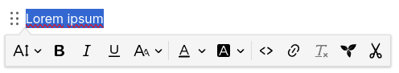
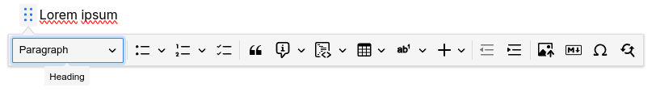
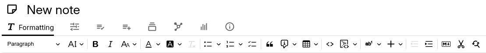

# 文本

Trilium 中的默认笔记类型，文本笔记支持富文本格式、表格、图片、警示框以及其他一些功能。

## 格式工具栏

与文本笔记的大多数交互都是通过内置工具栏完成的。根据个人偏好，有两种不同的布局：

*   _浮动工具栏_ 默认隐藏，仅在需要时出现。在此模式下，实际上有两种不同的工具栏：
    
*   选中文本时出现的工具栏。它提供文本级别的格式设置，如粗体、斜体、文本颜色、行内代码等。
    __

更多信息请参阅 <a class="reference-link" href="Text/Formatting%20toolbar.md">格式工具栏</a>。

## 功能与格式

以下是文本笔记支持的各种功能列表：

<table>
    <thead>
        <tr>
            <th>专题文章</th>
            <th>功能</th>
        </tr>
    </thead>
    <tbody>
        <tr>
            <td><a class="reference-link" href="Text/General%20formatting.md">通用格式</a></td>
            <td><ul><li>标题（章节标题、段落）</li><li>字体大小</li><li>粗体、斜体、下划线、删除线</li><li>上标、下标</li><li>字体颜色与背景颜色</li><li>清除格式</li></ul></td>
        </tr>
        <tr>
            <td><a class="reference-link" href="Text/Lists.md">列表</a></td>
            <td><ul><li>无序列表</li><li>有序列表</li><li>待办事项列表</li></ul></td>
        </tr>
        <tr>
            <td><a class="reference-link" href="Text/Block%20quotes%20%26%20admonitions.md">块引用与警示框</a></td>
            <td><ul><li>块引用</li><li>警示框</li></ul></td>
        </tr>
        <tr>
            <td><a class="reference-link" href="Text/Tables.md">表格</a></td>
            <td><ul><li>基本表格</li><li>合并单元格</li><li>表格与单元格样式</li><li>表格标题</li></ul></td>
        </tr>
        <tr>
            <td><a class="reference-link" href="Text/Developer-specific%20formatting.md">开发者专用格式</a></td>
            <td><ul><li>行内代码</li><li>代码块</li><li>键盘快捷键</li></ul></td>
        </tr>
        <tr>
            <td><a class="reference-link" href="Text/Footnotes.md">脚注</a></td>
            <td><ul><li>脚注</li></ul></td>
        </tr>
        <tr>
            <td><a class="reference-link" href="Text/Images.md">图片</a></td>
            <td><ul><li>图片</li></ul></td>
        </tr>
        <tr>
            <td><a class="reference-link" href="Text/Links.md">链接</a></td>
            <td><ul><li>外部链接</li><li>Trilium 内部链接</li></ul></td>
        </tr>
        <tr>
            <td><a class="reference-link" href="Text/Include%20Note.md">包含笔记</a></td>
            <td><ul><li>包含笔记</li></ul></td>
        </tr>
        <tr>
            <td><a class="reference-link" href="Text/Insert%20buttons.md">插入按钮</a></td>
            <td><ul><li>符号</li><li><a class="reference-link" href="Text/Math%20Equations.md">数学公式</a></li><li>Mermaid 图表</li><li>水平分隔线</li><li>分页符</li></ul></td>
        </tr>
        <tr>
            <td><a class="reference-link" href="Text/Other%20features.md">其他功能</a></td>
            <td><ul><li>缩进<ul><li>Markdown 导入</li></ul></li><li><a class="reference-link" href="Text/Cut%20to%20subnote.md">剪切为子笔记</a></li></ul></td>
        </tr>
        <tr>
            <td><a class="reference-link" href="Text/Premium%20features.md">高级功能</a></td>
            <td><ul><li><a class="reference-link" href="Text/Slash%20Commands.md">斜杠命令</a></li><li><a class="reference-link" href="../Advanced%20Usage/Templates.md">模板</a></li><li><a class="reference-link" href="Text/Format%20Painter.md">格式刷</a></li></ul></td>
        </tr>
    </tbody>
</table>

## 只读模式与编辑模式

文本笔记通常以编辑模式打开。但是，如果笔记过大或笔记被明确标记为只读，则可能以只读模式打开。更多信息请参阅 <a class="reference-link" href="../Basic%20Concepts%20and%20Features/Notes/Read-Only%20Notes.md">只读笔记</a>。

## 键盘快捷键

有大量键盘快捷键可用于格式化文本，无需使用鼠标。有关所有按键组合的参考，请参阅 <a class="reference-link" href="../Basic%20Concepts%20and%20Features/Keyboard%20Shortcuts.md">键盘快捷键</a>。此外，请参阅 <a class="reference-link" href="Text/Markdown-like%20formatting.md">类 Markdown 格式</a> 作为键盘快捷键的替代方案。

## 内容宽度

为了在较宽屏幕上提高可读性，文本笔记的宽度通过一个可配置选项进行限制。更多信息请参阅 <a class="reference-link" href="../Basic%20Concepts%20and%20Features/UI%20Elements/Content%20width.md">内容宽度</a>。

## 转换为 Markdown 笔记

文本笔记可以转换为 <a class="reference-link" href="Markdown.md">Markdown</a> 笔记。请参阅 <a class="reference-link" href="Converting%20between%20note%20types.md">在笔记类型之间转换</a>。

## 技术细节

对于文本编辑功能，Trilium 使用了一款名为 <a class="reference-link" href="../Advanced%20Usage/Technologies%20used/CKEditor.md">CKEditor</a> 的商业产品（基于开源基础）。这带来了拥有强大所见即所得（WYSIWYG）编辑器的优势。