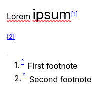

# 脚注
<figure class="image image-style-align-right"></figure>

脚注是插入段落引用或显示在笔记底部的详细信息的好地方。

## 交互操作

*   要插入新的脚注，请按下 （或按右箭头并选择_新脚注_）。
*   要插入对现有脚注的引用，请按右箭头并选择_插入脚注_，然后输入要插入的脚注编号。
*   将鼠标悬停在引用（例如 `[1]`）上，将在工具提示中显示脚注内容，方便查阅。
*   点击文本中的引用（例如 `[1]`）将跳转到相应的脚注。
*   同样，点击脚注的 `^` 按钮将跳转到文本中相应的引用位置。