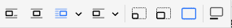
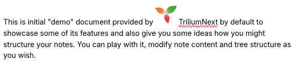
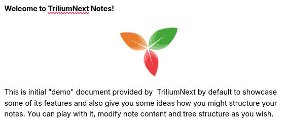
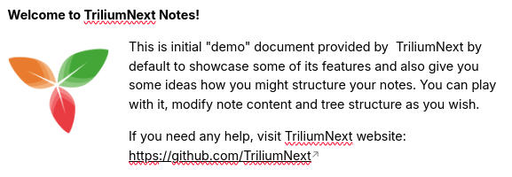
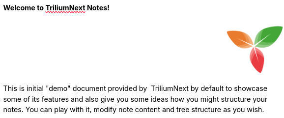

# 图片

Trilium 支持存储和显示图片。支持的格式有 PNG、JPEG、GIF、BMP、WebP、AVIF 和 SVG。

图片可以作为笔记的[附件](../../Basic%20Concepts%20and%20Features/Notes/Attachments.md)上传，也可以作为独立的[笔记](../../Basic%20Concepts%20and%20Features/Navigation/Tree%20Concepts.md)放置在[笔记树](../../Basic%20Concepts%20and%20Features/Navigation/Tree%20Concepts.md)中。其引用可以被复制到文本笔记中，以便在文本中显示。

## 上传图片

要向笔记中添加图片：

*   只需将其从文件资源管理器中拖放到 Trilium 内的笔记编辑器上，图片即会上传。
*   或者，从<a class="reference-link" href="Formatting%20toolbar.md">格式工具栏</a>中查找_插入图片_图标。
*   您也可以从网页复制并粘贴图片（参见下文）。

## 剪贴板与自动下载图片

Trilium 对从剪贴板复制和粘贴的图片有特殊处理。

*   对于文本和图片的混合内容，图片会由服务器（或桌面应用，取决于正在使用的程序）自动下载。
    
    *   这意味着图片必须是可以公开访问的，并且可以从 Trilium 运行的位置访问到。无法访问的图片最终会显示为损坏的图片。
*   如果单个图片被粘贴到 Trilium 中，它将优先使用剪贴板中的图片。这使得复制 Trilium 原本无法访问的图片成为可能，例如来自 Google Chat、Slack 等平台的图片。
*   当从 Trilium 复制带有图片的文本并粘贴到其他应用（如 Microsoft Word 或 LibreOffice Writer）时，图片将被保留。

图片的自动下载功能默认启用，可以在<a class="reference-link" href="../../Basic%20Concepts%20and%20Features/UI%20Elements/Options.md">选项</a> → _媒体_ → _自动下载图片_ 中进行切换。

## 配置图片

点击图片将弹出一个包含多个选项的弹出窗口：  

### 对齐

第一组选项用于配置对齐方式，依次为：

| 图标 | 选项 | 预览 | 描述 |
| --- | --- | --- | --- |
|  | 内联 |  | 顾名思义，图片可以放在段落内部，并可以像文本块一样移动。使用拖放或剪切粘贴来移动它。 |
|  | 居中图片 |  | 图片将作为块显示并居中，不允许文本在其左侧或右侧。 |
|  | 文本环绕 |  | 图片将显示在文本的左侧或右侧。 |
|  | 块对齐 |  | 与_居中图片_类似，图片将作为块显示，并左对齐或右对齐，但不允许文本在其任一侧流动。 |

## 压缩

由于 Trilium 并非主要用于存储图片数据，它会尝试在将上传的图片存储到数据库之前对其进行压缩和调整大小（使用相当激进的设置）。您可能会注意到一些质量下降。基本质量设置可在<a class="reference-link" href="../../Basic%20Concepts%20and%20Features/UI%20Elements/Options.md">选项</a> → _媒体_ 中找到。

如果您想以原始分辨率保存图片，建议将其作为笔记的附件保存（在<a class="reference-link" href="../../Basic%20Concepts%20and%20Features/UI%20Elements/Note%20buttons.md">笔记按钮</a> → _导入文件_ 中查找上下文菜单）。

## 并排对齐图片

通常有两种方式可以并排显示图片：

*   如果它们大小大致相同，只需根据上面的对齐部分将两张图片设为内联。图片可以拖放到同一行。
*   如果它们大小不同，可以创建一个带有不可见边框的[表格](Tables.md)。