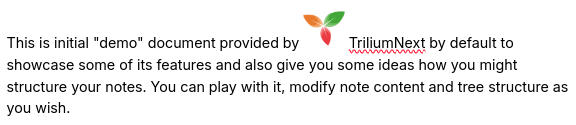
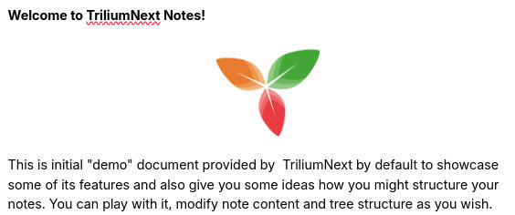

# 图片
Trilium 支持存储和显示图片。支持的格式有 PNG、JPEG、GIF、BMP、WebP、AVIF 和 SVG。

图片可以以笔记的[附件](../../Basic%20Concepts%20and%20Features/Notes/Attachments.md)形式上传，也可以作为独立的[笔记](../../Basic%20Concepts%20and%20Features/Navigation/Tree%20Concepts.md)放入[笔记树](../../Basic%20Concepts%20and%20Features/Navigation/Tree%20Concepts.md)中。其引用可以复制到文本笔记中，以便在文本中显示。

## 上传图片

要将图片添加到笔记中：

*   只需将其从文件资源管理器拖放到 Trilium 内的笔记编辑器中，图片就会被上传。
*   或者，从 <a class="reference-link" href="Formatting%20toolbar.md">格式工具栏</a> 中查找 _插入图片_ 图标。
*   你也可以从网页复制并粘贴图片（见下文）。

## 剪贴板与图片自动下载

Trilium 对复制到剪贴板和从剪贴板粘贴的图片有特殊处理。

*   对于文本和图片的混合内容，图片会由服务器（或桌面应用，取决于所使用的版本）自动下载。
    *   这意味着图片必须是公开可访问的，并且能从 Trilium 运行的位置访问到。无法访问的图片最终会显示为损坏的图片。
*   如果粘贴到 Trilium 的是单张图片，它会优先使用剪贴板中的图片。这使得复制 Trilium 原本无法访问的图片成为可能，例如 Google Chat、Slack 等。
*   当从 Trilium 复制带有图片的文本并粘贴到其他应用（如 Microsoft Word 或 LibreOffice Writer）时，图片会被保留。

图片自动下载默认启用，可以在 <a class="reference-link" href="../../Basic%20Concepts%20and%20Features/UI%20Elements/Options.md">选项</a> → _媒体_ → _自动下载图片_ 中切换。

## 配置图片

点击图片会弹出一个包含多个选项的弹窗：  

### 对齐方式

第一组选项用于配置对齐方式，依次为：

| 图标 | 选项 | 预览 | 描述 |
| --- | --- | --- | --- |
|  | 行内 |  | 顾名思义，图片可以放在段落内，像文本块一样移动。使用拖放或剪切粘贴来移动它。 |
|  | 居中图片 |  | 图片将作为块显示并居中，不允许文本出现在其左侧或右侧。 |
|  | 文字环绕 |  | 图片将显示在文本的左侧或右侧。 |
|  | 块对齐 |  | 与 _居中图片_ 类似，图片将作为块显示并左对齐或右对齐，但不允许文本在其两侧流动。 |

## 压缩

由于 Trilium 并非真正用作图片数据的主要存储，它会在将上传的图片存储到数据库之前尝试压缩和调整大小（使用相当激进的设置）。你可能会注意到一些质量下降。基本质量设置可在 <a class="reference-link" href="../../Basic%20Concepts%20and%20Features/UI%20Elements/Options.md">选项</a> → _媒体_ 中找到。

如果你想以原始分辨率保存图片，建议将其作为附件保存到笔记中（在 <a class="reference-link" href="../../Basic%20Concepts%20and%20Features/UI%20Elements/Note%20buttons.md">笔记按钮</a> → _导入文件_ 中查找上下文菜单）。

## 并排对齐图片

通常有两种方式可以并排显示图片：

*   如果它们大小大致相同，只需按照上面的对齐部分将两张图片设为行内即可。图片可以拖放到同一行。
*   如果它们大小不同，创建一个边框不可见的[表格](Tables.md)。