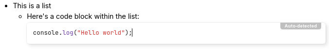
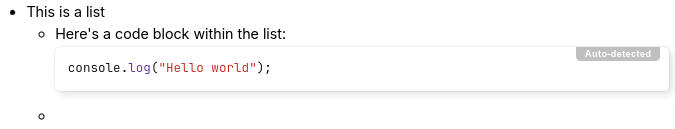

# 列表
文本笔记支持三种类型的列表：

*    项目符号列表（也称为无序列表）。
*    编号列表（或有序列表）。
*    待办事项列表

对于项目符号列表和编号列表，可以通过按下  图标来配置替代标记，例如方块或罗马数字编号。对于编号列表，还可以指定起始编号或是否按倒序计数。

## 键盘交互

*   创建新列表：
    *   项目符号列表：以 `*` 或 `-` 开头，后跟一个空格；
    *   编号列表：以 `1.` 或 `1)` 开头，后跟一个空格；
    *   待办事项列表：以 `- [ ]` 开头表示未勾选的项目，或以 `[x]` 开头表示已勾选的项目。
*   要在列表中创建新项目，请按 <kbd>Enter</kbd>。
*   要在列表项中创建空行，请按 <kbd>Shift</kbd>+<kbd>Enter</kbd>。
*   要退出列表，请按两次 <kbd>Enter</kbd>。
*   要合并两个列表，只需删除它们之间的间隔。
*   要创建嵌套列表，只需使用  按钮（参见 <a class="reference-link" href="Other%20features.md">其他功能</a> 中的 _缩进_）或 <kbd>Tab</kbd> 键。要减少当前元素的嵌套层级，请按 <kbd>Shift</kbd>+<kbd>Tab</kbd>。

## 列表中的标题、代码块

可以在列表中添加内容级块，例如标题、代码块、表格，方法如下：

|  |  |  |
| --- | --- | --- |
| 1 |  | 首先，创建一个列表。 |
| 2 |  | 按 Enter 创建一个新的列表项。 |
| 3 |  | 按 Backspace 去掉项目符号。注意光标位置。 |
| 4 |  | 此时，插入任何所需的块级项目，例如代码块。 |
| 5 |  | 要继续创建新的项目符号，请按 Enter 直到光标移动到新的空白位置。 |
| 6 |  | 再按一次 Enter 创建新的项目符号。 |

同样的原则适用于所有三种列表类型（项目符号、编号和待办事项）。

## 待办事项列表

参见 <a class="reference-link" href="To-do%20Lists.md">待办事项列表</a>。

## 可折叠列表

从 Trilium v0.104.0 开始，可以折叠嵌套的列表项。这适用于项目符号列表、编号列表以及待办事项列表。

要折叠或展开具有嵌套子项目的列表项：

*   使用鼠标，将光标移到列表项上，其左侧会出现一个箭头。点击它将在折叠和展开之间切换。
*   对于项目符号列表和编号列表，也可以直接点击标记（例如项目符号或编号）而不是箭头来折叠或展开它。这对于待办事项列表不适用，因为点击会切换待办事项的完成状态。
*   按 <kbd>Ctrl</kbd>+<kbd>Alt</kbd>+<kbd>Enter</kbd>，将切换光标位置处项目的折叠/展开状态。

注意事项：

*   折叠的项目始终显示箭头以指示其状态。
*   折叠状态保存在笔记级别，并在各实例之间同步，这意味着它将在刷新或重新打开应用程序后恢复。
*   折叠状态也会在 <a class="reference-link" href="../../Basic%20Concepts%20and%20Features/Import%20%26%20Export.md">导入与导出</a> 中持久化，但仅适用于 HTML 格式。Markdown 导出不会保留折叠状态。
*   可折叠项目符号仅存在于可编辑文本笔记的上下文中。只读列表将始终完全展开。
*   列表项在编辑时会自动展开，以避免在隐藏区域中键入内容。