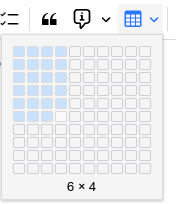
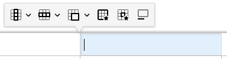
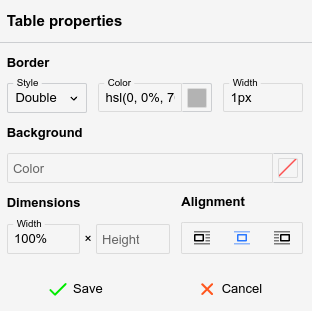
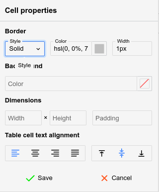

# 表格

表格是<a class="reference-link" href="../Text.md">文本</a>笔记的一项强大功能，因为编辑它们通常很容易。

<figure class="image image-style-align-right"></figure>

要创建表格，只需按下表格按钮，然后用鼠标选择所需的列数和行数，如旁边图示所示。

## 格式工具栏

当选中表格时，会出现一个特殊的格式工具栏：

## 在表格中导航

*   使用鼠标：
    *   点击单元格以聚焦它。
    *   点击表格顶部或底部的  按钮，在其附近插入一个空段落。
    *   点击表格左上角的  按钮以完全选中它（便于复制粘贴或剪切），或拖放它以移动表格。
*   使用键盘：
    *   使用键盘上的方向键在单元格之间轻松导航。
    *   也可以使用 <kbd>Tab</kbd> 键移动到下一个单元格，使用 Shift+Tab 移动到上一个单元格。
    *   与方向键不同，在表格末尾（最后一行、最后一列）按 <kbd>Tab</kbd> 键会自动创建新行。
    *   要选择多个单元格，在使用方向键时按住 <kbd>Shift</kbd> 键。

## 调整单元格大小

*   将鼠标悬停在两个相邻单元格的边界上并拖动，即可调整列宽。
*   默认情况下，行高无法使用鼠标调整，但可以在单元格设置中配置（见下文）。
*   要精确调整单元格的宽度（以像素或百分比为单位），请选择  按钮。

## 插入新行和新列

*   要插入新列，请点击所需位置，然后按下格式工具栏中的  按钮，并选择 _在左侧或右侧插入列_。
*   要插入新行，请点击所需位置，然后按下  按钮，并选择 _在上方或下方插入行_。
    *   在表格末尾创建新行的更快替代方法是按 <kbd>Tab</kbd> 键。

## 合并单元格

要合并两个或多个单元格，只需通过拖放选择它们，然后按下格式工具栏中的  按钮。

按下其旁边的箭头可获得更多选项：

*   点击单个单元格，然后选择向上/向下/向右/向左合并单元格，以与相邻单元格合并。
*   选择 _垂直拆分单元格_ 或 _水平拆分单元格_，将一个单元格拆分为多个单元格（也可用于撤销合并）。

## 表格属性

<figure class="image image-style-align-right"></figure>

可以通过  按钮访问表格属性，并允许进行以下调整：

*   边框（不是单元格的边框，而是表格的外边缘），包括样式（单线、双线）、颜色和宽度。
*   背景颜色，默认不设置。
*   表格的宽度和高度，以百分比（必须以 `%` 结尾）或像素（必须以 `px` 结尾）为单位。
*   表格的对齐方式。
    *   左对齐或右对齐，此时文本将环绕在表格旁边。
    *   居中对齐，此时文本将避开表格，无论表格宽度如何。

表格将立即更新以反映更改，但必须按下 _保存_ 按钮才能使更改持久生效。

## 单元格属性

<figure class="image image-style-align-right"></figure>

与表格属性类似， 按钮会打开一个弹出窗口，用于调整一个或多个单元格的样式（基于用户的选择）。

可以调整以下选项：

*   边框样式、颜色和宽度（与表格属性相同），但仅应用于当前单元格。
*   背景颜色，默认不设置。
*   单元格的宽度和高度，以百分比（必须以 `%` 结尾）或像素（必须以 `px` 结尾）为单位。
*   内边距（文本与单元格边框之间的距离）。
*   文本的对齐方式，包括水平（左对齐、居中、右对齐、两端对齐）和垂直（顶部、中部或底部）。

单元格将立即更新以反映更改，但必须按下 _保存_ 按钮才能使更改持久生效。

## 标题

按下  按钮可插入表格的标题或文本描述，该标题将显示在表格上方。

## 表格边框

默认情况下，表格会带有预定义的灰色边框。

要调整边框，请按照以下步骤操作：

1.  选择表格。
2.  在浮动面板中，选择 _表格属性_ 选项（）。
    1.  在新打开的面板顶部查找 _边框_ 部分。
    2.  这将控制表格的外边框。
    3.  选择边框样式。通常 _单线_ 是理想的选择。
    4.  选择边框颜色。
    5.  选择边框宽度，以像素为单位。
3.  选择表格的所有单元格，然后按下 _单元格属性_ 选项（）。
    1.  这将控制表格的内边框，在单元格级别。
    2.  请注意，可以通过选择一个或多个单元格来单独更改边框，这种情况下只会更改与这些单元格相交的边框。
    3.  重复步骤（2）中的相同步骤。

### 具有不可见边框的表格

可以将表格设置为具有不可见边框，以便实现文本或[图片](Images.md)的基本布局（列、网格），而不受边框的干扰：

1.  首先插入一个具有所需列数和行数的表格。
2.  选择整个表格。
3.  在 _表格属性_ 中，设置：
    1.  _样式_ 为 _单线_
    2.  _颜色_ 为 `transparent`
    3.  宽度为 `1px`。
4.  在 _单元格属性_ 中，设置与上一步相同的值。

## 表格缩进

自 v0.104.1 起，表格可以作为块进行缩进（整个表格移动，而不仅仅是单元格的内容）。

1.  点击  按钮以选择整个表格。否则，缩进仅适用于当前单元格的内容。
2.  按 <kbd>Tab</kbd> 键增加缩进，或按 <kbd>Shift</kbd>+<kbd>Tab</kbd> 键减少缩进。或者，使用格式工具栏中的缩进按钮。

Markdown 不支持缩进表格，因此在转换为 Markdown 时缩进会丢失。

## Markdown 导入/导出

简单表格以 GitHub 风格的 Markdown 格式导出（例如一系列 `|` 项目）。如果表格比较复杂（包含 HTML 元素、具有自定义大小或图片），则表格会转换为 HTML 格式。

通常，由于回退到 HTML 格式，导出为 Markdown 时的格式丢失应该是最小的。