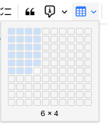
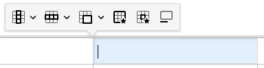

# 表格

表格是<a class="reference-link" href="../Text.md">文本</a>笔记的一项强大功能，因为编辑表格通常很容易。

<figure class="image image-style-align-right"></figure>

要创建表格，只需按下表格按钮，然后用鼠标选择所需的列数和行数，如旁边的图所示。

自 v0.107.0 起，同一菜单以 _插入表格…_ 项开头，用于创建比网格更大的表格，或直接输入其尺寸：

1.  点击  按钮并选择 _插入表格…_。光标处会打开一个小表单。
2.  输入 _行数_（最多 1000）和 _列数_（最多 100）。表格最多可有 5000 个单元格，例如 1000 行 5 列。
3.  按 _插入_ 或 <kbd>Enter</kbd>。

要关闭表单而不插入表格，请按 <kbd>Esc</kbd> 或点击其外部。使用键盘时，菜单打开期间 <kbd>Tab</kbd> 会在 _插入表格…_ 和网格之间移动。

## 格式工具栏

当选中表格时，会出现一个特殊的格式工具栏：

## 上下文菜单

自 v0.106.0 起，右键点击表格内的任意位置会打开一个包含最常见表格操作的上下文菜单：

*   _在上方插入行_ 和 _在下方插入行_ 会在当前单元格所在行的旁边插入一个空行。当选区跨越多行时，会插入相同数量的行。
*   _在左侧插入列_ 和 _在右侧插入列_ 对列的作用方式相同。
*   自 v0.107.0 起，根据选区情况，_设为表头_ 或 _将表头设置到本行_ 会将行转换为表头行，表头行始终从表格顶部开始：
    *   当选区从第一行开始时显示 _设为表头_，并将每个选中的行设为表头行。
    *   当选区位于第一行以下的单行时显示 _将表头设置到本行_，并将该行及其上方的每一行设为表头行。
    *   当选区跨越第一行以下的多个行时，两者都不显示。
    *   复选标记表示这些行已经是表头行。再次选择该项会将它们及其下方的每个表头行恢复为常规行。例如，在一个有五个表头行的表格中，在第三行选择 _将表头设置到本行_ 后，只有前两行保留为表头行。
*   _合并单元格_ 将选中的单元格合并为一个。选中的单元格必须构成一个矩形。
*   _拆分单元格_ 将每个选中的单元格拆分为两个，可以 _垂直_ 或 _水平_ 拆分。同一子菜单中的 _取消合并单元格_ 会将选区中的每个合并单元格恢复为其覆盖的单个单元格，并将其内容保留在左上角的单元格中；未合并的单元格保持不变。
*   _均匀分布列_ 将选区所涉及列的组合宽度平均分配给它们。其他列和表格宽度保持不变。它需要跨越至少两列的选区；合并单元格按其覆盖的每一列计算。
*   _剪切_、_复制_ 和 _复制为 Markdown_ 作用于选中的单元格。自 v0.107.0 起，_复制_ 和 _粘贴_ 会打开包含其变体的子菜单，例如 _复制为 Markdown_ 和 _粘贴为纯文本_；点击 _复制_ 或 _粘贴_ 本身仍会执行复制或粘贴：
    *   剪切或复制会生成一个仅包含选中单元格的较小表格。将其粘贴到单元格选区上会替换这些单元格；粘贴到其他位置会将其作为独立表格插入。剪切会清除单元格内容，但不会删除行或列。
    *   _复制为 Markdown_ 会将选中的单元格转换为 Markdown 表格。选中的表头行会成为 Markdown 表头；如果没有表头行，则会输出一个空表头行，因为 Markdown 表格需要表头行。
*   自 v0.107.0 起，_粘贴_ 子菜单中的 _在上方粘贴行_ 和 _在下方粘贴行_ 会将剪贴板内容作为新行粘贴到当前单元格所在行的旁边，而不是从光标处开始覆盖单元格。它们仅在选区位于单行时显示，并且与 _粘贴_ 一样，仅在可以读取剪贴板时显示：
    *   复制的表格会为其每一行生成一个新行，从第一列开始填充。当其列数多于表格时，表格会增加列，与常规粘贴一样。其他内容会放入单个新行的第一个单元格中。
    *   新行随后会被选中。
    *   当合并单元格将该行与其他行连接在一起时，新行会位于整个行块的上方或下方。
*   _排序_ 位于剪贴板部分下方，按当前单元格所在列对行进行 _升序_ 或 _降序_ 排序。参见[对行排序](#sorting-rows)。
*   _删除行_ 和 _删除列_ 位于 _排序_ 下方，会删除选区所涉及的每一行或每一列，即使只选中了其中部分单元格。
*   _删除表格_ 会删除整个表格，并在其位置留下一个空段落。在嵌套于另一个表格内的表格中，只会删除内部表格。
*   自 v0.107.0 起，_删除表格_ 下方的 _选择_ 会选择选区所涉及的每一行（_行_）或列（_列_）的单元格，或表格的每个单元格（_表格_）。与将表格作为整体选择的  按钮不同，_表格_ 选择的是其单元格，因此诸如 _合并单元格_ 之类的单元格操作会应用于所有单元格。在嵌套于另一个表格内的表格中，_表格_ 只选择内部表格的单元格。

右键点击不属于当前选区的单元格会先将光标移到那里，因此菜单始终作用于指针下的单元格。

> [!NOTE]
> 在浏览器中，Trilium 的菜单会替换浏览器在表格内的自带上下文菜单。要访问浏览器的菜单（例如其拼写检查建议），请在右键点击时按住 <kbd>Shift</kbd>。桌面应用程序不受影响，因为其菜单已包含拼写建议。在浏览器中，菜单仅在页面可以读取剪贴板时才提供 _粘贴_，这需要安全（HTTPS）上下文和你的许可；否则，请使用 <kbd>Ctrl</kbd>+<kbd>V</kbd> 粘贴。

## 导航表格

*   使用鼠标：
    *   点击单元格以聚焦它。
    *   点击表格顶部或底部的  按钮，在其附近插入一个空段落。
    *   点击表格左上角的  按钮以完全选中它（便于复制粘贴或剪切），或拖放它以重新定位表格。
*   使用键盘：
    *   使用键盘上的方向键可轻松在单元格之间导航。
    *   也可以使用 <kbd>Tab</kbd> 转到下一个单元格，使用 Shift+Tab 转到上一个单元格。
    *   与方向键不同，在表格末尾（最后一行、最后一列）按 <kbd>Tab</kbd> 会自动创建新行。
    *   要选择多个单元格，请在使用方向键时按住 <kbd>Shift</kbd>。

## 调整单元格大小

*   可以通过将鼠标悬停在两个相邻单元格的边界上并拖动来调整列的大小。
*   要使多个列具有相同的宽度，请选中跨越它们的单元格，然后从格式工具栏的  按钮或从[上下文菜单](#context-menu)中选择 _均匀分布列_。
*   默认情况下，行高无法使用鼠标调整，但可以从单元格设置中进行配置（见下文）。
*   要精确调整单元格的宽度（以像素或百分比为单位），请选择  按钮。

## 插入新行和新列

*   要插入新列，请点击所需位置，然后按格式工具栏中的  按钮并选择 _在左侧或右侧插入列_。
*   要插入新行，请点击所需位置，然后按  按钮并选择 _在上方_ 或 _在下方插入行_。
    *   在表格末尾创建新行的更快替代方法是按 <kbd>Tab</kbd> 键。
*   这两种操作也可在[上下文菜单](#context-menu)中使用，它会插入与选区跨度相同数量的行或列。

## 移动行和列

自 v0.106.0 起，可以使用键盘重新排列行和列：

*   <kbd>Alt</kbd>+<kbd>Up</kbd> 和 <kbd>Alt</kbd>+<kbd>Down</kbd> 将选区涉及的行向上或向下移动。
*   <kbd>Alt</kbd>+<kbd>Left</kbd> 和 <kbd>Alt</kbd>+<kbd>Right</kbd> 将选区涉及的列向左或向右移动。

合并单元格永远不会因移动而被拆分。由合并单元格连接在一起的行或列会作为一个块移动，向这样的块移动时会完全跳过它。

当表格有表头行时，移动到表头区域下方的表头行会变为常规行，而移动到表头区域内的常规行会变为表头行。表头列的行为相同。

在表格之外，<kbd>Alt</kbd>+<kbd>Left</kbd> 和 <kbd>Alt</kbd>+<kbd>Right</kbd> 仍会导航笔记历史，<kbd>Alt</kbd>+<kbd>Up</kbd> 和 <kbd>Alt</kbd>+<kbd>Down</kbd> 仍会移动当前段落。

## 对行排序

自 v0.107.0 起，可以按某一列的值对表格的行进行排序：

*   要对所有行排序，请将光标放在要排序的列的任意单元格中，然后从[上下文菜单](#context-menu)中选择 _排序_ → _升序_ 或 _降序_。相同的项也位于格式工具栏的  按钮中。
*   要仅对部分行排序，请在要排序的列中选中它们的单元格，然后以相同方式排序。当选区跨越多个列时，无法进行排序。

表头行始终位于表格顶部，永远不会被排序。可以使用 <kbd>Ctrl</kbd>+<kbd>Z</kbd> 撤销排序。

### 值的比较方式

每个单元格都作为纯文本读取，因此格式不会影响顺序。Trilium 随后会检测单元格所持有的值类型：

| 类型 | 示例 | 比较依据 |
| --- | --- | --- |
| 时间 | `15:02`、`15:02:38`、`3:02 PM` | 一天中的时间。 |
| 日期 | `2026-09-30`、`2026-09-30 15:02`、`30 September 2026`、`Wednesday, 30 September 2026`、`2026-09-30T15:02:38+03:00` | 日期和时间。 |
| 数字 | `12`、`-3.5`、`1,234.56`、`$ 12.04`、`21 RON`、`24.5m` | 数值。 |
| 文本 | 其他任何内容。 | 按字母顺序，忽略大小写，文本中的数字按数值顺序排列（`Item 9` 在 `Item 10` 之前）。重音符号计入，因此 `a` 和 `á` 不同。 |
| 空 | 空单元格，或仅包含空格的单元格。 | 不比较。空单元格始终排在最后。 |

升序将时间排在最前，然后是日期、数字和文本。降序则相反。空单元格在两个方向上都排在最后。

值相同的数字、日期和时间按其文本排序，因此 `5 apples` 在 `5 pears` 之前。单元格文本相同（忽略大小写）的行保持其相对顺序。

*   日期也会以笔记语言的格式识别，例如德语中的 `30.09.2026` 或 `30. September 2026`，以及在<a class="reference-link" href="../../Basic%20Concepts%20and%20Features/UI%20Elements/Options.md">选项</a> → _文本笔记_ → _编辑器_ → _日期/时间格式_ 中选择的用于[插入日期和时间](Insert%20buttons.md)的格式。
*   数字可以以货币符号开头，例如 `$`、`€` 或 `£`。数字后面的任何内容（例如单位）都会被忽略，因此单位不会被转换：`1 km` 排在 `500 m` 之前。以字母开头的单元格，例如 `RON 21`，被视为文本。
*   小数分隔符遵循笔记的语言：`1.500` 在英语中是一点五，但在德语中是一千五百。逗号或句点后面如果不是恰好三位数字，则始终被读取为小数分隔符，因此 `1,5` 在两种语言中都是一点五。
*   笔记的语言是在其基本属性中设置的语言，否则为默认内容语言。参见 <a class="reference-link" href="Content%20language%20%26%20Right-to-left%20support.md">内容语言与从右到左支持</a>。

### 合并单元格

由合并单元格连接的行会保持在一起并作为一个块移动。该块按其第一行中的值排序。当该块在排序列中有多个单元格时，其他单元格不影响顺序，并会显示一条消息：_某些行被一起排序，因为合并单元格将它们相互绑定_。

当选区仅覆盖此类块的一部分时，整个块都会被排序。

## 合并单元格

要将两个或多个单元格合并在一起，只需通过拖放选中它们，然后按格式工具栏中的  按钮。

按旁边的箭头可获得更多选项：

*   点击单个单元格并选择 向上/向下/向右/向左合并单元格 以与相邻单元格合并。
*   选择 _合并选中的单元格_ 以合并选中的单元格，与按按钮本身相同。
*   选择 _垂直拆分单元格_ 或 _水平拆分单元格_，以将单元格拆分为多个单元格（也可用于撤销合并）。
*   选择 _取消合并单元格_ 以将选区中的每个合并单元格恢复为其覆盖的单个单元格，并将其内容保留在左上角的单元格中。

_合并选中的单元格_ 和 _取消合并单元格_ 自 v0.107.0 起可用。合并和拆分也可通过右键点击选中的单元格，经由[上下文菜单](#context-menu)使用，其中 _取消合并单元格_ 位于 _拆分单元格_ 子菜单中。

## 表格属性

<figure class="image image-style-align-right"></figure>

表格属性可通过  按钮访问，允许进行以下调整：

*   边框（不是单元格的边框，而是表格的外缘），包括样式（单线、双线）、颜色和宽度。
*   背景颜色，默认未设置。
*   表格的宽度和高度，以百分比（必须以 `%` 结尾）或像素（必须以 `px` 结尾）为单位。
*   表格的对齐方式。
    *   左对齐或右对齐，此时文本会在其旁边环绕。
    *   居中，此时文本会避开表格，无论表格宽度如何。

表格会立即更新以反映更改，但必须按 _保存_ 按钮才能使更改持久化。

## 单元格属性

<figure class="image image-style-align-right"></figure>

与表格属性类似， 按钮会打开一个弹出窗口，用于调整一个或多个单元格的样式（基于用户的选择）。

可以调整以下选项：

*   边框样式、颜色和宽度（与表格属性相同），但仅应用于当前单元格。
*   背景颜色，默认未设置。
*   单元格的宽度和高度，以百分比（必须以 `%` 结尾）或像素（必须以 `px` 结尾）为单位。
*   内边距（文本相对于单元格边框的距离）。
*   文本的对齐方式，包括水平（左、居中、右、两端对齐）和垂直（顶部、中部或底部）。

单元格会立即更新以反映更改，但必须按 _保存_ 按钮才能使更改持久化。

## 边框和背景颜色

表格和单元格的边框和背景颜色会像[文本颜色](General%20formatting.md)一样适应[主题](../../Basic%20Concepts%20and%20Features/Themes.md)。从调色板中选取、使用取色器选择或输入的颜色会以适合当前主题的较浅或较深色调显示，因此边框保持可见，文本在背景上保持可读。色相保持不变，表格保留选取时的颜色。

使用旧版 Trilium 应用的颜色会完全按照选取时的样子显示，直到笔记下次被编辑。

无法适应颜色的旧版浏览器会完全按照选取时的样子显示它们。

## 标题

按  按钮以插入表格的标题或文本描述，它将显示在表格上方。

## 表格边框

默认情况下，表格会带有预定义的灰色边框。

要调整边框，请按照以下步骤操作：

1.  选中表格。
2.  在浮动面板中，选择 _表格属性_ 选项（）。
    1.  在新打开的面板顶部查找 _边框_ 部分。
    2.  这将控制表格的外边框。
    3.  为边框选择一种样式。通常 _单线_ 是理想的选择。
    4.  为边框选择一种颜色。
    5.  为边框选择一种宽度，以像素为单位。
3.  选中表格的所有单元格，然后按 _单元格属性_ 选项（）。
    1.  这将在单元格级别控制表格的内边框。
    2.  请注意，可以通过选择一个或多个单元格来单独更改边框，此时只会更改与这些单元格相交的边框。
    3.  重复步骤 (2) 中的相同步骤。

### 具有不可见边框的表格

可以将表格设置为具有不可见边框，以便对文本或[图像](Images.md)进行基本布局（列、网格），而不受其边框的干扰：

1.  首先插入具有所需列数和行数的表格。
2.  选中整个表格。
3.  在 _表格属性_ 中，设置：
    1.  _样式_ 为 _单线_
    2.  _颜色_ 为 `transparent`
    3.  宽度为 `1px`。
4.  在单元格属性中，设置与上一步相同的内容。

## 表格缩进

自 v0.104.1 起，表格可以作为一个块进行缩进（整个表格移动，而不仅仅是单元格的内容）。

1.  点击  按钮以选中整个表格。否则，缩进仅应用于当前单元格的内容。
2.  按 <kbd>Tab</kbd> 增加缩进，或按 <kbd>Shift</kbd>+<kbd>Tab</kbd> 减少缩进。或者，使用格式工具栏中的缩进按钮。

Markdown 不支持缩进的表格，因此转换为 Markdown 时缩进会丢失。

## Markdown 导入/导出

简单表格会以 GitHub 风格的 Markdown 格式导出（例如一系列 `|` 项）。如果发现表格更复杂（包含 HTML 元素、具有自定义尺寸或图像），则表格会改为转换为 HTML 表格。

通常，由于会回退到 HTML 格式，导出为 Markdown 时格式损失应该很小。