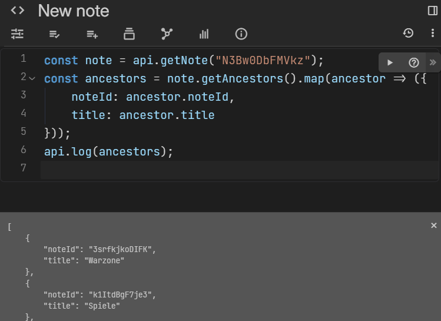

# 日志记录

前端和后端笔记都可以记录消息以进行调试。

## 通过 `api.log` 进行 UI 日志记录

<figure class="image image_resized image-style-align-center" style="width:57.74%;"></figure>

API 日志功能与脚本编辑器集成，它显示所有通过 `api.log` 记录的消息。这适用于后端脚本和前端脚本。

执行使用 `api.log` 的脚本后，API 日志面板将出现，可以通过点击面板右上角的关闭按钮暂时将其关闭。

除了字符串之外，也可以传递一个对象，在这种情况下，如果可能的话，它将被格式化得美观易读（例如，不支持递归对象）。

## 控制台日志记录

对于用户无法直接看到的日志，也可以使用标准的 `console.log`。

*   对于前端脚本，日志将显示在开发者工具（也称为“检查”）中。
*   对于后端脚本，日志将在运行时显示在服务器输出中，但**不会**显示在<a class="reference-link" href="../Troubleshooting/Error%20logs/Backend%20(server)%20logs.md">后端（服务器）日志</a>中。